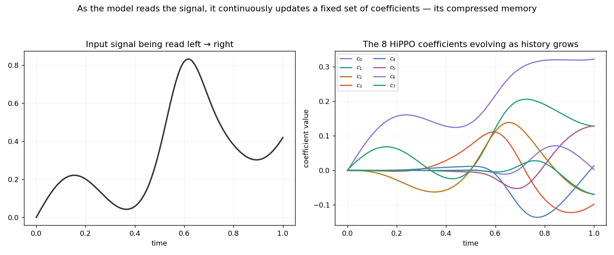
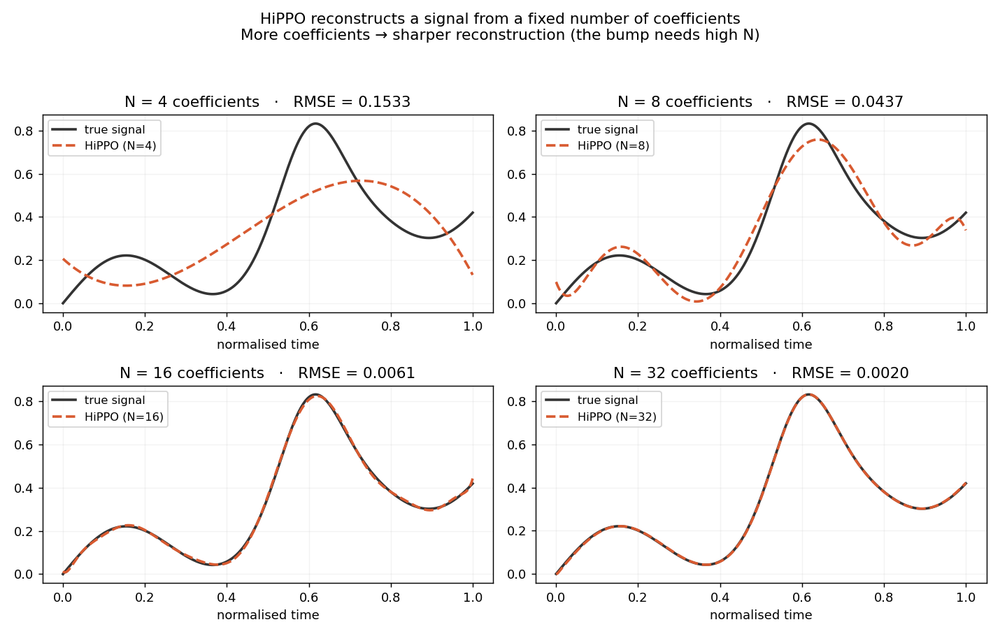

# HiPPO: How AI Models Remember Long Sequences

This guide explains one of the most elegant ideas in modern AI: how a model can read a million words and still remember what happened at the very beginning, using only a small fixed amount of memory. No prior machine learning knowledge is required. If you are comfortable with basic algebra (things like `2x + 3`) you can follow everything here.

---

## The problem this guide solves

Imagine you are reading a long book, one word at a time. Someone will stop you at a random point and ask: "What has happened in the story so far?"

You have two choices.

**Choice A: remember every word.** This works perfectly but is impossible at scale. One million words requires one million slots of memory. Every new word makes the memory larger. This is how the attention mechanism inside GPT-style models works, and it is why those models get slow and expensive on very long texts.

**Choice B: keep a short summary.** You carry a notepad with room for exactly 64 numbers. As you read each word, you update the notepad. The notepad never grows. Whether you have read 10 words or 10 million, it always holds exactly 64 numbers.

**HiPPO is Choice B done extremely well.** The clever part is figuring out what those 64 numbers should represent so that you can reconstruct the story from them surprisingly faithfully, even after millions of words.

That is the one question HiPPO answers:

> If a model can only keep a small, fixed amount of information, what is the smartest way to summarize everything it has read so far?

---

## The key insight: store the shape, not the data

Instead of storing the actual words or data values, HiPPO stores a **description of the overall shape** of the history.

Think about how you might describe a graph to a friend over the phone. You would not read out every single data point. You would say things like:

- "On average it sits around 5." (the overall level)
- "It is generally rising." (the trend)
- "It curves upward in the middle." (the bend)
- "There is a little wiggle near the end." (finer detail)

Each of those statements is one number capturing one aspect of the shape. Put enough of them together and your friend can draw a graph that looks almost exactly like the original, without ever hearing the individual points.

HiPPO does exactly this. Its memory is a list of numbers where:

- the first number captures the average level,
- the second captures the trend (rising or falling),
- the third captures the curvature,
- and so on, each number adding finer detail.

These numbers are called **coefficients**. Together they form the model's hidden state.

---

## A warm-up: summarizing a simple list

Before working with continuous signals, let us practice on something simpler.

Suppose you see the numbers: **2, 4, 6, 8**.

You could describe them with just two facts:

- **Average = 5** (the level: (2 + 4 + 6 + 8) / 4 = 5)
- **Trend = +2 per step** (they rise by 2 each time)

From these two facts you can rebuild the list: 2, 4, 6, 8. You compressed four numbers into two with no loss, because the data was a perfect straight line. Simple data needs few summary numbers. Complex, wiggly data needs more.

This is the entire philosophy of HiPPO: store a small number of well-chosen summary numbers. The model typically keeps 16 to 64 of them.

---

## Building blocks: reference shapes

To describe the shape of a history, you need a set of standard reference shapes. You then measure how much of each reference shape is present in your data.

### The music analogy

Any sound can be broken into pure tones: a low hum, a middle note, a high note. A sound engineer stores the volume of each tone rather than the raw waveform. A handful of tone-volumes can reconstruct the original sound. This is the idea behind MP3 audio compression.

The "pure tones" are the reference shapes. The "volume of each tone" is a coefficient.

### HiPPO's reference shapes

HiPPO uses reference shapes that are good for describing patterns over time:

- **Shape 0:** a flat horizontal line, measures the average level
- **Shape 1:** a straight diagonal slope, measures the trend (rising or falling)
- **Shape 2:** a gentle U-shape or inverted-U, measures the curvature
- **Shape 3:** an S-shaped wiggle, measures finer oscillation
- and so on, each shape wigglier than the previous one

These specific shapes are called **Legendre polynomials**.

---

## Legendre polynomials

Do not be scared by the name. A polynomial is simply an expression like `x`, or `3x^2 - 1`, or `x^3 - x`. The Legendre polynomials are a specific, well-known list of them.


Here are the first four, written over the range x = -1 to x = 1:

| Name | Formula | Shape | What it captures |
| --- | --- | --- | --- |
| P0 | 1 | flat horizontal line | average level |
| P1 | x | straight diagonal | trend (slope) |
| P2 | (1/2)(3x^2 - 1) | U-shaped curve | curvature |
| P3 | (1/2)(5x^3 - 3x) | S-shaped wiggle | finer oscillation |

If you plotted these from x = -1 to x = 1 you would see: a flat line, a slope, a U, and an S. Each is wigglier than the one before it. The image above shows exactly this.

### Where these formulas come from

You do not have to take these on faith. There is a simple procedure that builds them one at a time. The rule is:

> Start with the simple powers 1, x, x^2, x^3, ... and adjust each one so it is completely independent from all the previous ones.

"Independent" has a precise meaning here: two shapes are independent if, when you multiply them together and find the area under the result, the area is exactly zero. This is the same idea as the three directions in space (left-right, forward-back, up-down): moving in one direction does not change your position in the others.

Here is how the first three are built:

**Building P0:** Take the simplest possible shape, a constant. Set P0 = 1. Done.

**Building P1:** Start with `x`. Test independence from P0 = 1: multiply `x` by `1` to get `x`, and the area under `x` from -1 to 1 is zero (the positive half and negative half cancel exactly). So `x` is already independent from `1`. Set P1 = x.

**Building P2:** Start with `x^2`. Test independence from P0 = 1: multiply `x^2` by `1` to get `x^2`, and the area under `x^2` from -1 to 1 is 2/3 (not zero). So `x^2` has some "average level" mixed in. We subtract that out, leaving `x^2 - 1/3`. After rescaling so that the value at x = 1 equals 1, we get `(1/2)(3x^2 - 1)`. That is P2.

This procedure is called Gram-Schmidt. It generates every Legendre polynomial: each new one is the next power, cleaned of any overlap with the earlier ones.

### Why independence matters

When two reference shapes are independent, each one captures completely separate information. Knowing the average tells you nothing about the trend. Knowing the trend tells you nothing about the curvature. No storage is wasted, because every summary number pulls its own weight.

---

## The HiPPO recipe

Now we put the pieces together. At any moment, HiPPO does three things:

**Step 1:** Look at the history. All the data seen so far, from the very beginning up to now.

**Step 2:** Measure how much of each reference shape is present. For each Legendre shape (average, trend, curve, wiggle...), compute one number: how strongly does the history match that shape? This is done by multiplying the history by the shape and computing the area.

**Step 3:** Store those numbers. The collection of measurements is the memory. Four shapes give four numbers. Sixty-four shapes give sixty-four numbers.

### Which moments count most

There is one more choice: when measuring the history, does the very beginning count equally with the recent past?

HiPPO's main version (called LegS, for "Legendre Scaled") counts all of history equally. Whether something happened at the very beginning or just now, it gets equal weight in the summary. As time passes, the window simply stretches to always cover everything from start to now.

This equal weighting is what gives HiPPO its special power: it can remember things from very far back just as reliably as recent things. It has no fixed forgetting horizon.

There is also an alternative version (LegT) that only looks at a fixed recent window and forgets everything older. But LegS, with its equal weighting over all history, is the one used in modern models like Mamba.

---

## A complete worked example

Let us make everything concrete with a tiny example using 3 summary numbers: average, trend, and curvature.

Suppose the history so far is a simple ramp: a signal that rises steadily from 0 up to 1. Picture a straight line going up.

We compute the three summary numbers by measuring how much of each shape is present.

**Number 0 (average, using the flat shape P0):**
The average value of a ramp that goes from 0 to 1 is the midpoint:

```text
average = 1/2 = 0.5
```

The first memory number is **0.5**. This makes sense: a ramp from 0 to 1 sits at 0.5 on average.

**Number 1 (trend, using the sloped shape P1):**
A ramp is steadily rising, so it should have a clear positive trend. Working out the measurement gives approximately **0.29**. A positive number confirms the signal is rising.

**Number 2 (curvature, using the U-shaped P2):**
A ramp is a perfectly straight line with no bend. The curvature measurement comes out to exactly **0**. No curvature, exactly as expected.

So the memory is:

```text
memory = (0.5,  0.29,  0.0)
```

Read it in plain English: "On average 0.5, steadily rising, with no bend." That is a perfect description of a ramp, captured in just three numbers. From these three numbers you could redraw the ramp almost exactly.

This is the whole point: three numbers faithfully summarized the entire history, because we chose smart reference shapes.

---

## How the memory updates when new data arrives

Here is the practical magic. When a new data point arrives, HiPPO does **not** re-scan the whole history from the beginning. It updates the memory with one small calculation.

### The update rule

```text
new memory = A x (old memory) + B x (new input)
```

Where:

- **old memory** is the summary you already had
- **new input** is the single data point that just arrived
- **A** is a fixed matrix that says how the old summary should shift as time moves forward
- **B** is a small column of numbers that says how the new input gets blended in

That is all. Multiply the old memory by A, add B times the new input, and you have the updated memory. It is a fixed amount of arithmetic, fast and constant regardless of how long the history is.

### What A and B look like

For our 3-number example:

```text
        [ 1      0      0    ]         [ 1    ]
A  =    [ 1.73   2      0    ]    B =  [ 1.73 ]
        [ 2.24   3.87   3    ]         [ 2.24 ]
```

Those decimals are square roots: 1.73 is roughly sqrt(3), 2.24 is roughly sqrt(5), 3.87 is roughly sqrt(15). They come directly from the mathematical properties of the Legendre shapes.

### The remarkable fact

No one chose the numbers in A and B by hand. They come out automatically from the mathematics, once you decide:

1. to store Legendre-shape summaries, and
2. to weight all of history equally.

In most neural networks, the numbers inside weight matrices are found by trial and error during training (gradient descent). HiPPO's A and B are derived: they are the unique correct answer to the question "how does the summary change as time moves forward?" There is nothing to tune. This is why HiPPO produces excellent results even before any training.

### The triangular shape of A

Notice that everything above the diagonal in A is zero. This "lower-triangular" shape is not an accident. It means information flows one way: the coarse summary (average) influences the finer summaries (trend, curvature), but not the reverse. Coarse-to-fine, never backward. This falls directly out of the way Legendre shapes relate to each other.

---

## Watching the memory update over time

The image below shows what happens when HiPPO reads a moderately complex signal over many time steps. The three memory coefficients (average, trend, curvature) evolve smoothly as new data arrives.



Each line is one memory slot. Notice how:

- The average (blue) is the most stable, reacting slowly to new information.
- The trend (orange) responds more quickly.
- The curvature (green) is the most reactive, capturing moment-to-moment changes.

This makes intuitive sense: coarser summaries are stabler; finer summaries are more sensitive.

---

## How well does the summary reconstruct the original?

The image below shows the result of using HiPPO to summarize a signal, then reconstructing it from the stored coefficients.



The original signal is shown in one colour; the reconstruction from the stored coefficients is shown in another. With just 16 summary numbers, the reconstruction closely follows the original, including the general shape, major features, and approximate timing of changes. Fine-grained noise is smoothed out, but the essential information is preserved.

This is the payoff of the whole approach: a compact, fixed-size memory that keeps the important structure of a long history.

---

## Why the memory never explodes

There is a practical danger with any repeated calculation. If you multiply by something over and over, the result might grow to infinity. Since HiPPO applies matrix A once per data point, potentially thousands of times for a long sequence, we need to be sure the memory stays within reasonable bounds.

### Eigenvalues

Every matrix has special numbers attached to it called eigenvalues. In plain terms, an eigenvalue tells you the "stretch factor" of the matrix in a particular direction. If you apply the matrix repeatedly:

- a stretch factor larger than 1 means the memory explodes. Bad.
- a stretch factor smaller than 1 means the memory fades in a controlled way. Good.

In the continuous-time version of the math HiPPO actually uses, the condition is that eigenvalues must be negative (pointing toward "shrink," not "grow").

### HiPPO is stable by design

For our example matrix A, the eigenvalues are exactly the numbers on the diagonal: 1, 2, 3. In the actual HiPPO equation these appear with a minus sign, becoming -1, -2, -3. All negative. Every direction shrinks in a controlled way. The memory cannot explode no matter how long the sequence.

This is not luck. The lower-triangular shape of A makes the eigenvalues easy to read (they sit on the diagonal), and the way HiPPO is constructed guarantees they are all negative. Stability is built in from the start.

---

## Where HiPPO fits: the road to Mamba

HiPPO by itself is a theory of memory. Two famous models build on it.

### S4 (2021)

S4 took HiPPO and made it fast. The challenge was that applying matrix A repeatedly can be slow for very long sequences. S4 found a clever way to reorganize A so the computation runs quickly even at 16,000 or more time steps. S4 kept HiPPO's excellent memory and added speed.

### Mamba (2023)

Mamba added one crucial upgrade: selectivity.

In plain HiPPO, the matrices A and B are the same for every input token. The word "the" is processed exactly like the word "earthquake." That is wasteful: some words matter far more than others.

Mamba makes B and the step size **depend on the input token itself**:

- an important, rare word gets written into memory strongly and lingers,
- a common filler word barely touches the memory.

The model learns to decide what to remember. This is what makes Mamba competitive with GPT-style attention models while using far less memory on long texts.

The one-line summary of the whole journey:

```text
HiPPO decides what the memory should be.
S4    makes it fast.
Mamba makes it smart about what to keep.
```

---

## Summary: five ideas to remember

1. **The problem:** summarize an ever-growing history into a fixed, small set of numbers.

2. **The trick:** store the shape of the history (average, trend, curve, wiggle...) instead of the raw data.

3. **The shapes:** Legendre polynomials, a standard set of independent reference shapes built by cleaning the simple powers 1, x, x^2, x^3, ...

4. **The update:** new memory = A x old memory + B x new input. The matrices A and B are derived from the mathematics, not tuned by hand.

5. **The stability:** A's eigenvalues are all negative, so the memory fades gracefully and never explodes.

---

## What each memory slot means

| Memory slot | Reference shape | What it captures |
| --- | --- | --- |
| 1st | flat horizontal line | average level |
| 2nd | straight slope | trend (rising or falling) |
| 3rd | U-shaped curve | curvature |
| 4th | S-shaped wiggle | finer oscillation |

---

## Further reading

Start here and go as deep as you want:

- **A Visual Guide to Mamba and State Space Models** by Maarten Grootendorst (blog post): lots of pictures, very approachable. Start here.
- **The Annotated S4** by Sasha Rush and Sidd Karamcheti (blog post): walks through real code line by line. Good second step.
- **HiPPO: Recurrent Memory with Optimal Polynomial Projections** by Gu, Dao, Ermon, Rudra, and Re (2020), arXiv 2008.07669: the original research paper. For when you want the full mathematics.
- **Mamba: Linear-Time Sequence Modeling with Selective State Spaces** by Gu and Dao (2023), arXiv 2312.00752: the model that brought HiPPO into production.

---

This guide kept things intuitive. The full rigorous derivation, including the calculus that produces A and B, the exact integrals, and formal proofs, lives in the companion document `HiPPO_SSM_explained.md` in this folder. Everything here is a faithful, simplified picture of the same mathematics.
