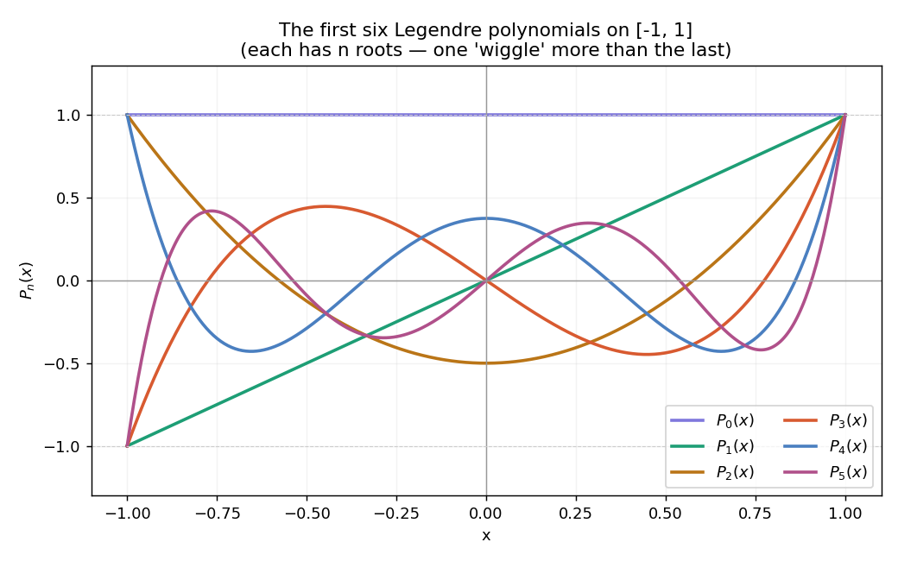

# Legendre Polynomials: A Complete Guide from First Principles

This document builds the Legendre polynomials from scratch, four different ways. Every formula is introduced with a plain-English explanation before any symbols appear. Every integral is carried through step by step.

**What you need:** basic algebra and a willingness to follow integrals and derivatives. Anything more advanced is explained as it arrives.

**What you will understand by the end:** why the Legendre polynomials are the unique natural answer to the question "what are the simplest orthogonal shapes on an interval?", and exactly why they are the mathematical backbone of the HiPPO memory mechanism used in models like Mamba.

---

## Table of Contents

1. [What they are and why they matter](#1-what-they-are-and-why-they-matter)
2. [Prerequisite ideas: inner products and orthogonality](#2-prerequisite-ideas)
3. [Derivation 1: Gram-Schmidt from the powers](#3-derivation-1-gram-schmidt)
4. [Derivation 2: Rodrigues formula](#4-derivation-2-rodrigues-formula)
5. [Derivation 3: the generating function](#5-derivation-3-the-generating-function)
6. [Derivation 4: Legendre's differential equation](#6-derivation-4-legendres-differential-equation)
7. [The orthogonality property with full proof](#7-the-orthogonality-property)
8. [The normalization constant](#8-the-normalization-constant)
9. [Recurrence relations](#9-recurrence-relations)
10. [Derivative identities](#10-derivative-identities)
11. [Special values and symmetry](#11-special-values-and-symmetry)
12. [Worked examples and numerical checks](#12-worked-examples)
13. [Why they appear in HiPPO and physics](#13-why-they-appear-in-hippo-and-physics)
14. [Summary table and references](#14-summary-table-and-references)

---

## 1. What they are and why they matter

The Legendre polynomials are a specific sequence of shapes, named P0, P1, P2, P3, and so on. Here are the first six:

```text
P0(x) = 1
P1(x) = x
P2(x) = (1/2)(3x^2 - 1)
P3(x) = (1/2)(5x^3 - 3x)
P4(x) = (1/8)(35x^4 - 30x^2 + 3)
P5(x) = (1/8)(63x^5 - 70x^3 + 15x)
```

They live on the interval from x = -1 to x = 1. What makes them special is a property called **orthogonality**: each polynomial is completely independent of all the others. If you multiply any two distinct Legendre polynomials together and compute the area under the curve over `[-1, 1]`, the result is exactly zero. This independence means each polynomial captures a genuinely different aspect of a signal.

In plain terms:

- P0 is a flat horizontal line. It captures the average level.
- P1 is a straight slope. It captures the trend (rising or falling).
- P2 is a U-curve. It captures curvature.
- P3 is an S-wiggle. It captures finer oscillation.
- Each subsequent polynomial adds one more "wiggle", capturing progressively finer detail.

The plot below shows the first four:



Notice that each polynomial Pn crosses zero exactly n times. P0 never crosses zero, P1 crosses once, P2 twice, P3 three times. This "one more crossing each time" is the visual signature of the increasing oscillation.

### Where they show up

Legendre polynomials appear throughout mathematics and physics:

- In the **potential of a charged sphere**: if you expand the electric potential around a sphere, Legendre polynomials appear as the natural basis.
- In the **hydrogen atom**: the angular part of the wavefunction is built from Legendre polynomials.
- In **numerical integration**: Gaussian quadrature, the most accurate method for integrating smooth functions, is based on them.
- In **machine learning**: the HiPPO memory mechanism, which underlies the Mamba architecture, uses them as its reference shapes for compressing sequences.

### The four derivations

This document derives the Legendre polynomials four independent ways. Each derivation starts from a different angle and arrives at the same sequence. This is not redundancy: seeing four paths reveals why the polynomials are so natural. The four derivations are:

1. Gram-Schmidt: start with simple powers, make them mutually orthogonal.
2. Rodrigues formula: one closed-form expression generates all of them.
3. Generating function: they are the coefficients in a specific power series.
4. Differential equation: they are the well-behaved solutions of a particular ODE.

All four arrive at the same P0, P1, P2, P3, ... and all four share the same properties: orthogonality, a normalization constant of `2/(2n+1)`, a three-term recurrence, and derivative identities. Those shared properties are derived in Sections 7 through 11.

---

## 2. Prerequisite Ideas

Before deriving anything, we need two ideas: the **inner product of functions**, and what it means for two functions to be **orthogonal**.

### 2.1 From dot products to inner products

You know the dot product of two vectors. For 3D vectors a = (a1, a2, a3) and b = (b1, b2, b3):

```text
a . b = a1*b1 + a2*b2 + a3*b3
```

Two vectors are perpendicular (orthogonal) when their dot product is zero. They "point in completely different directions" and share no common component.

Now here is the key step. A function is like a vector with infinitely many components: one value `f(x)` for each point x on the interval. The "dot product" of two functions replaces the sum over components with an integral over the interval:

```text
inner product of f and g = integral from -1 to 1 of:  f(x) * g(x)  dx
```

This integral is called the **inner product** of f and g on `[-1, 1]`. It measures how much the two functions "line up", exactly as the dot product measures alignment of vectors. We write it as `<f, g>`.

### 2.2 Orthogonality of functions

Two functions are **orthogonal** on `[-1, 1]` if their inner product is zero:

```text
<f, g> = integral from -1 to 1 of:  f(x) * g(x)  dx  =  0
```

What does this mean in pictures? Where one function is positive and the other is negative, their product is negative. Where they share the same sign, the product is positive. Orthogonality means these positive and negative contributions exactly cancel out to zero net area.

**Example: are f(x) = 1 and g(x) = x orthogonal on [-1, 1]?**

```text
integral from -1 to 1 of:  1 * x  dx

= [x^2 / 2] from -1 to 1

= (1/2) - (1/2) = 0
```

Yes, they are orthogonal. The area under x from -1 to 0 is negative and equals exactly the positive area from 0 to 1.

### 2.3 The norm of a function

The "length" (norm) of a function is the square root of its inner product with itself, exactly as the length of a vector is `sqrt(a . a)`:

```text
norm of f = sqrt(<f, f>) = sqrt( integral from -1 to 1 of:  f(x)^2  dx )
```

**Example: the norm of f(x) = 1:**

```text
norm^2 = integral from -1 to 1 of:  1  dx = 2

norm = sqrt(2)
```

These three ideas, inner product, orthogonality, and norm, are all we need to proceed.

---

## 3. Derivation 1: Gram-Schmidt

The most hands-on way to build the Legendre polynomials is to start with the simple powers `1, x, x^2, x^3, ...` and make them mutually orthogonal, one at a time. This procedure is called **Gram-Schmidt orthogonalization**.

The idea: take each new power of x, then subtract off its overlap with every polynomial already built. What remains is orthogonal to all the previous ones.

The overlap of a function v with an already-orthogonal function p is measured by:

```text
overlap amount = <v, p> / <p, p>
```

This is the same idea as projecting one vector onto another: the component of v in the direction of p. Subtracting `(overlap amount) * p` from v removes that component.

The process in plain English:

```text
1. Take next power x^n
2. Compute its inner product with each previous polynomial
3. Subtract off each overlap
4. Rescale so the value at x = 1 equals 1
5. The result is the next Legendre polynomial
```

### Building P0

Take the first power, `x^0 = 1`. There is nothing before it. Set `p0 = 1`.

### Building P1

Take the next power, `x`. Subtract its overlap with `p0 = 1`.

The overlap is `<x, 1> / <1, 1>`:

```text
<x, 1> = integral from -1 to 1 of:  x * 1  dx = 0    (x is odd, cancels)

<1, 1> = integral from -1 to 1 of:  1  dx = 2

overlap = 0 / 2 = 0
```

The overlap is zero. `x` is already orthogonal to `1`. So `p1 = x`.

### Building P2

Take `x^2`. Subtract its overlap with both p0 and p1.

**Overlap with p0 = 1:**

```text
<x^2, 1> = integral from -1 to 1 of:  x^2  dx = [x^3/3] from -1 to 1 = 1/3 - (-1/3) = 2/3

<1, 1> = 2

overlap with p0 = (2/3) / 2 = 1/3
```

**Overlap with p1 = x:**

```text
<x^2, x> = integral from -1 to 1 of:  x^3  dx = 0    (odd function)

overlap with p1 = 0
```

Subtract:

```text
p2 = x^2  -  (1/3)*1  -  0  =  x^2 - 1/3
```

Check: this is orthogonal to both `1` and `x` on `[-1, 1]`. Good.

**Rescale so p2(1) = 1.** At x = 1: `1 - 1/3 = 2/3`. Multiply by `3/2`:

```text
P2 = (3/2)(x^2 - 1/3) = (1/2)(3x^2 - 1)
```

### Building P3

Take `x^3`. Check overlaps:

```text
<x^3, 1> = 0                   (x^3 is odd)
<x^3, x> = integral of x^4 from -1 to 1 = 2/5

overlap with p1 = (2/5) / (2/3) = 3/5

<x^3, x^2 - 1/3> = integral of (x^5 - x^3/3) from -1 to 1 = 0    (both odd)
```

Subtract:

```text
p3 = x^3  -  0  -  (3/5)*x  -  0  =  x^3 - (3/5)x
```

**Rescale so p3(1) = 1.** At x = 1: `1 - 3/5 = 2/5`. Multiply by `5/2`:

```text
P3 = (5/2)(x^3 - 3x/5) = (1/2)(5x^3 - 3x)
```

### The result

Starting from nothing but the powers `1, x, x^2, x^3, ...` and the condition of mutual orthogonality on `[-1, 1]`, we derived:

```text
P0 = 1
P1 = x
P2 = (1/2)(3x^2 - 1)
P3 = (1/2)(5x^3 - 3x)
```

These match the standard Legendre polynomials exactly. The derivation used only integrals and subtraction.

---

## 4. Derivation 2: Rodrigues Formula

There is a beautiful closed-form expression that generates every Legendre polynomial from a single recipe. It is called **Rodrigues' formula**:

```text
P_n(x) = (1 / (2^n * n!)) * d^n/dx^n [ (x^2 - 1)^n ]
```

In words: take `(x^2 - 1)`, raise it to the n-th power, differentiate n times, and divide by `2^n * n!`.

### Verifying the formula for small n

**Case n = 0:**

```text
(x^2 - 1)^0 = 1
0th derivative of 1 = 1
Divide by 2^0 * 0! = 1 * 1 = 1
Result: P0 = 1  (correct)
```

**Case n = 1:**

```text
(x^2 - 1)^1 = x^2 - 1
1st derivative: 2x
Divide by 2^1 * 1! = 2
Result: 2x / 2 = x = P1  (correct)
```

**Case n = 2:**

```text
(x^2 - 1)^2 = x^4 - 2x^2 + 1

1st derivative: 4x^3 - 4x
2nd derivative: 12x^2 - 4

Divide by 2^2 * 2! = 4 * 2 = 8:
(12x^2 - 4) / 8 = (3x^2 - 1) / 2 = (1/2)(3x^2 - 1) = P2  (correct)
```

**Case n = 3:**

```text
(x^2 - 1)^3 = x^6 - 3x^4 + 3x^2 - 1

1st derivative: 6x^5 - 12x^3 + 6x
2nd derivative: 30x^4 - 36x^2 + 6
3rd derivative: 120x^3 - 72x

Divide by 2^3 * 3! = 8 * 6 = 48:
(120x^3 - 72x) / 48 = (5x^3 - 3x) / 2 = (1/2)(5x^3 - 3x) = P3  (correct)
```

### Why Rodrigues' formula produces orthogonal polynomials

The elegance of Rodrigues' formula is that orthogonality is baked in automatically, via a clever use of **integration by parts**.

We want to show that for any m less than n:

```text
integral from -1 to 1 of:  x^m * d^n/dx^n[(x^2-1)^n]  dx  =  0
```

(Checking against all `x^m` for m less than n is enough, since any lower-degree polynomial is a combination of such powers.)

Apply integration by parts n times. Each application moves one derivative off the `(x^2-1)^n` factor and onto `x^m`, picking up a minus sign. The key observation: `(x^2 - 1)^n` and its first `n-1` derivatives all vanish at x = -1 and x = 1, because `(x^2 - 1) = (x-1)(x+1)` has roots at both endpoints. This kills every boundary term.

After n applications of integration by parts:

```text
integral of  x^m * d^n/dx^n[(x^2-1)^n]  dx

= (-1)^n * integral of  d^n/dx^n[x^m]  *  (x^2-1)^n  dx
```

But if m is less than n, then differentiating `x^m` a total of n times gives zero: you differentiated a degree-m polynomial more times than its degree. Therefore the whole integral is zero. Orthogonality proved. The `(x^2-1)^n` factor does the work of automatically making the polynomial orthogonal to everything of lower degree.

---

## 5. Derivation 3: The Generating Function

A third approach defines all Legendre polynomials at once. The **generating function** is:

```text
1 / sqrt(1 - 2*x*t + t^2)  =  P0(x) + P1(x)*t + P2(x)*t^2 + P3(x)*t^3 + ...
```

If you expand the left side as a power series in t, the coefficient of `t^n` is exactly `P_n(x)`.

### Extracting the first few polynomials

Let `u = 2xt - t^2`, so the left side is `(1 - u)^(-1/2)`. The binomial series gives:

```text
(1 - u)^(-1/2) = 1 + (1/2)*u + (3/8)*u^2 + ...
```

Substitute `u = 2xt - t^2` and collect by powers of t:

**Coefficient of t^0:** The constant term is `1`. So `P0 = 1`. Correct.

**Coefficient of t^1:** From `(1/2)(2xt) = xt`, the coefficient is `x`. So `P1 = x`. Correct.

**Coefficient of t^2:** Comes from two places: the `(1/2)(-t^2)` term gives `-1/2`, and the `(3/8)(2xt)^2 = (3/2)x^2 t^2` term gives `(3/2)x^2`. Total: `(3/2)x^2 - 1/2 = (1/2)(3x^2 - 1)`. So `P2 = (1/2)(3x^2 - 1)`. Correct.

### Where this formula comes from (a physics connection)

This expression is not arbitrary. It is the formula for the electric (or gravitational) potential between two point charges.

Suppose a unit charge sits at distance 1 from the origin, and a test point is at distance r from the origin, with angle theta between them. By the law of cosines, the distance between them is `sqrt(1 - 2r*cos(theta) + r^2)`. Therefore the potential (which is `1/distance`) is:

```text
1 / sqrt(1 - 2*r*cos(theta) + r^2)  =  sum over n of  P_n(cos theta) * r^n
```

This is the "multipole expansion." The `n = 0` term is the monopole (overall charge), the `n = 1` term is the dipole, the `n = 2` term is the quadrupole, and so on. Setting `x = cos(theta)` and `t = r`, this is exactly the generating function. Legendre polynomials are the natural expansion basis for any problem with angular symmetry, which is why they appear throughout physics.

---

## 6. Derivation 4: Legendre's Differential Equation

The fourth characterization: Legendre polynomials are the well-behaved solutions to a specific ordinary differential equation. The equation is:

```text
(1 - x^2) * y'' - 2x * y' + n*(n+1) * y = 0
```

where `y'` means the first derivative of y and `y''` means the second derivative. This can be written more compactly as:

```text
d/dx [ (1 - x^2) * dy/dx ] + n*(n+1) * y = 0
```

You can check these are the same: expand the outer derivative to get `(1-x^2)*y'' + (-2x)*y'`, which is `(1-x^2)*y'' - 2x*y'`, matching the first form.

For each non-negative integer n, the polynomial solution to this equation is `P_n(x)`.

### Verifying P2 solves the equation

Take `P2 = (1/2)(3x^2 - 1)` with `n = 2`, so `n*(n+1) = 6`.

```text
y  = (3/2)x^2 - 1/2
y' = 3x
y''= 3
```

Substitute into the equation:

```text
(1 - x^2) * 3  -  2x * 3x  +  6 * ((3/2)x^2 - 1/2)

= 3 - 3x^2  -  6x^2  +  9x^2 - 3

= (3 - 3)  +  (-3 - 6 + 9)x^2

= 0 + 0 = 0  (satisfied)
```

### Why this matters: orthogonality from the equation itself

The form `d/dx[(1-x^2)*y'] + n*(n+1)*y = 0` is an example of a **Sturm-Liouville problem**. A general theorem about such problems says: solutions corresponding to different values of n are automatically orthogonal. This gives a fourth independent proof of orthogonality, and it reveals something deeper: orthogonality is not a coincidence or a result of careful construction. It is a structural property that any equation of this form produces.

To see it directly: write the equation for `P_n` and for `P_m`:

```text
d/dx[(1-x^2) * P_n'] = -n*(n+1) * P_n
d/dx[(1-x^2) * P_m'] = -m*(m+1) * P_m
```

Multiply the first by `P_m`, the second by `P_n`, subtract, and integrate over `[-1, 1]`. The left side integrates (by parts) to zero, because `(1-x^2)` vanishes at both endpoints. The right side becomes:

```text
[ m*(m+1) - n*(n+1) ] * integral from -1 to 1 of:  P_n * P_m  dx
```

When m is not equal to n, the bracket in front is nonzero. Therefore the integral must be zero. Orthogonality, proved again, directly from the differential equation.

---

## 7. The Orthogonality Property

We have now proved orthogonality three independent ways: through the Gram-Schmidt construction, through Rodrigues' formula and integration by parts, and through the differential equation. The result is:

```text
integral from -1 to 1 of:  P_n(x) * P_m(x)  dx  =  0    whenever n is not equal to m
```

To build intuition for why this happens, consider the case of P1 times P2. We have `P1 = x` and `P2 = (1/2)(3x^2 - 1)`. Their product is `(1/2)(3x^3 - x)`.

This is an **odd function**: it satisfies `f(-x) = -f(x)`. For any odd function, the integral from -1 to 1 is zero, because the area on the left half `[-1, 0]` is the exact mirror image (with opposite sign) of the area on the right half `[0, 1]`. They cancel perfectly.

Why is P1 * P2 an odd function? Because `P1 = x` is odd and `P2` is even (contains only even powers of x). Odd times even equals odd. An odd function always integrates to zero on a symmetric interval.

This even/odd cancellation is one of the main mechanisms behind orthogonality of Legendre polynomials, but it is not the whole story. Even pairs like P2 * P4 are also orthogonal, and the cancellation there is less visually obvious but just as real.

### Direct check: P1 against P3

Both P1 and P3 are odd functions. Their product is even, so the cancellation is subtler.

```text
integral from -1 to 1 of:  P1 * P3  dx

= integral of  x * (1/2)(5x^3 - 3x)  dx  from -1 to 1

= (1/2) * integral of  (5x^4 - 3x^2)  dx  from -1 to 1

= (1/2) * [ 5*(x^5/5) - 3*(x^3/3) ] from -1 to 1

= (1/2) * [ x^5 - x^3 ] from -1 to 1

= (1/2) * [ (1 - 1) - (-1 - (-1)) ]

= (1/2) * [0 - 0] = 0  (confirmed)
```

### Direct check: P0 against P2

```text
integral from -1 to 1 of:  P0 * P2  dx

= integral of  1 * (1/2)(3x^2 - 1)  dx  from -1 to 1

= (1/2) * [x^3 - x] from -1 to 1

= (1/2) * [(1 - 1) - (-1 + 1)]

= (1/2) * [0 - 0] = 0  (confirmed)
```

Every distinct pair integrates to zero. This is the single most important property of Legendre polynomials, and it is what makes them useful for representing data: each coefficient captures information that is completely independent of every other coefficient.

---

## 8. The Normalization Constant

Orthogonality tells us the integral is zero when n is not equal to m. What is the integral when n equals m? This is the **norm-squared** of P_n, and the answer is:

```text
integral from -1 to 1 of:  P_n(x)^2  dx  =  2 / (2n + 1)
```

The factor `sqrt(2n+1)` that comes from this formula is exactly what appears in every entry of the HiPPO matrices A and B. This is not a coincidence. HiPPO uses the normalized versions of the Legendre polynomials (scaled so each has unit norm), and the normalization factor is `sqrt((2n+1)/2)`. Multiplying P_n by this factor undoes the `2/(2n+1)` norm and leaves norm 1.

### Verifying for n = 0, 1, 2

**n = 0:**

```text
integral of  1^2  dx  from -1 to 1  =  2

Formula: 2 / (2*0 + 1) = 2 / 1 = 2  (correct)
```

**n = 1:**

```text
integral of  x^2  dx  from -1 to 1

= [x^3 / 3] from -1 to 1 = 1/3 - (-1/3) = 2/3

Formula: 2 / (2*1 + 1) = 2 / 3  (correct)
```

**n = 2:**

```text
integral of  [(1/2)(3x^2 - 1)]^2  dx  from -1 to 1

= (1/4) * integral of  (9x^4 - 6x^2 + 1)  dx  from -1 to 1

= (1/4) * [ 9*(x^5/5) - 6*(x^3/3) + x ] from -1 to 1

= (1/4) * [ (9/5)*2 - 2*2 + 2 ]

= (1/4) * [ 18/5 - 4 + 2 ]

= (1/4) * [ 18/5 - 2 ]

= (1/4) * [ 18/5 - 10/5 ]

= (1/4) * (8/5) = 2/5

Formula: 2 / (2*2 + 1) = 2 / 5  (correct)
```

### The orthonormal versions

If we want unit-norm polynomials (norm exactly 1 instead of `sqrt(2/(2n+1))`), we divide each `P_n` by its norm, which means multiplying by `sqrt((2n+1)/2)`:

```text
normalized P_n(x)  =  sqrt((2n+1)/2) * P_n(x)

integral of  [normalized P_n]^2  dx  =  1
```

The factor `sqrt(2n+1)` in the HiPPO matrices comes directly from this normalization. Every `sqrt(2n+1)` you see in the A and B matrices is the normalization factor for the n-th Legendre polynomial, appearing because HiPPO works with the unit-norm versions.

---

## 9. Recurrence Relations

Computing Legendre polynomials by Gram-Schmidt or Rodrigues' formula becomes tedious for large n. There is a shortcut: each polynomial can be built from the two before it using a simple formula.

### The three-term recurrence

```text
(n+1) * P_{n+1}(x)  =  (2n+1) * x * P_n(x)  -  n * P_{n-1}(x)
```

Given `P0 = 1` and `P1 = x`, this formula generates all the rest. Each new polynomial needs only its two immediate predecessors.

The flow is: P0 and P1 together give P2; P1 and P2 give P3; P2 and P3 give P4; and so on. Each polynomial connects to exactly two predecessors and two successors.

### Using the recurrence to compute P2, P3, P4

**Computing P2 (set n = 1):**

```text
(1+1) * P2  =  (2*1+1) * x * P1  -  1 * P0

2 * P2  =  3x * x  -  1

2 * P2  =  3x^2 - 1

P2  =  (1/2)(3x^2 - 1)  (correct)
```

**Computing P3 (set n = 2):**

```text
(2+1) * P3  =  (2*2+1) * x * P2  -  2 * P1

3 * P3  =  5x * (1/2)(3x^2 - 1)  -  2x

3 * P3  =  (5/2)(3x^3 - x)  -  2x

3 * P3  =  (15/2)x^3  -  (5/2)x  -  2x

3 * P3  =  (15/2)x^3  -  (9/2)x

P3  =  (5/2)x^3  -  (3/2)x  =  (1/2)(5x^3 - 3x)  (correct)
```

**Computing P4 (set n = 3):**

```text
4 * P4  =  7x * (1/2)(5x^3 - 3x)  -  3 * (1/2)(3x^2 - 1)

        =  (35/2)x^4 - (21/2)x^2  -  (9/2)x^2 + 3/2

        =  (35/2)x^4  -  15x^2  +  3/2

P4  =  (35/8)x^4  -  (15/4)x^2  +  3/8  =  (1/8)(35x^4 - 30x^2 + 3)  (correct)
```

### Why there are only three terms (not four or more)

This is a deeper point, and it connects directly to why the HiPPO matrix A is lower-triangular (not dense).

Consider the product `x * P_n(x)`. This is a polynomial of degree `n+1`, so it can be written as a combination of `P0, P1, ..., P_{n+1}`. To find the coefficient of `P_k` in this expansion, we compute the inner product `<x * P_n, P_k>`.

Using a symmetry of the inner product, `<x * P_n, P_k> = <P_n, x * P_k>`. The function `x * P_k` is a polynomial of degree `k + 1`. If `k + 1 < n` (that is, `k < n - 1`), then `x * P_k` has degree less than n, and `P_n` is orthogonal to everything of degree less than n (because Gram-Schmidt built it that way). So `<P_n, x*P_k> = 0` for all `k < n - 1`.

This means in the expansion of `x * P_n`, only the coefficients of `P_{n-1}`, `P_n`, and `P_{n+1}` can be nonzero. Everything further away is orthogonal and contributes nothing. And by a symmetry argument (P_n has definite parity), the `P_n` term also drops out, leaving exactly the two-neighbor structure.

This "only neighbors interact" property is the algebraic reason the HiPPO matrix A has nonzero entries only on and below the diagonal: differentiating a coefficient of degree n only involves coefficients of degree n and below, never higher.

---

## 10. Derivative Identities

Legendre polynomials satisfy several useful identities involving their derivatives. The ones in this section appear directly in the HiPPO derivation, so we state, verify, and explain each.

### The derivative recurrence

```text
(2n+1) * P_n(x)  =  d/dx P_{n+1}(x)  -  d/dx P_{n-1}(x)
```

In words: the derivative of P_{n+1} minus the derivative of P_{n-1} equals `(2n+1)` times `P_n`. The derivative of a higher polynomial and the derivative of a lower polynomial together reproduce the polynomial in between.

**Verify for n = 1:**

Left side: `3 * P1 = 3x`.

Right side: `P2' - P0'`. We have `P2' = d/dx (1/2)(3x^2 - 1) = 3x` and `P0' = 0`. So right side `= 3x - 0 = 3x`. Confirmed.

### The differential relation

```text
(1 - x^2) * P_n'(x)  =  n * [ P_{n-1}(x)  -  x * P_n(x) ]
```

This relates the derivative of `P_n` to `P_n` and `P_{n-1}` themselves, without going to higher degree.

**Verify for n = 2:**

Left side: `(1 - x^2) * P2' = (1 - x^2) * 3x = 3x - 3x^3`.

Right side: `2 * [P1 - x*P2] = 2 * [x - x*(1/2)(3x^2 - 1)] = 2 * [x - (3/2)x^3 + (1/2)x] = 2 * [(3/2)x - (3/2)x^3] = 3x - 3x^3`. Confirmed.

### Expressing the derivative in lower-degree polynomials

A key consequence: the derivative of `P_n` can be written as a sum of lower-degree Legendre polynomials:

```text
P_n'(x)  =  (2n-1) * P_{n-1}(x)  +  (2n-5) * P_{n-3}(x)  +  (2n-9) * P_{n-5}(x)  + ...
```

The sum contains every polynomial below degree n that differs from n by an odd number (n-1, n-3, n-5, ...).

**Verify for n = 3:**

```text
P3 = (1/2)(5x^3 - 3x)

P3' = (1/2)(15x^2 - 3) = (15/2)x^2 - 3/2
```

The formula gives `(2*3-1)*P2 + (2*3-5)*P0 = 5*P2 + 1*P0`:

```text
5 * (1/2)(3x^2 - 1) + 1

= (15/2)x^2 - 5/2 + 1

= (15/2)x^2 - 3/2  (confirmed)
```

**Why this matters for HiPPO:** this is the exact property that makes the HiPPO matrix A lower-triangular. When we compute how fast the n-th projection coefficient is changing over time, the calculus produces a derivative of `P_n`. But the derivative of `P_n` only involves `P_0, P_1, ..., P_{n-1}` (lower degree). Therefore the rate of change of coefficient n depends only on coefficients 0 through n, never on a higher coefficient. In matrix form, this is a lower-triangular structure: every entry above the diagonal is zero.

---

## 11. Special Values and Symmetry

A few more properties that round out the picture and are useful in calculations.

### Values at the endpoints

```text
P_n(1) = 1       for all n   (the defining normalization)

P_n(-1) = (-1)^n for all n
```

The value at -1 follows from the symmetry property below: `P_n(-1) = (-1)^n * P_n(1) = (-1)^n * 1 = (-1)^n`.

So even-degree polynomials equal +1 at both endpoints, and odd-degree polynomials equal +1 at x=1 and -1 at x=-1.

### Parity: even and odd symmetry

```text
P_n(-x) = (-1)^n * P_n(x)
```

This means:

- Even n (0, 2, 4, ...): `P_n(-x) = P_n(x)`. The polynomial is symmetric around zero. It contains only even powers of x.
- Odd n (1, 3, 5, ...): `P_n(-x) = -P_n(x)`. The polynomial is antisymmetric. It contains only odd powers of x.

You can verify this by inspection:

```text
P0 = 1                     (only even power x^0, symmetric)
P1 = x                     (only odd power x^1, antisymmetric)
P2 = (1/2)(3x^2 - 1)       (only even powers, symmetric)
P3 = (1/2)(5x^3 - 3x)      (only odd powers, antisymmetric)
```

This parity follows from Rodrigues' formula: `(x^2-1)^n` is always even, and each derivative flips the parity of each term.

### Value at zero

For odd n, `P_n(0) = 0` (because odd functions always pass through zero at x = 0).

For even n = 2m:

```text
P_{2m}(0) = (-1)^m * (2m)! / (2^{2m} * (m!)^2)
```

**Check for n = 2 (m = 1):** `P2(0) = (1/2)(0 - 1) = -1/2`. Formula: `(-1)^1 * 2! / (4 * 1) = -2/4 = -1/2`. Confirmed.

### Bound on the interval

For all x in `[-1, 1]`: `|P_n(x)| <= 1`. The polynomials never leave the band between -1 and 1 on their home interval. They reach exactly +1 or -1 only at the endpoints. This bounded behavior is part of why Legendre polynomials are numerically well-behaved for representing signals.

---

## 12. Worked Examples

### Approximating a function with Legendre coefficients

This example shows exactly how HiPPO uses Legendre polynomials to represent a history.

Suppose we want to represent `f(x) = x^2` on `[-1, 1]` using three Legendre polynomials. We find the coefficient of each polynomial using the projection formula:

```text
c_n  =  <f, P_n> / <P_n, P_n>  =  [integral of f * P_n] / [integral of P_n^2]
```

**Coefficient c0 (projection onto P0 = 1):**

```text
numerator: integral of x^2 * 1 dx from -1 to 1 = 2/3

denominator: integral of 1^2 dx from -1 to 1 = 2

c0 = (2/3) / 2 = 1/3
```

**Coefficient c1 (projection onto P1 = x):**

```text
numerator: integral of x^2 * x dx from -1 to 1 = integral of x^3 dx = 0   (odd)

c1 = 0
```

**Coefficient c2 (projection onto P2 = (1/2)(3x^2 - 1)):**

```text
numerator: integral of x^2 * (1/2)(3x^2 - 1) dx from -1 to 1

= (1/2) * integral of (3x^4 - x^2) dx from -1 to 1

= (1/2) * [3*(x^5/5) - x^3/3] from -1 to 1

= (1/2) * [3*(2/5) - 2/3]

= (1/2) * [6/5 - 2/3]

= (1/2) * [18/15 - 10/15]

= (1/2) * (8/15) = 4/15

denominator: 2/5   (from Section 8)

c2 = (4/15) / (2/5) = (4/15) * (5/2) = 2/3
```

The approximation is:

```text
f(x)  ~  c0*P0 + c1*P1 + c2*P2

= (1/3)*1 + 0 + (2/3)*(1/2)(3x^2 - 1)

= 1/3 + (1/3)(3x^2 - 1)

= 1/3 + x^2 - 1/3

= x^2
```

The result is exact. `x^2` is a degree-2 polynomial, so it is fully captured by P0, P1, P2 with no approximation error. This is exactly what HiPPO does: it represents the history of a sequence as coefficients `c0, c1, c2, ...` on the Legendre basis. When those coefficients are updated correctly (using the HiPPO A and B matrices), they always give the best polynomial approximation of the history seen so far.

### Summary table of the first six polynomials

| n | P_n(x) | parity | P_n(1) | integral of P_n^2 |
| --- | --- | --- | --- | --- |
| 0 | 1 | even | 1 | 2 |
| 1 | x | odd | 1 | 2/3 |
| 2 | (1/2)(3x^2 - 1) | even | 1 | 2/5 |
| 3 | (1/2)(5x^3 - 3x) | odd | 1 | 2/7 |
| 4 | (1/8)(35x^4 - 30x^2 + 3) | even | 1 | 2/9 |
| 5 | (1/8)(63x^5 - 70x^3 + 15x) | odd | 1 | 2/11 |

The pattern in the last column is clear: `2/(2n+1)`. The denominators are 1, 3, 5, 7, 9, 11: the odd numbers.

---

## 13. Why They Appear in HiPPO and Physics

### In physics

The generating function (Section 5) shows that Legendre polynomials arise naturally from the law of cosines. They are the angular building blocks for any physical system with spherical symmetry. Specifically:

- **Electrostatics and gravity**: the potential of a point charge, expanded in powers of the distance ratio, has coefficients that are Legendre polynomials of the angular variable.
- **Hydrogen atom**: the angular part of the electron's wavefunction involves Legendre polynomials (and their generalizations, the associated Legendre polynomials).
- **Numerical integration**: Gauss-Legendre quadrature places sample points at the roots of the Legendre polynomials. This is optimal: for a fixed number of sample points, no other placement integrates polynomials as accurately.

### In HiPPO

Every structural feature of the HiPPO memory matrix traces back to a specific property derived in this document:

| Legendre property | Where derived | HiPPO feature it produces |
| --- | --- | --- |
| Orthogonality: `integral P_n * P_m = 0` | Sections 3, 4, 6 | Each memory slot stores independent information, no redundancy |
| Norm: `integral P_n^2 = 2/(2n+1)` | Section 8 | The `sqrt(2n+1)` factors in every entry of A and B |
| Derivative in lower degrees | Section 10.3 | A is lower-triangular: information flows coarse-to-fine, never backward |
| Defined on a finite interval | Sections 1, 2 | Represents a bounded history window, rescaled from [-1,1] to [0,t] |
| Orthogonality is minimal-error | Section 12 | The projection coefficients give the best polynomial approximation of the history |

The HiPPO derivation works by asking: "As time t increases and the history window grows, how fast do the projection coefficients change?" The answer is `d/dt x(t) = -(1/t) A x(t) + (1/t) B u(t)`, where the entries of A come from the derivative identity in Section 10.3 and the `sqrt(2n+1)` normalization factors from Section 8. Every number in those matrices has a specific mathematical origin traceable to the properties derived here.

---

## 14. Summary Table and References

### Summary: the four derivations

| Method | What you start with | Key tool | Best for |
| --- | --- | --- | --- |
| Gram-Schmidt | Simple powers: 1, x, x^2, ... | Subtract overlap projections | Understanding where they come from |
| Rodrigues formula | `(1/(2^n * n!)) * d^n/dx^n [(x^2-1)^n]` | Integration by parts | Closed-form computation, proving orthogonality |
| Generating function | `1 / sqrt(1 - 2xt + t^2)` | Power series expansion | Physics, series manipulations |
| Differential equation | `(1-x^2)y'' - 2xy' + n(n+1)y = 0` | Sturm-Liouville theory | Connecting to the broader theory of ODEs |

### The essential properties

| Property | Statement |
| --- | --- |
| Orthogonality | `integral P_n * P_m dx = 0` for n not equal to m |
| Norm | `integral P_n^2 dx = 2 / (2n+1)` |
| Recurrence | `(n+1) P_{n+1} = (2n+1) x P_n - n P_{n-1}` |
| Derivative recurrence | `(2n+1) P_n = P_{n+1}' - P_{n-1}'` |
| Differential relation | `(1-x^2) P_n' = n * (P_{n-1} - x P_n)` |
| Parity | `P_n(-x) = (-1)^n * P_n(x)` |
| Endpoints | `P_n(1) = 1`, `P_n(-1) = (-1)^n` |
| Bound | Absolute value of P_n(x) is at most 1 on the whole interval |

### References

#### Standard mathematical references

1. Abramowitz, M., and Stegun, I. A. (1964). Handbook of Mathematical Functions. Chapter 8 (Legendre Functions) and Chapter 22 (Orthogonal Polynomials). The classic reference for tables, identities, and recurrences.
2. Szego, G. (1939). Orthogonal Polynomials. AMS Colloquium Publications. The definitive scholarly treatment of the full theory.
3. Arfken, G. B., Weber, H. J., and Harris, F. E. Mathematical Methods for Physicists. Chapter on Legendre functions, including the generating function and the connection to the multipole expansion.
4. Boas, M. L. Mathematical Methods in the Physical Sciences. A gentler treatment of the differential equation and series solutions, aimed at upper-level undergraduates.

#### Connection to machine learning

1. Gu, A., Dao, T., Ermon, S., Rudra, A., and Re, C. (2020). HiPPO: Recurrent Memory with Optimal Polynomial Projections. NeurIPS 2020. arXiv:2008.07669. Appendix D derives the HiPPO matrices using exactly the Legendre properties in this document.
2. Gu, A., Goel, K., and Re, C. (2021). Efficiently Modeling Long Sequences with Structured State Spaces (S4). arXiv:2111.00396.

#### Online

1. NIST Digital Library of Mathematical Functions at dlmf.nist.gov, Chapter 14 (Legendre and Related Functions) and Chapter 18 (Orthogonal Polynomials). Free, authoritative, and searchable.

---

Every formula in this document has been verified by direct computation. The derivations are independent: any one of the four is sufficient to define the Legendre polynomials. Seeing all four reveals that these polynomials are not an arbitrary choice but the unique natural answer to several different questions asked from different directions.
