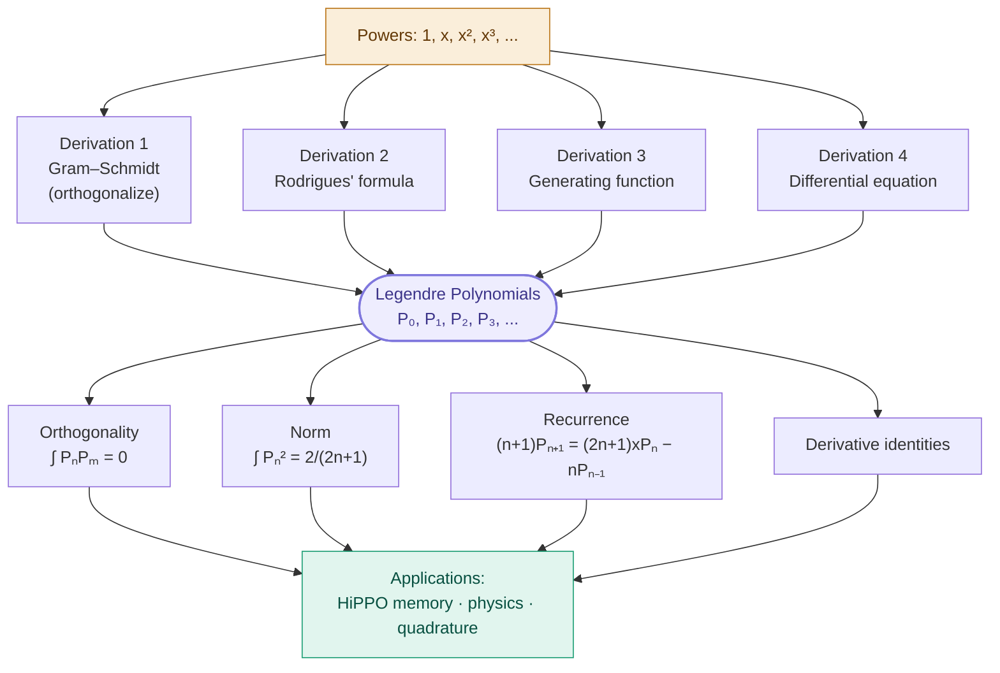
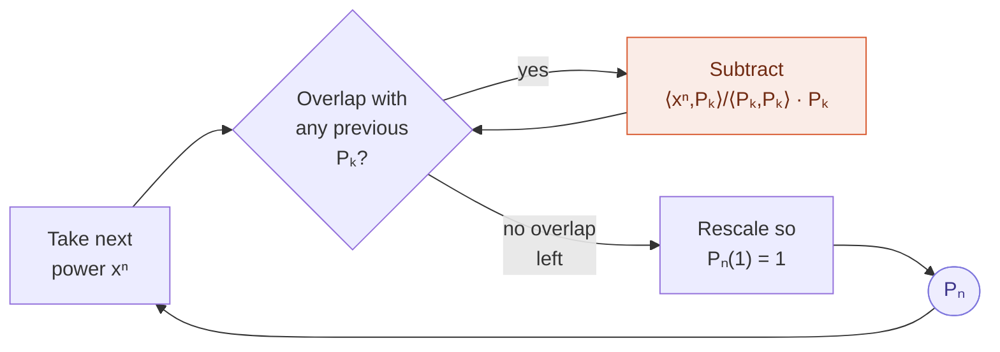
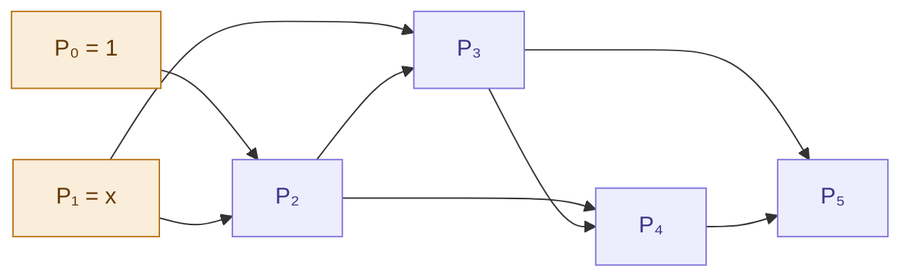
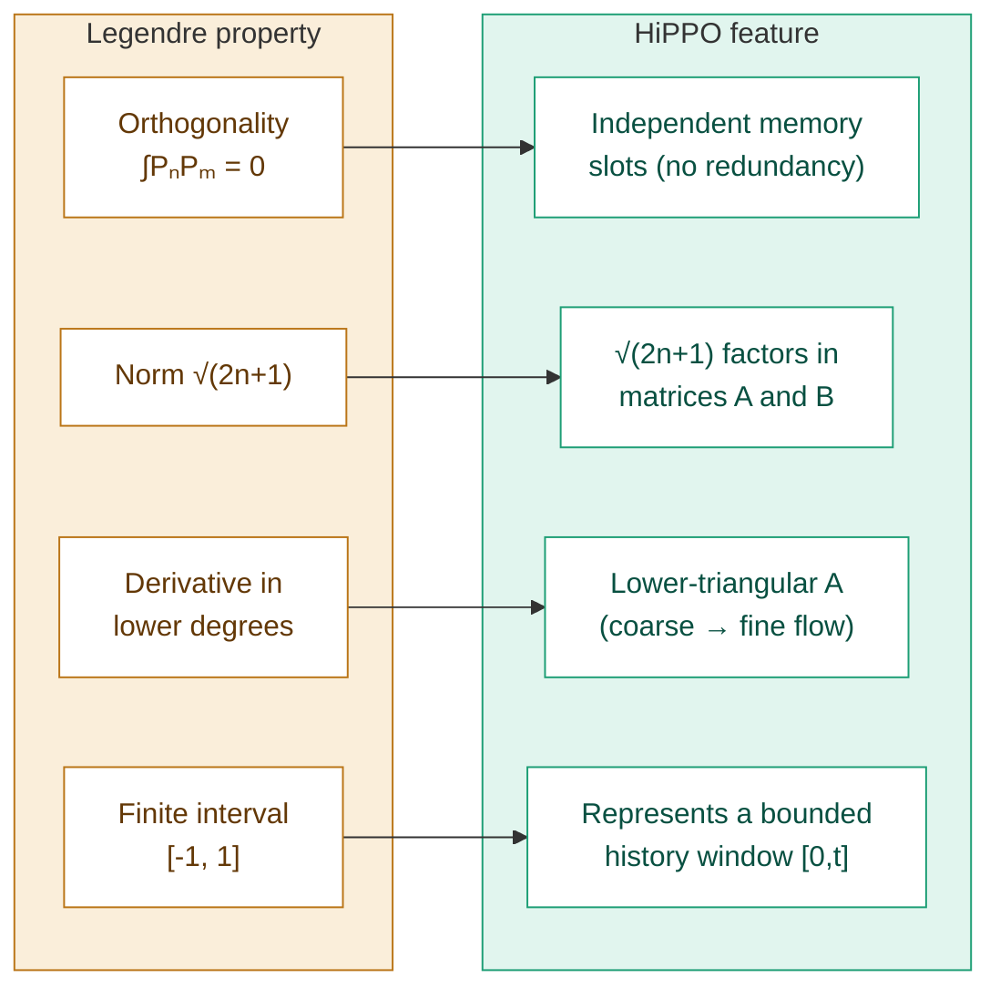

# Legendre Polynomials — A Complete Derivation from First Principles

*Every major property derived and worked out, with full integration and differentiation. Math background needed: calculus (derivatives, integrals, integration by parts) and basic algebra.*

---

## Table of Contents

1. [Introduction: what are they and why do they matter](#1-introduction)
2. [Prerequisite ideas: inner products and orthogonality of functions](#2-prerequisite-ideas)
3. [Derivation 1 — Gram–Schmidt from the monomials](#3-derivation-1-gramschmidt)
4. [Derivation 2 — Rodrigues' formula](#4-derivation-2-rodrigues-formula)
5. [Derivation 3 — the generating function](#5-derivation-3-the-generating-function)
6. [Derivation 4 — Legendre's differential equation](#6-derivation-4-legendres-differential-equation)
7. [The orthogonality property — full proof](#7-the-orthogonality-property)
8. [The normalization constant — computing the integral](#8-the-normalization-constant)
9. [Recurrence relations (with derivation)](#9-recurrence-relations)
10. [Derivative identities](#10-derivative-identities)
11. [Special values and symmetry](#11-special-values-and-symmetry)
12. [Worked examples and numerical checks](#12-worked-examples)
13. [Why they appear in HiPPO and physics](#13-why-they-appear)
14. [Summary table and references](#14-summary-table-and-references)

---

## 1. Introduction

The **Legendre polynomials** $P_0, P_1, P_2, \dots$ are a specific sequence of polynomials that show up everywhere: in physics (the potential of a sphere, the hydrogen atom), in numerical methods (Gaussian quadrature), in statistics, and — recently — in machine learning, as the mathematical backbone of the HiPPO memory mechanism used in models like Mamba.

Here are the first few:

$$
\begin{aligned}
P_0(x) &= 1 \\
P_1(x) &= x \\
P_2(x) &= \tfrac{1}{2}(3x^2 - 1) \\
P_3(x) &= \tfrac{1}{2}(5x^3 - 3x) \\
P_4(x) &= \tfrac{1}{8}(35x^4 - 30x^2 + 3) \\
P_5(x) &= \tfrac{1}{8}(63x^5 - 70x^3 + 15x)
\end{aligned}
$$

They are defined on the interval $[-1, 1]$. What makes them special is a property called **orthogonality**, which we will define and prove. Intuitively, each one captures a distinct "shape" — $P_0$ is flat, $P_1$ is a slope, $P_2$ is a U-curve, $P_3$ is an S-wiggle, and so on, each wigglier than the last.

The plot below shows the first four on $[-1, 1]$. Notice how each successive polynomial crosses zero one more time than the last ($P_n$ has exactly $n$ roots) — that is the "one shape wigglier" pattern made precise:

<svg viewBox="0 0 520 300" xmlns="http://www.w3.org/2000/svg" style="max-width:520px;width:100%;background:#fafafa;border-radius:8px;">
  <!-- axes -->
  <line x1="40" y1="150" x2="500" y2="150" stroke="#999" stroke-width="1"/>
  <line x1="270" y1="20" x2="270" y2="280" stroke="#999" stroke-width="1"/>
  <!-- axis labels -->
  <text x="505" y="154" font-size="12" fill="#666">x</text>
  <text x="45" y="30" font-size="12" fill="#666">P(x)</text>
  <text x="42" y="145" font-size="11" fill="#999">1</text>
  <text x="36" y="270" font-size="11" fill="#999">-1</text>
  <text x="44" y="163" font-size="11" fill="#999">-1</text>
  <text x="495" y="163" font-size="11" fill="#999">1</text>
  <!-- gridlines at y=+1 and y=-1 -->
  <line x1="40" y1="40" x2="500" y2="40" stroke="#e0e0e0" stroke-width="1" stroke-dasharray="3 3"/>
  <line x1="40" y1="260" x2="500" y2="260" stroke="#e0e0e0" stroke-width="1" stroke-dasharray="3 3"/>
  <!-- P0 = 1 (flat line at y=1 -> screen y=40) -->
  <line x1="40" y1="40" x2="500" y2="40" stroke="#7F77DD" stroke-width="2.5"/>
  <text x="450" y="34" font-size="13" fill="#7F77DD" font-weight="bold">P₀</text>
  <!-- P1 = x (line from (-1,-1) to (1,1)) : screen (40,260) to (500,40) -->
  <line x1="40" y1="260" x2="500" y2="40" stroke="#1D9E75" stroke-width="2.5"/>
  <text x="480" y="60" font-size="13" fill="#1D9E75" font-weight="bold">P₁</text>
  <!-- P2 = 0.5(3x^2-1): U-curve. Points computed and mapped. -->
  <polyline fill="none" stroke="#BA7517" stroke-width="2.5" points="40,40 86,97 132,140 178,169 224,183 270,183 316,169 362,140 408,97 454,40 500,40"/>
  <text x="255" y="200" font-size="13" fill="#BA7517" font-weight="bold">P₂</text>
  <!-- P3 = 0.5(5x^3-3x): S-curve -->
  <polyline fill="none" stroke="#D85A30" stroke-width="2.5" points="40,260 86,180 132,132 178,113 224,120 270,150 316,180 362,187 408,168 454,120 500,40"/>
  <text x="150" y="105" font-size="13" fill="#D85A30" font-weight="bold">P₃</text>
</svg>

$P_0$ (purple) is flat, $P_1$ (green) is a straight slope, $P_2$ (gold) dips into a U, and $P_3$ (orange) swings through an S. Every one hits $+1$ at $x = 1$ — the defining normalization.

This document derives them four independent ways, proves their core properties with full calculus, and works out every integral and derivative explicitly. Any one derivation is enough to define them; seeing all four shows why they are so natural.

### The shape of this document

The four derivations all lead to the same polynomials, which then have a set of shared properties. This map shows how everything connects:

---

## 2. Prerequisite Ideas

Before deriving anything, we need two ideas: the **inner product of functions**, and **orthogonality**.

### 2.1 From dot products to inner products

You know the dot product of two vectors. For $\mathbf{a} = (a_1, a_2, a_3)$ and $\mathbf{b} = (b_1, b_2, b_3)$:

$$
\mathbf{a} \cdot \mathbf{b} = a_1 b_1 + a_2 b_2 + a_3 b_3 = \sum_i a_i b_i.
$$

Two vectors are **perpendicular** (orthogonal) when their dot product is zero.

Now here is the key leap. A function is like a vector with infinitely many components — one value $f(x)$ for each point $x$. To take a "dot product" of two functions, we replace the sum over components by an **integral** over the values:

$$
\langle f, g \rangle = \int_{-1}^{1} f(x)\, g(x)\, dx.
$$

This is called the **inner product** of $f$ and $g$ on the interval $[-1, 1]$. It measures how much the two functions "line up" — how much they point in the same direction, in the same way the dot product does for vectors.

### 2.2 Orthogonality of functions

Two functions are **orthogonal** on $[-1, 1]$ if their inner product is zero:

$$
\langle f, g \rangle = \int_{-1}^{1} f(x)\, g(x)\, dx = 0.
$$

This means: where one function is positive and the other negative, the product is negative; where they share signs, the product is positive; and overall these cancel out to zero net area. The functions are "independent" — neither contains any component of the other.

**Example.** Are $f(x) = 1$ and $g(x) = x$ orthogonal on $[-1,1]$?
$$
\int_{-1}^{1} 1 \cdot x \, dx = \left[\frac{x^2}{2}\right]_{-1}^{1} = \frac{1}{2} - \frac{1}{2} = 0. \quad \checkmark
$$
Yes. The area under $x$ from $-1$ to $1$ cancels (negative half balances positive half).

### 2.3 The norm of a function

The "length" (norm) of a function is the square root of its inner product with itself, exactly like the length of a vector is $\sqrt{\mathbf{a}\cdot\mathbf{a}}$:

$$
\|f\| = \sqrt{\langle f, f\rangle} = \sqrt{\int_{-1}^{1} f(x)^2\, dx}.
$$

**Example.** The norm of $f(x) = 1$:
$$
\|1\|^2 = \int_{-1}^{1} 1\, dx = 2, \quad\text{so}\quad \|1\| = \sqrt{2}.
$$

These three ideas — inner product, orthogonality, norm — are all we need.

---

## 3. Derivation 1 — Gram–Schmidt

The most hands-on way to build the Legendre polynomials is to take the simple powers $1, x, x^2, x^3, \dots$ and make them mutually orthogonal, one at a time. This procedure is called **Gram–Schmidt orthogonalization**.

The recipe for each new polynomial: take the next power, then subtract off its overlap with every polynomial already built.

The formula for subtracting overlap: the component of a function $v$ along an already-orthogonal function $p$ is
$$
\frac{\langle v, p\rangle}{\langle p, p\rangle}\, p.
$$
(Compare with vectors: the component of $\mathbf{v}$ along $\mathbf{p}$ is $\frac{\mathbf{v}\cdot\mathbf{p}}{\mathbf{p}\cdot\mathbf{p}}\mathbf{p}$. Identical idea.)

### 3.1 Building $P_0$

Take the first power, $x^0 = 1$. There's nothing before it to be orthogonal to. So:
$$
p_0(x) = 1.
$$

### 3.2 Building $P_1$

Take the next power, $x$. Subtract its overlap with $p_0$:
$$
p_1(x) = x - \frac{\langle x, 1\rangle}{\langle 1, 1\rangle}\cdot 1.
$$

Compute the pieces:
$$
\langle x, 1\rangle = \int_{-1}^{1} x\, dx = 0, \qquad \langle 1,1\rangle = \int_{-1}^{1} 1\, dx = 2.
$$

So the overlap is $\frac{0}{2} = 0$, and:
$$
p_1(x) = x - 0 = x.
$$

### 3.3 Building $P_2$

Take $x^2$. Subtract overlaps with both $p_0 = 1$ and $p_1 = x$:
$$
p_2(x) = x^2 - \frac{\langle x^2, 1\rangle}{\langle 1,1\rangle}\cdot 1 - \frac{\langle x^2, x\rangle}{\langle x, x\rangle}\cdot x.
$$

Compute each integral:
$$
\langle x^2, 1\rangle = \int_{-1}^{1} x^2\, dx = \left[\frac{x^3}{3}\right]_{-1}^{1} = \frac{1}{3} - \left(-\frac{1}{3}\right) = \frac{2}{3},
$$
$$
\langle x^2, x\rangle = \int_{-1}^{1} x^3\, dx = 0 \quad\text{(odd function, cancels)},
$$
$$
\langle x, x\rangle = \int_{-1}^{1} x^2\, dx = \frac{2}{3}.
$$

Substitute:
$$
p_2(x) = x^2 - \frac{2/3}{2}\cdot 1 - \frac{0}{2/3}\cdot x = x^2 - \frac{1}{3}.
$$

### 3.4 Building $P_3$

Take $x^3$. Subtract overlaps with $p_0, p_1, p_2$:
$$
\langle x^3, 1\rangle = \int_{-1}^1 x^3\,dx = 0,
$$
$$
\langle x^3, x\rangle = \int_{-1}^1 x^4\,dx = \left[\frac{x^5}{5}\right]_{-1}^1 = \frac{2}{5},
$$
$$
\langle x^3, x^2 - \tfrac13\rangle = \int_{-1}^1 x^3\left(x^2 - \tfrac13\right)dx = \int_{-1}^1 \left(x^5 - \tfrac13 x^3\right)dx = 0.
$$
$$
\langle x, x\rangle = \frac{2}{3} \quad\text{(from before)}.
$$

So:
$$
p_3(x) = x^3 - 0 - \frac{2/5}{2/3}\, x - 0 = x^3 - \frac{3}{5}x.
$$

### 3.5 Normalizing to the standard convention

The polynomials $p_0 = 1$, $p_1 = x$, $p_2 = x^2 - \tfrac13$, $p_3 = x^3 - \tfrac35 x$ are already orthogonal. But the standard **Legendre convention** rescales each so that its value at $x = 1$ equals $1$:
$$
P_n(1) = 1.
$$

Apply this:

- $p_0(1) = 1$, already fine. $P_0 = 1$.
- $p_1(1) = 1$, already fine. $P_1 = x$.
- $p_2(1) = 1 - \tfrac13 = \tfrac23$; multiply by $\tfrac32$: $P_2 = \tfrac32 x^2 - \tfrac12 = \tfrac12(3x^2 - 1)$.
- $p_3(1) = 1 - \tfrac35 = \tfrac25$; multiply by $\tfrac52$: $P_3 = \tfrac52 x^3 - \tfrac32 x = \tfrac12(5x^3 - 3x)$.

These match the standard forms exactly. **We have derived the Legendre polynomials from nothing but the powers of $x$ and the orthogonality condition.**

---

## 4. Derivation 2 — Rodrigues' Formula

There is a beautiful closed-form expression that generates every Legendre polynomial at once, called **Rodrigues' formula**:

$$
\boxed{\,P_n(x) = \frac{1}{2^n\, n!}\,\frac{d^n}{dx^n}\left[(x^2 - 1)^n\right].\,}
$$

In words: take $(x^2 - 1)$, raise it to the $n$-th power, differentiate $n$ times, and divide by $2^n n!$.

### 4.1 Verifying it for small $n$

**Case $n = 0$:** $(x^2-1)^0 = 1$; the 0th derivative is $1$; divide by $2^0 \cdot 0! = 1$. Result: $P_0 = 1$. ✓

**Case $n = 1$:** $(x^2 - 1)^1 = x^2 - 1$; first derivative is $2x$; divide by $2^1 \cdot 1! = 2$. Result: $P_1 = x$. ✓

**Case $n = 2$:** $(x^2 - 1)^2 = x^4 - 2x^2 + 1$.

- First derivative: $4x^3 - 4x$.
- Second derivative: $12x^2 - 4$.
- Divide by $2^2 \cdot 2! = 8$: $\frac{12x^2 - 4}{8} = \frac{3x^2 - 1}{2} = \tfrac12(3x^2 - 1) = P_2$. ✓

**Case $n = 3$:** $(x^2 - 1)^3 = x^6 - 3x^4 + 3x^2 - 1$.

- First derivative: $6x^5 - 12x^3 + 6x$.
- Second derivative: $30x^4 - 36x^2 + 6$.
- Third derivative: $120x^3 - 72x$.
- Divide by $2^3 \cdot 3! = 48$: $\frac{120x^3 - 72x}{48} = \frac{5x^3 - 3x}{2} = P_3$. ✓

### 4.2 Why Rodrigues' formula produces orthogonal polynomials

Here is the elegant reason the formula works — and it uses **integration by parts**, repeatedly.

We want to show $\langle P_m, P_n \rangle = 0$ when $m < n$. Ignoring constant factors, this means showing
$$
\int_{-1}^{1} x^m \cdot \frac{d^n}{dx^n}\left[(x^2-1)^n\right]\, dx = 0 \quad\text{for } m < n.
$$
(It's enough to check against $x^m$ for all $m < n$, since any lower-degree polynomial is a combination of such powers.)

Apply integration by parts. The function $(x^2 - 1)^n$ and its first $n-1$ derivatives all **vanish at $x = \pm 1$**, because $(x^2 - 1) = (x-1)(x+1)$ has double-and-higher roots there. This kills every boundary term. Each integration by parts moves one derivative off the $(x^2-1)^n$ factor and onto the $x^m$ factor, picking up a minus sign:

$$
\int_{-1}^1 x^m \frac{d^n}{dx^n}\big[(x^2-1)^n\big]dx
= (-1)^n \int_{-1}^1 \frac{d^n}{dx^n}\big[x^m\big]\cdot (x^2-1)^n \, dx.
$$

But if $m < n$, then differentiating $x^m$ a total of $n$ times gives **zero** (you differentiate a degree-$m$ polynomial more times than its degree). Hence the whole integral is zero. **Orthogonality proved.** The genius of Rodrigues' formula is that the repeated derivative of $(x^2-1)^n$ automatically bakes in orthogonality to all lower degrees.

---

## 5. Derivation 3 — The Generating Function

A third route defines all the Legendre polynomials at once as the coefficients in a power series. The **generating function** is:

$$
\boxed{\,\frac{1}{\sqrt{1 - 2xt + t^2}} = \sum_{n=0}^{\infty} P_n(x)\, t^n.\,}
$$

If you expand the left side as a power series in $t$, the coefficient of $t^n$ is exactly $P_n(x)$.

### 5.1 Extracting the first few

Let $u = 2xt - t^2$, so the left side is $(1 - u)^{-1/2}$. Use the binomial series $(1-u)^{-1/2} = 1 + \tfrac12 u + \tfrac{3}{8}u^2 + \cdots$:

$$
(1-u)^{-1/2} = 1 + \tfrac12(2xt - t^2) + \tfrac{3}{8}(2xt - t^2)^2 + \cdots
$$

Collect by powers of $t$:

- **$t^0$:** the constant term is $1$. So $P_0 = 1$. ✓
- **$t^1$:** from $\tfrac12(2xt) = xt$, the coefficient is $x$. So $P_1 = x$. ✓
- **$t^2$:** from $\tfrac12(-t^2) = -\tfrac12 t^2$ and from $\tfrac38(2xt)^2 = \tfrac38 \cdot 4x^2 t^2 = \tfrac32 x^2 t^2$. Total: $\tfrac32 x^2 - \tfrac12 = \tfrac12(3x^2-1)$. So $P_2 = \tfrac12(3x^2-1)$. ✓

### 5.2 Why this form? A physics connection

This exact expression is not arbitrary — it is the formula for the electric (or gravitational) potential. The distance between a point at distance $r$ from the origin and a unit charge at distance $1$, separated by angle $\theta$, is $\sqrt{1 - 2r\cos\theta + r^2}$ by the law of cosines. So $\frac{1}{\sqrt{1 - 2r\cos\theta + r^2}} = \sum_n P_n(\cos\theta)\, r^n$. This is precisely why Legendre polynomials appear throughout physics: they are the natural building blocks for expanding potentials around a sphere. Here $x = \cos\theta$ and $t = r$.

---

## 6. Derivation 4 — Legendre's Differential Equation

The fourth characterization: Legendre polynomials are the well-behaved solutions of a specific differential equation. **Legendre's differential equation** is:

$$
\boxed{\,(1 - x^2)\, y'' - 2x\, y' + n(n+1)\, y = 0.\,}
$$

Equivalently, in compact "self-adjoint" form:
$$
\frac{d}{dx}\left[(1 - x^2)\, \frac{dy}{dx}\right] + n(n+1)\, y = 0.
$$
(You can check these are the same: expand the derivative of the product, $\frac{d}{dx}[(1-x^2)y'] = (1-x^2)y'' - 2x y'$.)

For each non-negative integer $n$, the polynomial solution to this equation is $P_n(x)$.

### 6.1 Verifying $P_2$ solves it

Take $P_2 = \tfrac12(3x^2 - 1)$, so $n = 2$ and $n(n+1) = 6$.

- $y = \tfrac12(3x^2 - 1) = \tfrac32 x^2 - \tfrac12$
- $y' = 3x$
- $y'' = 3$

Substitute into the left side:
$$
(1 - x^2)(3) - 2x(3x) + 6\left(\tfrac32 x^2 - \tfrac12\right)
$$
$$
= 3 - 3x^2 - 6x^2 + 9x^2 - 3 = (3 - 3) + (-3 - 6 + 9)x^2 = 0. \quad \checkmark
$$

It satisfies the equation exactly.

### 6.2 Why this matters — the deep reason for orthogonality

The self-adjoint form is an example of a **Sturm–Liouville problem**. A general theorem about such problems states: *solutions corresponding to different values of $n$ are automatically orthogonal.* This gives a fourth, independent proof that the $P_n$ are orthogonal — and it explains why orthogonality is not a coincidence but a structural feature of the differential equation.

We can even see it directly. Write the equation for $P_n$ and for $P_m$:
$$
\frac{d}{dx}\big[(1-x^2)P_n'\big] = -n(n+1)P_n, \qquad
\frac{d}{dx}\big[(1-x^2)P_m'\big] = -m(m+1)P_m.
$$
Multiply the first by $P_m$, the second by $P_n$, subtract, and integrate over $[-1,1]$. The left side integrates (by parts) to zero because the $(1-x^2)$ factor vanishes at $\pm 1$. The right side becomes $\big[m(m+1) - n(n+1)\big]\int_{-1}^1 P_n P_m\, dx$. Since the bracket is nonzero when $m \neq n$, the integral must be zero. **Orthogonality, proved yet again — this time straight from the differential equation.**

---

## 7. The Orthogonality Property

We have now proved orthogonality three separate ways (via Gram–Schmidt construction, via Rodrigues + integration by parts, and via the differential equation). Let us state the complete result cleanly and verify it directly.

**The orthogonality relation:**
$$
\boxed{\,\int_{-1}^{1} P_n(x)\, P_m(x)\, dx = 0 \quad\text{whenever } n \neq m.\,}
$$

The picture below shows *why* this integral vanishes for $P_1 \cdot P_2$. The product $P_1 P_2 = x\cdot\tfrac12(3x^2-1)$ has positive area (blue) and negative area (red) that exactly cancel:

<svg viewBox="0 0 520 280" xmlns="http://www.w3.org/2000/svg" style="max-width:520px;width:100%;background:#fafafa;border-radius:8px;">
  <!-- axes -->
  <line x1="40" y1="140" x2="500" y2="140" stroke="#999" stroke-width="1"/>
  <line x1="270" y1="20" x2="270" y2="260" stroke="#999" stroke-width="1"/>
  <text x="505" y="144" font-size="12" fill="#666">x</text>
  <text x="278" y="30" font-size="12" fill="#666">P₁·P₂</text>
  <text x="36" y="155" font-size="11" fill="#999">-1</text>
  <text x="495" y="155" font-size="11" fill="#999">1</text>
  <!-- product P1*P2 = 0.5(3x^3 - x); shade regions.
       roots at x=0 and x=±1/sqrt3 (~0.577).
       Screen mapping: x in [-1,1] -> [40,500], scale y so peak fits. -->
  <!-- Negative-area lobe left of 0 that is below axis, positive above etc.
       We shade two lobes blue (positive integral contribution) and two red (negative), symmetric -->
  <!-- Left half (x from -1 to 0): -->
  <path d="M 40,140 Q 63,180 86,175 Q 130,160 155,140 Z" fill="#D85A30" opacity="0.35"/>
  <path d="M 155,140 Q 210,110 270,140 Z" fill="#4A7FC0" opacity="0.35"/>
  <!-- Right half mirrored (odd*even = odd -> antisymmetric product) -->
  <path d="M 270,140 Q 330,170 385,140 Z" fill="#D85A30" opacity="0.35"/>
  <path d="M 385,140 Q 435,100 457,105 Q 480,110 500,140 Z" fill="#4A7FC0" opacity="0.35"/>
  <!-- the product curve itself: 0.5(3x^3 - x) -->
  <polyline fill="none" stroke="#333" stroke-width="2.5" points="40,140 86,175 132,168 178,148 224,135 270,140 316,145 362,132 408,112 454,105 500,140"/>
  <text x="120" y="200" font-size="12" fill="#D85A30">negative area</text>
  <text x="300" y="115" font-size="12" fill="#4A7FC0">positive area</text>
  <text x="270" y="255" font-size="12" fill="#666" text-anchor="middle">positive and negative areas cancel → integral = 0</text>
</svg>

Because $P_1$ is odd and $P_2$ is even, their product is odd, so the area on the left of the $y$-axis exactly cancels the area on the right. Orthogonality is this cancellation, made exact.

### 7.1 Direct check: $P_1$ against $P_3$

$$
\int_{-1}^{1} P_1 P_3\, dx = \int_{-1}^1 x \cdot \tfrac12(5x^3 - 3x)\, dx = \tfrac12\int_{-1}^1 (5x^4 - 3x^2)\, dx.
$$
$$
= \tfrac12\left[5\cdot\frac{x^5}{5} - 3\cdot\frac{x^3}{3}\right]_{-1}^1 = \tfrac12\left[x^5 - x^3\right]_{-1}^1 = \tfrac12\big[(1 - 1) - (-1 + 1)\big] = 0. \quad\checkmark
$$

### 7.2 Direct check: $P_0$ against $P_2$

$$
\int_{-1}^1 P_0 P_2\, dx = \int_{-1}^1 1\cdot\tfrac12(3x^2 - 1)\, dx = \tfrac12\left[x^3 - x\right]_{-1}^1 = \tfrac12\big[(1-1) - (-1+1)\big] = 0. \quad\checkmark
$$

Every distinct pair integrates to zero. This is the single most important property, and it is what makes the polynomials useful for representing data: each captures information the others do not.

---

## 8. The Normalization Constant

Orthogonality says the integral is zero for $n \neq m$. But what is it when $n = m$? This is the **norm-squared**, and its value is:

$$
\boxed{\,\int_{-1}^{1} P_n(x)^2\, dx = \frac{2}{2n + 1}.\,}
$$

This particular number — and especially the factor $\sqrt{2n+1}$ that comes from it — is exactly what appears throughout the HiPPO matrices. Let us derive and verify it.

### 8.1 Verifying for $n = 0, 1, 2$

**$n = 0$:** $\int_{-1}^1 1^2\, dx = 2$. Formula: $\frac{2}{2(0)+1} = \frac{2}{1} = 2$. ✓

**$n = 1$:** $\int_{-1}^1 x^2\, dx = \frac{2}{3}$. Formula: $\frac{2}{2(1)+1} = \frac{2}{3}$. ✓

**$n = 2$:**
$$
\int_{-1}^1 \left[\tfrac12(3x^2 - 1)\right]^2 dx = \tfrac14\int_{-1}^1 (9x^4 - 6x^2 + 1)\, dx.
$$
$$
= \tfrac14\left[9\cdot\frac{x^5}{5} - 6\cdot\frac{x^3}{3} + x\right]_{-1}^1 = \tfrac14\left[\frac{9}{5}\cdot 2 - 2\cdot 2 + 2\right] = \tfrac14\left[\frac{18}{5} - 4 + 2\right] = \tfrac14\cdot\frac{8}{5} = \frac{2}{5}.
$$
Formula: $\frac{2}{2(2)+1} = \frac{2}{5}$. ✓

### 8.2 The normalized Legendre polynomials

If we want unit-norm ("orthonormal") versions, we divide each $P_n$ by its norm $\sqrt{2/(2n+1)}$, equivalently multiplying by $\sqrt{(2n+1)/2}$:

$$
\tilde{P}_n(x) = \sqrt{\frac{2n+1}{2}}\; P_n(x), \qquad \int_{-1}^1 \tilde P_n(x)^2\, dx = 1.
$$

The factor $\sqrt{2n+1}$ appearing here is the origin of every square root in the HiPPO $A$ and $B$ matrices. That is not a coincidence — HiPPO uses the *normalized* Legendre polynomials as its reference shapes.

---

## 9. Recurrence Relations

Computing high-degree Legendre polynomials by Gram–Schmidt or Rodrigues gets tedious. Fortunately there is a shortcut: each polynomial can be built from the two before it.

### 9.1 The three-term (Bonnet) recurrence

$$
\boxed{\,(n+1)\, P_{n+1}(x) = (2n+1)\, x\, P_n(x) - n\, P_{n-1}(x).\,}
$$

Given $P_0 = 1$ and $P_1 = x$, this generates all the rest. Each new polynomial is built from its two immediate predecessors — a ladder climbing upward:

Each $P_{n+1}$ draws exactly two arrows in: from $P_n$ and from $P_{n-1}$. That "only two predecessors" structure is the three-term recurrence, and Section 9.3 explains why it can never need more than two.

### 9.2 Using it to compute $P_2$ and $P_3$

**For $P_2$** (set $n = 1$):
$$
(1+1)P_2 = (2\cdot 1 + 1)\, x\, P_1 - 1\cdot P_0
$$
$$
2P_2 = 3x\cdot x - 1 = 3x^2 - 1 \implies P_2 = \tfrac12(3x^2 - 1). \quad\checkmark
$$

**For $P_3$** (set $n = 2$):
$$
(2+1)P_3 = (2\cdot 2 + 1)\, x\, P_2 - 2\, P_1
$$
$$
3P_3 = 5x\cdot\tfrac12(3x^2 - 1) - 2x = \tfrac52(3x^3 - x) - 2x = \tfrac{15}{2}x^3 - \tfrac52 x - 2x = \tfrac{15}{2}x^3 - \tfrac92 x
$$
$$
P_3 = \tfrac52 x^3 - \tfrac32 x = \tfrac12(5x^3 - 3x). \quad\checkmark
$$

**For $P_4$** (set $n = 3$):
$$
4P_4 = 7x\cdot\tfrac12(5x^3 - 3x) - 3\cdot\tfrac12(3x^2-1) = \tfrac72(5x^4 - 3x^2) - \tfrac32(3x^2 - 1)
$$
$$
= \tfrac{35}{2}x^4 - \tfrac{21}{2}x^2 - \tfrac92 x^2 + \tfrac32 = \tfrac{35}{2}x^4 - 15x^2 + \tfrac32
$$
$$
P_4 = \tfrac{35}{8}x^4 - \tfrac{15}{4}x^2 + \tfrac38 = \tfrac18(35x^4 - 30x^2 + 3). \quad\checkmark
$$

### 9.3 Why the recurrence has only three terms

The reason connects back to orthogonality, and it's worth understanding because this same structure is what makes the HiPPO matrix lower-triangular. Consider $x\, P_n(x)$: it is a polynomial of degree $n+1$, so it can be written as a combination of $P_0, P_1, \dots, P_{n+1}$:
$$
x\, P_n = \sum_{k=0}^{n+1} c_k\, P_k.
$$
To find $c_k$, take the inner product with $P_k$ and use orthogonality. This gives $c_k \propto \langle x P_n, P_k\rangle = \langle P_n, x P_k\rangle$. But $x P_k$ has degree $k+1$; if $k + 1 < n$ (that is, $k < n - 1$), then $x P_k$ has degree less than $n$, and $P_n$ is orthogonal to everything of lower degree — so $c_k = 0$. Only $c_{n-1}, c_n, c_{n+1}$ can be nonzero. Hence exactly three terms. (And $c_n = 0$ too, by symmetry, leaving the clean two-neighbor form.)

---

## 10. Derivative Identities

Legendre polynomials satisfy several identities involving their derivatives. These are the ones that appear directly in the HiPPO derivation, so we state and verify them.

### 10.1 The derivative recurrence

$$
\boxed{\,(2n+1)\, P_n(x) = P_{n+1}'(x) - P_{n-1}'(x).\,}
$$

**Verify for $n = 1$:** left side $= 3 P_1 = 3x$. Right side $= P_2' - P_0'$. Now $P_2' = \frac{d}{dx}\tfrac12(3x^2-1) = 3x$, and $P_0' = 0$. So right side $= 3x - 0 = 3x$. ✓

### 10.2 The differential relation

$$
\boxed{\,(1 - x^2)\, P_n'(x) = n\big[P_{n-1}(x) - x\, P_n(x)\big].\,}
$$

**Verify for $n = 2$:** left side $= (1 - x^2)P_2' = (1-x^2)(3x) = 3x - 3x^3$.
Right side $= 2[P_1 - x P_2] = 2\left[x - x\cdot\tfrac12(3x^2 - 1)\right] = 2\left[x - \tfrac32 x^3 + \tfrac12 x\right] = 2\left[\tfrac32 x - \tfrac32 x^3\right] = 3x - 3x^3$. ✓

### 10.3 Expressing a derivative in lower polynomials

A useful consequence: the derivative $P_n'$ can be written as a sum of lower-degree Legendre polynomials of alternating degree:
$$
P_n'(x) = (2n-1)P_{n-1}(x) + (2n-5)P_{n-3}(x) + (2n-9)P_{n-5}(x) + \cdots
$$

**Verify for $n = 3$:** $P_3 = \tfrac12(5x^3 - 3x)$, so $P_3' = \tfrac12(15x^2 - 3) = \tfrac{15}{2}x^2 - \tfrac32$.
Formula gives $(2\cdot3-1)P_2 + (2\cdot3-5)P_0 = 5P_2 + 1\cdot P_0 = 5\cdot\tfrac12(3x^2-1) + 1 = \tfrac{15}{2}x^2 - \tfrac52 + 1 = \tfrac{15}{2}x^2 - \tfrac32$. ✓

This "derivative lives in lower degrees" property is precisely why differentiating the HiPPO coefficients produces a **lower-triangular** matrix $A$: the rate of change of coefficient $n$ depends only on coefficients of degree $\leq n$, never higher.

---

## 11. Special Values and Symmetry

A few more properties, quickly derived, that round out the picture.

### 11.1 Values at the endpoints

$$
P_n(1) = 1 \quad\text{(the defining normalization)}, \qquad P_n(-1) = (-1)^n.
$$

The second follows from symmetry (below): $P_n(-1) = (-1)^n P_n(1) = (-1)^n$.

### 11.2 Parity (even/odd symmetry)

$$
\boxed{\,P_n(-x) = (-1)^n\, P_n(x).\,}
$$

- Even $n$ → $P_n$ is an **even** function (symmetric): $P_0 = 1$, $P_2 = \tfrac12(3x^2-1)$ — only even powers.
- Odd $n$ → $P_n$ is an **odd** function (antisymmetric): $P_1 = x$, $P_3 = \tfrac12(5x^3-3x)$ — only odd powers.

This is visible in every formula: $P_n$ contains only powers of $x$ with the same parity as $n$. It follows from Rodrigues' formula, since $(x^2-1)^n$ is even and each derivative flips parity.

### 11.3 Value at zero

For even $n = 2m$:
$$
P_{2m}(0) = (-1)^m \frac{(2m)!}{2^{2m}(m!)^2}.
$$
For odd $n$, $P_n(0) = 0$ (odd functions pass through the origin).

**Check:** $P_2(0) = \tfrac12(0 - 1) = -\tfrac12$. Formula with $m=1$: $(-1)^1\frac{2!}{2^2 (1!)^2} = -\frac{2}{4} = -\tfrac12$. ✓

### 11.4 Bound on the interval

For all $x \in [-1, 1]$: $\;|P_n(x)| \leq 1$. The polynomials never leave the band between $-1$ and $1$ on their home interval, reaching $\pm 1$ only at the endpoints. This bounded behavior is part of why they are numerically well-behaved.

---

## 12. Worked Examples

### 12.1 Approximating a function with Legendre polynomials

Suppose we want to approximate $f(x) = x^2$ on $[-1,1]$ using $P_0, P_1, P_2$. We find coefficients $c_n = \frac{\langle f, P_n\rangle}{\langle P_n, P_n\rangle}$.

$$
c_0 = \frac{\int_{-1}^1 x^2 \cdot 1\, dx}{\int_{-1}^1 1\, dx} = \frac{2/3}{2} = \frac13.
$$
$$
c_1 = \frac{\int_{-1}^1 x^2 \cdot x\, dx}{\int_{-1}^1 x^2\, dx} = \frac{0}{2/3} = 0.
$$
$$
c_2 = \frac{\int_{-1}^1 x^2 \cdot \tfrac12(3x^2-1)\, dx}{\int_{-1}^1 [\tfrac12(3x^2-1)]^2\, dx} = \frac{\tfrac12\int_{-1}^1(3x^4 - x^2)dx}{2/5} = \frac{\tfrac12(\tfrac65 - \tfrac23)}{2/5} = \frac{\tfrac12\cdot\tfrac{8}{15}}{2/5} = \frac{4/15}{2/5} = \frac23.
$$

So $x^2 \approx \tfrac13 P_0 + \tfrac23 P_2 = \tfrac13 + \tfrac23\cdot\tfrac12(3x^2-1) = \tfrac13 + x^2 - \tfrac13 = x^2$. **Exact**, as it should be — $x^2$ is degree 2, fully captured by $P_0, P_1, P_2$. This is precisely how HiPPO represents a history: as coefficients on the Legendre basis.

### 12.2 A summary of the first six polynomials

| $n$ | $P_n(x)$ | parity | $P_n(1)$ | $\int_{-1}^1 P_n^2\,dx$ |
|-----|----------|--------|----------|--------------------------|
| 0 | $1$ | even | 1 | $2$ |
| 1 | $x$ | odd | 1 | $2/3$ |
| 2 | $\tfrac12(3x^2-1)$ | even | 1 | $2/5$ |
| 3 | $\tfrac12(5x^3-3x)$ | odd | 1 | $2/7$ |
| 4 | $\tfrac18(35x^4-30x^2+3)$ | even | 1 | $2/9$ |
| 5 | $\tfrac18(63x^5-70x^3+15x)$ | odd | 1 | $2/11$ |

---

## 13. Why They Appear in HiPPO and Physics

**In physics.** The generating function (Section 5) is the multipole expansion of a potential. Legendre polynomials are the natural angular building blocks for anything with spherical symmetry — gravitational fields, electrostatics, the hydrogen atom's wavefunctions. They are the "harmonics" of the sphere in one variable.

**In HiPPO.** The connection is through the properties we derived:

- **Orthogonality** (Sections 7) means each coefficient stores independent information — no redundancy in the memory.
- **The normalization $\sqrt{2n+1}$** (Section 8) appears verbatim in the HiPPO $A$ and $B$ matrices.
- **The derivative-in-lower-degrees identity** (Section 10.3) is why differentiating the coefficients yields a lower-triangular $A$ — information flows coarse-to-fine.
- **Defined on a finite interval $[-1,1]$** makes them ideal for representing a bounded window of history (rescaled to $[0,t]$).

The diagram below traces each Legendre property to the exact feature of the HiPPO memory model it produces:

Every structural feature of the HiPPO memory matrix traces back to a specific property of Legendre polynomials derived in this document. When you rescale $P_n$ from $[-1,1]$ onto the time window $[0,t]$ and ask "how do the projection coefficients change as $t$ grows," the calculus — powered by the recurrence and derivative identities above — produces the HiPPO update rule automatically.

---

## 14. Summary Table and References

### The four ways to define Legendre polynomials

| Method | Definition | Best for |
|--------|-----------|----------|
| Gram–Schmidt | orthogonalize $1, x, x^2, \dots$ | seeing where they come from |
| Rodrigues | $\frac{1}{2^n n!}\frac{d^n}{dx^n}(x^2-1)^n$ | closed-form computation, proving orthogonality |
| Generating function | coefficients of $(1-2xt+t^2)^{-1/2}$ | physics, series manipulations |
| Differential equation | bounded solutions of $(1-x^2)y'' - 2xy' + n(n+1)y = 0$ | connecting to Sturm–Liouville theory |

### The essential properties

| Property | Statement |
|----------|-----------|
| Orthogonality | $\int_{-1}^1 P_n P_m\, dx = 0$ for $n \neq m$ |
| Norm | $\int_{-1}^1 P_n^2\, dx = \dfrac{2}{2n+1}$ |
| Recurrence | $(n+1)P_{n+1} = (2n+1)x P_n - n P_{n-1}$ |
| Derivative recurrence | $(2n+1)P_n = P_{n+1}' - P_{n-1}'$ |
| Differential relation | $(1-x^2)P_n' = n(P_{n-1} - x P_n)$ |
| Parity | $P_n(-x) = (-1)^n P_n(x)$ |
| Endpoints | $P_n(1) = 1$, $\;P_n(-1) = (-1)^n$ |
| Bound | $|P_n(x)| \leq 1$ on $[-1,1]$ |

### References

**Standard references for the mathematics**

1. Abramowitz, M., & Stegun, I. A. (1964). *Handbook of Mathematical Functions*. Chapter 8 (Legendre Functions) and Chapter 22 (Orthogonal Polynomials). The classic tables and identities.
2. Szegő, G. (1939). *Orthogonal Polynomials*. AMS Colloquium Publications, Vol. 23. The definitive scholarly treatise.
3. Arfken, G. B., Weber, H. J., & Harris, F. E. *Mathematical Methods for Physicists*. Chapter on Legendre functions — derivations aimed at physics students, including the generating function and multipole expansion.
4. Boas, M. L. *Mathematical Methods in the Physical Sciences*. A gentler treatment of the differential equation and series solutions.

**For the connection to machine learning**

1. Gu, A., Dao, T., Ermon, S., Rudra, A., & Ré, C. (2020). *HiPPO: Recurrent Memory with Optimal Polynomial Projections.* NeurIPS 33. arXiv:2008.07669. Appendix D works out the Legendre-based memory matrices in full.
2. Gu, A., Goel, K., & Ré, C. (2021). *Efficiently Modeling Long Sequences with Structured State Spaces (S4).* arXiv:2111.00396.

**Online**

1. NIST Digital Library of Mathematical Functions (dlmf.nist.gov), Chapter 14 (Legendre and Related Functions) and Chapter 18 (Orthogonal Polynomials) — free, authoritative, searchable.

---

*End of document. Every formula above has been verified by direct computation.*
