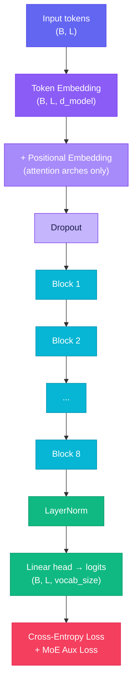
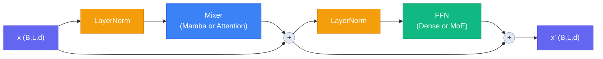
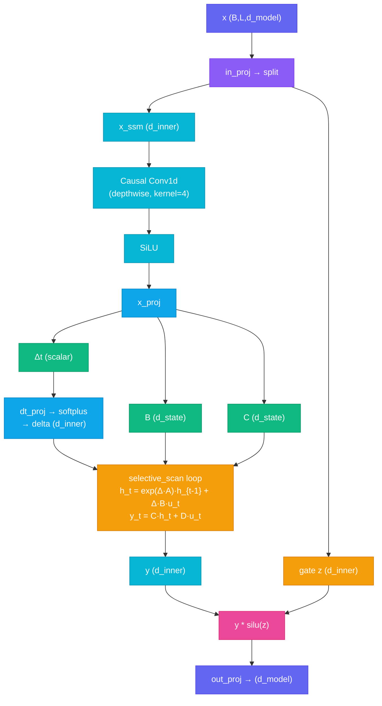
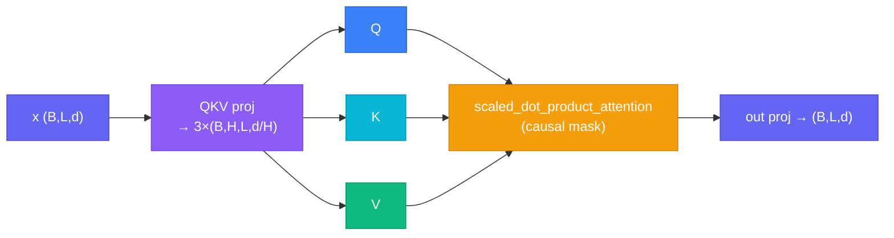
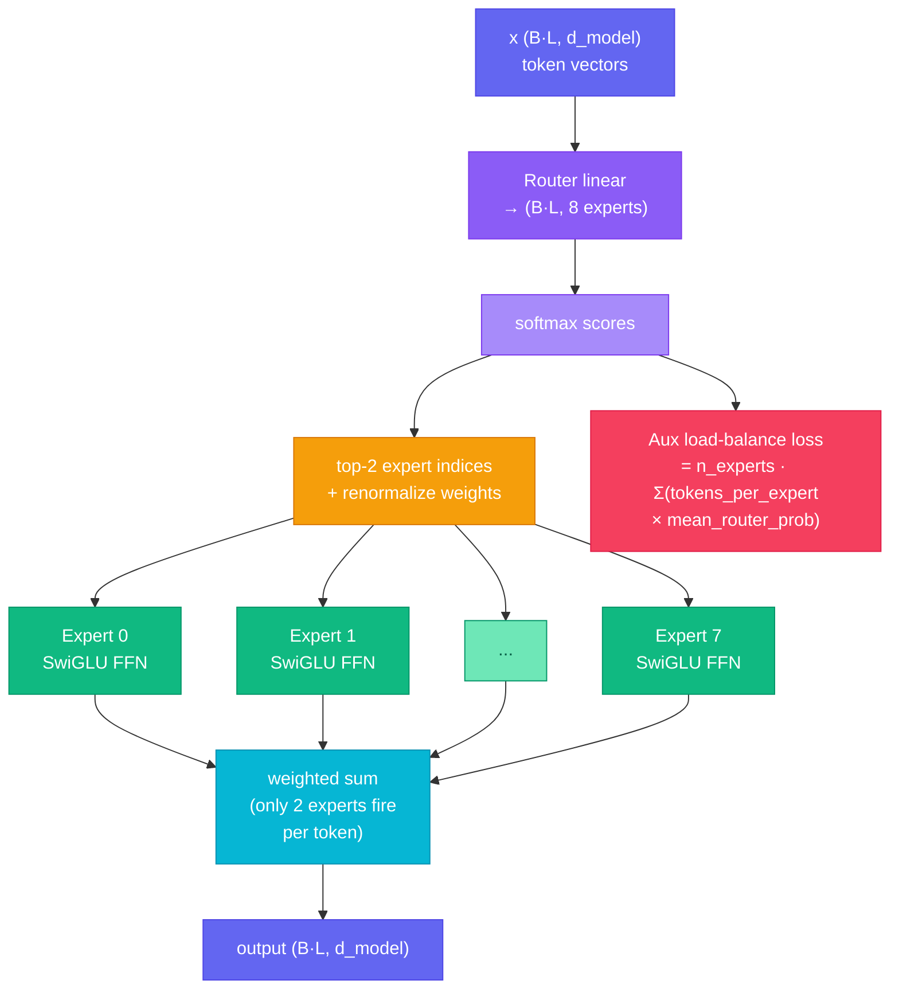
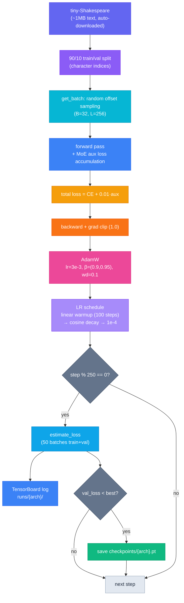

# jamba — Mamba + Attention + Mixture-of-Experts, from scratch

A standalone project that combines the three ideas the modern LLM frontier
converged on, in one configurable model you can train on a MacBook Air M2 (or any
machine):

- **Mamba blocks** — selective state space, `O(L)` memory, fixed-size state
- **Attention blocks** — exact recall, `O(L²)`, inserted sparingly
- **Mixture-of-Experts** — many expert FFNs, only the top-k run per token

This mirrors what AI21's **Jamba** ships: a mostly-Mamba backbone with a little
attention to patch recall, plus MoE for capacity. Everything is written from
scratch and heavily commented.

---

## ⚠️ Read this first — how to run (avoids the "No module named 'model'" error)

The scripts import each other (`from model import ...`). Python only finds those
imports if it knows where the files are. This project handles that automatically
via `_bootstrap.py` (every script imports it first, which adds the project folder
to Python's path) — **so it works no matter which directory you run from.**

Still, the clean way to run is:

```bash
cd path/to/jamba        # go INTO the project folder
python smoke_test.py    # then run
```

If you use an IDE (VS Code / PyCharm), open the **jamba folder itself** as your
project/workspace so the working directory matches. If you ever still hit an
import error, it means `model.py` and the script aren't in the same folder — make
sure all files below live together in one `jamba/` folder.

---

## Files

| File | Purpose |
| ------ | --------- |
| `model.py` | The `JambaLM` model — mamba/attention mixers + dense/MoE FFNs, plus the char tokenizer |
| `utils.py` | Shared helpers: device pick, data loading, batching, LR schedule |
| `_bootstrap.py` | Tiny import-path fix imported by every script (prevents ModuleNotFoundError) |
| `train.py` | Train any architecture (`--arch mamba/transformer/hybrid/jamba`) |
| `demo.py` | Compare all four (params, active/token, layout) + MoE routing — **no training** |
| `generate.py` | Load a checkpoint and generate text |
| `visualize_model.py` | torchinfo / torchview / Netron + MoE routing heatmap |
| `smoke_test.py` | ~15-second check that everything runs — **run first** |
| `requirements.txt` | `torch` + `matplotlib` |
| `requirements-viz.txt` | Optional visualization libraries |

---

## Quick start

```bash
python3 -m venv venv && source venv/bin/activate   # (Windows: venv\Scripts\activate)
pip install torch matplotlib

python smoke_test.py     # confirm everything runs
python demo.py           # see the four architectures compared (instant)
python train.py          # train the full jamba model on Shakespeare
python generate.py --seed "ROMEO:"    # generate from the trained model
```

---

## Project folder layout

After training, the project produces two runtime directories alongside the source files:

```folder
jamba/
├── checkpoints/          # saved model weights (one .pt file per arch)
│   ├── jamba.pt
│   ├── mamba.pt
│   ├── transformer.pt
│   └── hybrid.pt
└── runs/                 # TensorBoard event logs (one subfolder per arch)
    ├── jamba/
    ├── mamba/
    ├── transformer/
    └── hybrid/
```

### `checkpoints/` — model snapshots

`train.py` evaluates the model every 250 steps and saves a checkpoint whenever a new **best validation loss** is achieved:

```python
torch.save({
    "model":  model.state_dict(),   # all learned weights
    "config": CONFIG,               # full hyperparameter dict
    "arch":   arch,                 # "jamba", "mamba", etc.
    "vocab":  (tok.stoi, tok.itos)  # char ↔ index mappings
}, ckpt)
```

Only the best checkpoint per architecture is kept (overwritten on improvement). This means `checkpoints/jamba.pt` always holds the lowest-val-loss weights seen so far. `generate.py` loads this file to reconstruct the model and produce text without retraining.

**Why save only the best?** During cosine-decay training the loss isn't monotonically decreasing — checkpointing only on improvement prevents accidentally restoring a worse mid-run snapshot.

### `runs/` — TensorBoard training logs

`train.py` creates a `SummaryWriter` pointed at `runs/{arch}/`. At every evaluation step it logs four scalars:

| Tag | What it measures |
| --- | ---------------- |
| `loss/train` | mean cross-entropy over 50 random training batches |
| `loss/val` | mean cross-entropy over 50 random validation batches |
| `lr` | current learning rate (post warmup/cosine) |
| `moe/aux_loss` | MoE load-balancing penalty (should decrease if routing stays balanced) |

To open the dashboard:

```bash
tensorboard --logdir runs
# then open http://localhost:6006
```

The `moe/aux_loss` curve is the most informative one for Jamba specifically — it tells you whether the router is spreading tokens evenly across experts or collapsing onto a few.

---

## Why this architecture

Each ingredient fixes a specific limitation of the others:

| Ingredient | Strength | Weakness |
| --- | --- | --- |
| Mamba (SSM) | linear cost, fixed memory, long context | blurry exact recall |
| Attention | perfect exact recall / in-context lookup | quadratic cost, growing KV cache |
| MoE | huge capacity at low compute per token | more total parameters to store |

Jamba's insight: use Mamba for *most* layers (cheap), sprinkle in attention to
recover exact recall, and use MoE to add capacity without paying for it on every
token. You get long-context efficiency **and** recall **and** capacity.

---

## The four presets

All the same width and depth (8 layers, d_model=128) — only the block mix changes:

```text
mamba        [m. m. m. m. m. m. m. m.]   pure SSM, dense FFN
transformer  [A. A. A. A. A. A. A. A.]   pure attention, dense FFN
hybrid       [m. m. m. A. m. m. m. A.]   mostly mamba + attention, dense FFN
jamba        [m. mE m. AE m. mE m. AE]   hybrid mixers + MoE      <- the full thing

legend:  m = mamba   A = attention   . = dense FFN   E = MoE FFN
```

`demo.py` prints exactly this plus the parameter accounting.

---

## Architecture diagrams

### High-level forward pass



### Single Block (pre-norm + residual)

Every one of the 8 blocks has the same two-sublayer structure regardless of which mixer or FFN type is used:



### MambaBlock — selective state space

The SSM compresses history into a fixed-size state `h` of shape `(d_inner, d_state)`. The key innovation over classic SSMs is that `B`, `C`, and `Δ` are **input-dependent** — the model learns *what* to remember per token.



**Why the causal Conv1d?** It mixes a short local window (4 tokens) before the SSM, acting like a lightweight position-aware feature extractor that feeds better inputs into the recurrence.

**Why input-dependent B, C, Δ?** Classic SSMs (S4) use fixed A/B/C matrices — the same transition for every token. Mamba makes them functions of the input, so the model can slow down its state update on informative tokens and coast through filler tokens.

### MultiHeadAttention — exact recall



Uses `F.scaled_dot_product_attention` with `is_causal=True` — PyTorch fuses the softmax and masking into a single kernel (Flash-Attention style on CUDA/MPS).

**Why sparse attention (every 4th layer)?** Full attention on every layer costs O(L²) per layer. Mamba handles the bulk of sequence mixing cheaply; attention is only inserted to anchor exact recall that SSMs smear.

### MoE layer — routing + experts



Each **Expert** is a SwiGLU FFN:

```text
output = down( silu(gate(x)) * up(x) )
```

`d_hidden` is sized as `4 * d_model // top_k` so that running 2 experts costs roughly the same FLOPs as one dense FFN.

**Why the aux loss?** Without it the router collapses — a few experts get all the tokens and the rest are never trained. The Switch-Transformer-style auxiliary loss penalizes any uneven load distribution, keeping all 8 experts useful.

### Full layer-by-layer network view (default Jamba, 8 layers)

```mermaid
flowchart TD
    TOK["CharTokenizer\n(65-char vocab)"]
    TOK --> EMB["Token Embedding\n65 → 128"]
    EMB --> POS["+ Pos Embedding\n(256 positions)"]
    POS --> DROP["Dropout 0.1"]

    DROP --> L1["Layer 1\nMamba + Dense FFN"]
    L1 --> L2["Layer 2\nMamba + MoE FFN ×8 experts"]
    L2 --> L3["Layer 3\nMamba + Dense FFN"]
    L3 --> L4["Layer 4\nAttention (4 heads) + MoE FFN ×8"]
    L4 --> L5["Layer 5\nMamba + Dense FFN"]
    L5 --> L6["Layer 6\nMamba + MoE FFN ×8 experts"]
    L6 --> L7["Layer 7\nMamba + Dense FFN"]
    L7 --> L8["Layer 8\nAttention (4 heads) + MoE FFN ×8"]

    L8 --> LN["LayerNorm"]
    LN --> HEAD["Linear 128 → 65\n(weight-tied to embedding)"]
    HEAD --> LOSS["Cross-Entropy Loss\n+ 0.01 × MoE Aux Loss"]

    style TOK fill:#6366f1,color:#fff,stroke:#4f46e5
    style EMB fill:#8b5cf6,color:#fff,stroke:#7c3aed
    style POS fill:#a78bfa,color:#fff,stroke:#7c3aed
    style DROP fill:#c4b5fd,color:#1e1b4b,stroke:#7c3aed

    style L1 fill:#06b6d4,color:#fff,stroke:#0891b2
    style L2 fill:#10b981,color:#fff,stroke:#059669
    style L3 fill:#06b6d4,color:#fff,stroke:#0891b2
    style L4 fill:#f59e0b,color:#fff,stroke:#d97706
    style L5 fill:#06b6d4,color:#fff,stroke:#0891b2
    style L6 fill:#10b981,color:#fff,stroke:#059669
    style L7 fill:#06b6d4,color:#fff,stroke:#0891b2
    style L8 fill:#f59e0b,color:#fff,stroke:#d97706

    style LN fill:#64748b,color:#fff,stroke:#475569
    style HEAD fill:#8b5cf6,color:#fff,stroke:#7c3aed
    style LOSS fill:#f43f5e,color:#fff,stroke:#e11d48
```



**Weight tying**: the output linear head shares weights with the token embedding. This is a standard trick that reduces parameter count and regularizes the embedding space.

---

## Training pipeline



---

## The MoE bargain (the thing to actually look at)

Run `python demo.py` and compare the `jamba` row to the others:

- **Total parameters**: `jamba` has by far the most — MoE adds 8 expert FFNs per
  MoE layer, so lots of capacity.
- **Active params per token**: stays close to the others — each token only runs
  **top-2 of 8** experts (25% of expert params).

That's the whole point of Mixture-of-Experts: **more knowledge capacity, nearly the
same compute per token.**

---

## Visualizing the network

```bash
pip install -r requirements-viz.txt
brew install graphviz        # macOS — needed by torchview
```

- **torchinfo** — per-layer table. `--tool torchinfo`
- **torchview** — architecture diagram PNG. `--tool torchview`
- **Netron** — interactive ONNX explorer. `--tool netron`
- **MoE routing heatmap** — how tokens spread across experts. `--tool moe`
- **TensorBoard** — wired into `train.py`; logs loss + **MoE aux loss**.
  `tensorboard --logdir runs`

```bash
python visualize_model.py --arch jamba --tool all
python visualize_model.py --arch jamba --tool moe   # -> moe_routing_jamba.png
```

The MoE routing heatmap is the one to look at: on an untrained model the router
spreads tokens roughly uniformly; visualize after training to see whether load
balancing held.

---

## Configuration (`CONFIG` in `train.py`)

| Setting | Default | Meaning |
| --- | --- | --- |
| `d_model` | 128 | embedding / hidden width throughout the network |
| `n_layers` | 8 | total blocks |
| `n_heads` | 4 | attention heads (d_model/n_heads = 32 per head) |
| `d_state` | 16 | SSM state size — how much history Mamba compresses into |
| `context_len` | 256 | max sequence length |
| `dropout` | 0.1 | applied after embeddings and in dense FFN |
| `attn_every` | 4 | insert attention at every Nth layer (layers 4, 8 in default) |
| `moe_every` | 2 | use MoE FFN at every Nth layer (layers 2,4,6,8 in default) |
| `n_experts` | 8 | total experts per MoE layer |
| `top_k` | 2 | experts activated per token (25% of capacity) |
| `batch_size` | 32 | lower to 16 if memory-constrained |
| `max_steps` | 3000 | total training steps |
| `eval_every` | 250 | evaluate + maybe checkpoint every N steps |
| `lr` | 3e-3 | peak learning rate |
| `min_lr` | 1e-4 | floor after cosine decay |
| `warmup` | 100 | linear warmup steps before cosine decay begins |
| `grad_clip` | 1.0 | gradient norm clip threshold |

---

## Notes & honest caveats

- **Sequential scan.** The Mamba scan is a readable Python loop — correct and
  MPS-friendly, but not as fast as a fused parallel-scan kernel. Fine at this scale.
- **MoE dispatch.** Experts run via a per-expert masking loop: clear and correct;
  production MoE uses grouped GEMM + expert parallelism for speed.
- **MPS quirks.** If you hit an unsupported op, set `PYTORCH_ENABLE_MPS_FALLBACK=1`.
- **Character-level.** Uses a char tokenizer for simplicity (65-char vocab on Shakespeare).

---

## How this connects to the bigger picture

```text
Legendre polynomials  →  optimal projection basis
HiPPO                 →  stable A matrix for compressing history
S4 / S4D              →  makes it fast (diagonal A)
Mamba (selective SSM) →  input-dependent B, C, Δ
Jamba (this project)  →  Mamba backbone + sparse attention + MoE
```

This is the current frontier recipe in miniature: an efficient sequence mixer
(attention variants or SSMs) plus a sparse MoE feed-forward — the two axes every
2026 frontier model is built on.
