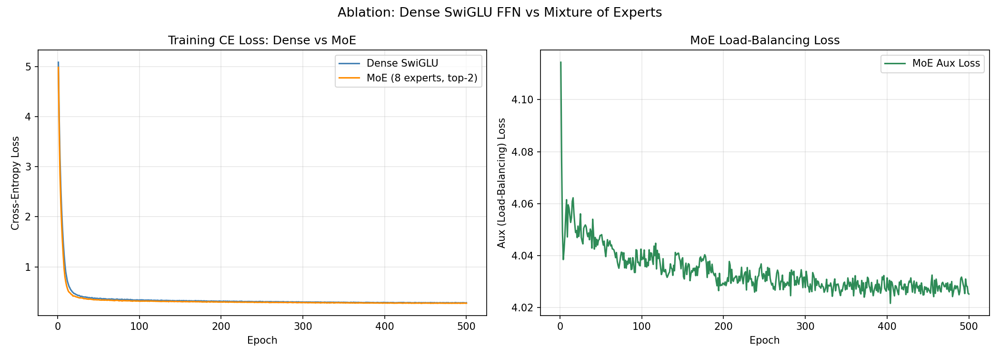
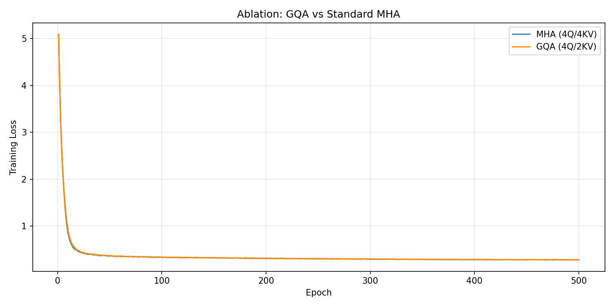
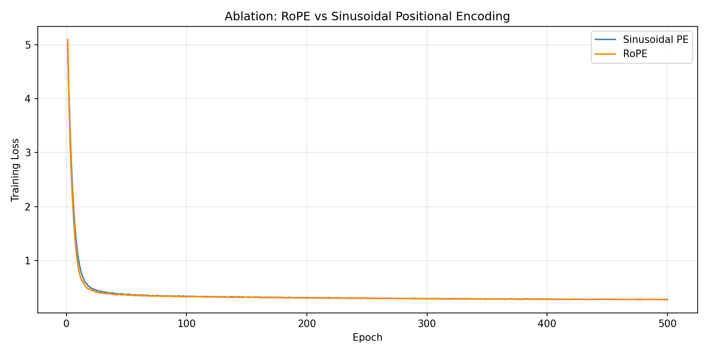

# Ablation Studies: Concepts Guide

This guide explains every idea behind the three ablation studies in this folder. The target is a complete beginner: someone who has never read a machine learning paper but is curious enough to want the real explanation, not just the surface version.

**Who this is for:** anyone. Technical details are included for practitioners, but every concept starts with a plain-language explanation so anyone can follow.

---

## What is an Ablation Study?

An ablation study is a controlled experiment where you change exactly one part of a system and measure what happens. The name comes from neuroscience: surgeons would remove (ablate) specific brain regions to learn what each region does.

In machine learning, an ablation study answers questions like:

- Does this component actually help, or could we remove it with no loss in quality?
- How much does it contribute compared to the rest of the model?
- Is the complexity worth the benefit?

This folder runs three ablation studies on small versions of a language model:

1. **Dense vs Mixture of Experts (MoE):** does replacing a single feed-forward network with eight specialist networks improve performance?
2. **GQA vs Multi-Head Attention (MHA):** does sharing Key/Value heads across Query heads hurt quality?
3. **RoPE vs Sinusoidal positional encoding:** does RoPE's relative-position approach outperform the original fixed sinusoidal approach?

Each study changes exactly one component. Everything else stays identical: the tokenizer, the dataset, the training procedure, the optimizer, the number of layers.

---

## What the Model is Learning to Do

All three studies train a small language model on a weather corpus. The model reads a sequence of tokens (pieces of words) and predicts what token comes next. After enough training, it can complete phrases:

```text
Input:  "the sky is cloudy"
Output: "today" (the most likely next token)
```

This is called next-token prediction, and it is the same task that GPT-4, LLaMA, and every other modern language model is trained on. The scale here is tiny (256 vocabulary, 64-dimensional embeddings, 4 Transformer blocks) but the architecture and training procedure are identical in structure to models with billions of parameters.

---

## The Full Architecture

Every model in these studies has the same structure. Only one component changes per study.

```text
Raw text ("the sky is cloudy today...")
   |
   v
[1] BPE Tokenizer: converts words into integer IDs
   |
   v
[2] Token Embedding: turns each ID into a vector of 64 numbers
   |
   v
[3] Dropout: randomly zeros 10% of values during training
   |
   v
[4 x Transformer Blocks]
   |-- RMSNorm
   |-- Attention (GQA or MHA, with RoPE or Sinusoidal positions)
   |-- Residual connection
   |-- RMSNorm
   |-- Feed-forward network (SwiGLU dense, or Mixture of Experts)
   |-- Residual connection
   |
   v
[5] Final RMSNorm
   |
   v
[6] Output projection: score for every token in the vocabulary
   |
   v
[7] Cross-Entropy Loss (+ load-balancing loss for MoE)
   |
   v
[8] Adam Optimizer + Cosine LR Decay + Gradient Clipping
```

The sections below explain each component.

---

## Part 1: Turning Text into Numbers

### BPE Tokenization

A neural network cannot read words. It works with numbers. A tokenizer is the translator: it converts human text into a list of integers, and can convert those integers back to text.

BPE stands for Byte Pair Encoding. It builds a vocabulary of subword pieces rather than whole words. The training algorithm works like this:

1. Start with individual bytes (0 to 255). Any text can be represented as bytes, so nothing is ever "unknown."
2. Scan the entire training corpus. Find the most frequently occurring adjacent pair of tokens.
3. Merge that pair into a single new token. Add it to the vocabulary.
4. Repeat until the vocabulary reaches the target size.

The result is a vocabulary containing common fragments:

```text
"weather"   -> ["weath", "er"]       (if "weath" is a common fragment)
"rainy"     -> ["rain", "y"]
"fog"       -> ["fog"]               (frequent enough to be its own token)
```

**Why not just use whole words?** Three problems. First, any word not seen during training becomes unknown, and real text contains endless new words. Second, a word-level vocabulary for real internet text would need millions of entries. Third, "run", "runs", "running" would all be separate entries with no shared knowledge; BPE naturally groups them through shared subword pieces.

This project uses a vocabulary of 256 tokens, which is tiny. GPT-4 uses roughly 100,000.

```python
tokenizer = Tokenizer(BPE(unk_token="[UNK]"))
tokenizer.pre_tokenizer = ByteLevel()
trainer = BpeTrainer(vocab_size=256, min_frequency=1)
tokenizer.train(files=[corpus_path], trainer=trainer)
```

### Building Training Sequences

Once the text is tokenized into a flat list of integers, training examples are created with a sliding window. Take 8 consecutive tokens as input; the same 8 tokens shifted by one position are the targets. The model must predict each next token given the previous ones:

```text
Full token sequence: [5, 23, 7, 41, 12, 8, 3, 19, 6, 44, ...]

Window 1:  Input  = [5, 23, 7, 41, 12, 8, 3, 19]
           Target = [23, 7, 41, 12, 8, 3, 19, 6]    <- shifted by 1

Window 2:  Input  = [23, 7, 41, 12, 8, 3, 19, 6]
           Target = [7, 41, 12, 8, 3, 19, 6, 44]
```

This creates 8 prediction tasks per window, making training very data-efficient.

---

## Part 2: Representing Meaning as Vectors

### Token Embeddings

A raw integer like `42` (the token ID for "rain") means nothing to a neural network as a number. An embedding converts each token ID into a list of 64 floating-point numbers. These numbers encode meaning: tokens that appear in similar contexts end up with similar vectors.

```text
Token ID 42 ("rain")  -> [0.12, -0.83, 0.44, 0.07, ..., -0.21]  (64 numbers)
Token ID 91 ("snow")  -> [0.09, -0.79, 0.51, 0.03, ..., -0.18]  (similar, both weather)
Token ID 3  ("the")   -> [0.94,  0.02, -0.11, 0.88, ...,  0.63]  (very different)
```

`nn.Embedding(vocab_size, embed_dim)` is a matrix of shape `(256, 64)`. Looking up token 42 literally indexes row 42. The matrix values are learned during training.

---

## Part 3: Normalisation

### RMSNorm

As numbers flow through a deep network, they can grow very large or very small. Large activations cause gradients to explode; near-zero activations cause gradients to vanish. Both stop learning. Normalisation brings the activations back to a manageable range after each step.

RMSNorm asks: "how large is this signal on average?" It divides by the root mean square of the activations:

```text
RMS(x)     = sqrt( mean(x^2) + tiny_constant )
RMSNorm(x) = (x / RMS(x)) * learned_scale
```

RMS stands for Root Mean Square: the square root of the average of the squared values. It measures the typical magnitude of the vector.

The older alternative is LayerNorm, which also subtracts the mean before dividing. Research found the mean subtraction does not help much in Transformers. RMSNorm skips it: faster to compute, one fewer learned parameter per layer. LLaMA, Gemma, and Mistral all use RMSNorm.

**Where it appears:** applied before every sublayer (pre-norm). The pattern per block is:

```text
output = input + sublayer(RMSNorm(input))
```

The residual connection (`+ input`) means the raw signal always flows through. The sublayer only needs to learn a correction.

---

## Part 4: The Feed-Forward Network

### SwiGLU

After attention lets tokens communicate, the feed-forward network (FFN) lets each token process its own representation independently. Think of it as each token consulting its own reference book after a group discussion.

The standard FFN expands to a larger dimension, applies a non-linearity, then compresses back. SwiGLU replaces the single expand step with a gated mechanism:

```text
Input x (64 dims)
   |-- gate_proj -> SiLU activation  ----|
   |                                     * (multiply element-wise)
   |-- value_proj ----------------------|
                                         |
                                    compress_proj
                                         |
                                   Output (64 dims)
```

Two parallel projections are computed from the same input. One is the gate (passed through SiLU). The other holds the content. Their element-wise product determines what information passes through to the compression layer.

The gate is learned: for each dimension of the intermediate representation, the gate can suppress or amplify based on the specific input token. This is more expressive than applying the same activation uniformly.

SiLU (Sigmoid Linear Unit) is defined as:

```text
SiLU(x) = x * sigmoid(x)
```

It smoothly suppresses negative values while allowing small negatives through. It is similar to GELU but slightly cheaper to compute.

All linear layers in this model use `bias=False`. Since RMSNorm is applied before each sublayer and has its own learnable scale, a bias would be redundant.

PaLM, LLaMA, and Gemma all use SwiGLU. It consistently achieves lower loss than ReLU or GELU FFNs at the same parameter count.

---

## Part 5: Positional Encoding

### The Problem

A Transformer's attention mechanism is completely position-blind by default. It treats its input like a bag of tokens with no sense of order. "The cat sat on the mat" and "mat the on sat cat the" would look identical without position information.

Positional encoding solves this by injecting information about where each token is in the sequence. The two ablation studies cover two different approaches to this problem.

### Sinusoidal Encoding (the original)

The original Transformer (2017) adds a fixed pattern of sine and cosine waves to each token's embedding before any attention is computed. Every position gets a unique fingerprint:

```text
Position 0:  [sin(0/1),   cos(0/1),   sin(0/100), cos(0/100),   ...]
Position 1:  [sin(1/1),   cos(1/1),   sin(1/100), cos(1/100),   ...]
Position 2:  [sin(2/1),   cos(2/1),   sin(2/100), cos(2/100),   ...]
```

The formula uses different frequencies for different dimensions:

```text
PE(pos, 2i)   = sin( pos / 10000^(2i/d) )
PE(pos, 2i+1) = cos( pos / 10000^(2i/d) )
```

where `pos` is the position, `i` is the dimension index, and `d` is the embedding size.

Key properties: the values are fixed (never learned), position is encoded as an absolute fingerprint, and the encoding is added once before all layers.

**The limitation:** sinusoidal encoding injects absolute position (position 5, position 6, etc.). For language, what often matters is relative distance (these two tokens are 3 apart). Also, if trained on sequences of length 8, the model has never seen the sinusoidal pattern for position 9 or 100 and cannot generalise to longer contexts.

### RoPE (Rotary Positional Embeddings)

Instead of stamping a watermark onto tokens before attention, RoPE injects position information inside the attention computation by rotating the Query and Key vectors. The rotation angle depends on position.

Imagine each token's query vector as a compass needle. Token at position 3 points at 3 o'clock; token at position 7 points at 7 o'clock. The dot product between two compass needles encodes how far apart they are, regardless of their absolute positions on the clock face.

The rotation formula for each pair of dimensions:

```text
Rotated pair = [ x1 * cos(theta) - x2 * sin(theta),
                 x1 * sin(theta) + x2 * cos(theta) ]
```

This is a standard 2D rotation matrix applied to adjacent dimension pairs.

The key mathematical property: the dot product between a rotated Query at position `p` and a rotated Key at position `q` depends only on `(p - q)`, the relative distance. Absolute positions cancel out. This is what makes RoPE better at generalising to longer sequences.

RoPE adds no learned parameters. The rotation angles are computed from a formula. It is applied inside every attention layer, refreshing position information at every depth. LLaMA, Gemma, Mistral, and Falcon all use RoPE.

---

## Part 6: Attention

### How Attention Works

Attention allows each token to gather relevant information from other positions in the sequence. Each token creates three things:

- **Query (Q):** what information am I looking for?
- **Key (K):** what information do I offer?
- **Value (V):** what content should I contribute if selected?

The attention score between token A and token B is `Q_A dot K_B`. High score means strong relevance. After softmax, these scores become weights. The output for each token is a weighted sum of all Value vectors.

Multiple heads run this process in parallel. Each head can learn to focus on a different kind of relationship: one head might track syntax, another semantics, another recent local context.

### Causal Masking

When training, all 8 tokens in a sequence are processed simultaneously. But the model must not see future tokens when predicting the current one. A causal mask enforces this:

```text
           pos 0  pos 1  pos 2  pos 3  pos 4
pos 0  -> [  ok    no     no     no     no  ]   (can only see itself)
pos 1  -> [  ok    ok     no     no     no  ]   (sees pos 0 and 1)
pos 2  -> [  ok    ok     ok     no     no  ]   (sees pos 0, 1, 2)
pos 3  -> [  ok    ok     ok     ok     no  ]
```

The "no" positions are filled with negative infinity before softmax. `softmax(-inf) = 0`, so they contribute nothing to the output.

### Standard Multi-Head Attention (MHA)

In standard multi-head attention, every Query head has its own dedicated Key and Value heads. With 4 heads:

```text
Q1 attends using K1, V1
Q2 attends using K2, V2
Q3 attends using K3, V3
Q4 attends using K4, V4
```

Each head is fully independent. K and V projection shapes: `(64, 64)` each.

**The inference memory cost:** when generating text token by token, the model must remember the Key and Value vectors for every past token to avoid recomputing them. This is the KV cache. With 4 heads, 4 layers, and long context, the KV cache can consume gigabytes of memory in large models.

### Grouped Query Attention (GQA)

GQA asks: do we really need 4 independent K/V pairs? What if groups of Query heads share a single K/V pair?

```text
Standard MHA (4Q, 4KV):          GQA (4Q, 2KV):
  Q1 -> K1, V1                     Q1 -\
  Q2 -> K2, V2                     Q2 ---> K1, V1   (group 1 shares)
  Q3 -> K3, V3                     Q3 -\
  Q4 -> K4, V4                     Q4 ---> K2, V2   (group 2 shares)
```

K and V projections shrink from `(64, 64)` to `(64, 32)`. The KV cache is halved. Query projections are unchanged, so each head still asks different questions. Quality stays close to full MHA because the expressiveness comes mostly from diverse Queries, not diverse Keys and Values.

After projecting K and V to 2 heads, the code expands them back to 4 using `repeat_interleave`:

```python
k = k.repeat_interleave(self.groups, dim=1)   # (B, 2, T, D) -> (B, 4, T, D)
v = v.repeat_interleave(self.groups, dim=1)
```

LLaMA 2/3, Mistral, and Gemma all use GQA.

### Residual Connections

Each Transformer block adds its output on top of its input:

```text
output = input + what_the_block_learned(input)
```

The block only needs to learn a small correction. The original signal always passes through unchanged. This matters for training deep networks: gradients can flow backwards through the addition operations all the way to the first layer without passing through learned weights. Without residual connections, gradients in deep networks shrink exponentially and early layers stop learning.

---

## Part 7: Mixture of Experts

### The Dense Baseline

In every project up to this point, every token passes through the same single feed-forward network. This is called a dense model: all parameters are active for every token.

### MoE: Multiple Specialist Networks

A Mixture of Experts layer replaces the single dense FFN with 8 independent expert networks plus a small router. For each token:

1. The router scores all 8 experts
2. The top 2 experts are selected
3. Those 2 experts process the token independently
4. Their outputs are blended as a weighted sum

```text
Token vector (64 dims)
    |
Linear (64 -> 8)   <- one score per expert
    |
Softmax
    |
[0.32, 0.05, 0.18, 0.03, 0.27, 0.06, 0.07, 0.02]   <- probability over 8 experts

Top-2 selected:
  Expert 0: 0.32
  Expert 4: 0.27

Renormalised to sum to 1:
  Expert 0: 0.32 / (0.32 + 0.27) = 0.54
  Expert 4: 0.27 / (0.32 + 0.27) = 0.46

Final output = 0.54 * expert_0_output + 0.46 * expert_4_output
```

Each expert is a full SwiGLU network. Only 2 of the 8 run per token. The other 6 sit idle and do not contribute to compute for that token.

**Why this matters:** the model has 8x more total parameters in the FFN layers, but uses only 2x the compute per token. More parameters means more capacity to learn patterns. Same compute means training and inference stay affordable.

Think of it like a hospital with 8 specialists. A triage nurse (the router) looks at each patient and decides which 2 specialists are most relevant. Each specialist sees a different subset of patients and develops deep expertise in their area.

### Router Collapse and the Load-Balancing Loss

Left alone, the router learns to always route to whichever expert proved useful early in training. That expert receives more gradient updates, gets better, attracts more tokens, and the cycle continues. Eventually everything routes to 1-2 experts and the other 6 receive no gradient and never improve. This is called router collapse.

The auxiliary load-balancing loss prevents this. It penalises routing that concentrates too many tokens on too few experts.

The formula is:

```text
aux_loss = N * sum(fraction_i * mean_prob_i)

where:
  N            = number of experts (8)
  fraction_i   = fraction of tokens routed to expert i
  mean_prob_i  = average router probability for expert i across all tokens
```

When routing is perfectly uniform: `8 * 8 * (0.125 * 0.125) = 1.0`

When all tokens go to one expert: `8 * 1.0 * 1.0 = 8.0` (much higher, strongly penalised)

**Why this works:** `fraction_i` is a hard count (not differentiable). But `mean_prob_i` is differentiable. The product creates a usable gradient signal: when expert 3 is overloaded (`fraction_3` is high), the loss increases when `mean_prob_3` is also high, and gradients push the router to lower expert 3's probability.

In the training loop, the two losses are combined:

```python
ce_loss      = CrossEntropyLoss(logits, targets)      # main objective
total_loss   = ce_loss + 0.01 * aux_loss              # 0.01 keeps aux from dominating
```

The `0.01` weight matters. Too small and the router ignores it. Too large and the model cares more about distributing tokens than predicting correctly.

---

## Part 8: Training Machinery

### Cross-Entropy Loss

After the model produces a score for every possible next token, cross-entropy loss measures how wrong it was. The formula is:

```text
loss = -log(probability_of_correct_token)

If correct prob = 0.9  ->  loss = -log(0.9) = 0.105   (low loss, good prediction)
If correct prob = 0.5  ->  loss = -log(0.5) = 0.693   (uncertain)
If correct prob = 0.1  ->  loss = -log(0.1) = 2.303   (high loss, bad prediction)
```

The model is penalised more severely for being confidently wrong than for being uncertain. At the start of training, a model guessing uniformly across 256 tokens assigns probability `1/256 = 0.0039` to every token. The starting loss would be `-log(0.0039) = 5.55`. This is the random baseline: the loss you would see from a model with no knowledge.

### Adam Optimiser

After computing the loss, the gradient tells us which direction to adjust each parameter to reduce the loss. Adam tracks two running averages per parameter:

- **Momentum:** the average direction of recent gradients. Like a ball rolling downhill, the update keeps moving in a consistent direction rather than bouncing around.
- **Adaptive scale:** the average size of recent gradients. Parameters that get large, consistent gradient updates receive smaller step sizes. Parameters that rarely update get larger step sizes.

Imagine tuning 180,000 dials on a mixing board. SGD turns every dial by the same amount regardless of history. Adam remembers which dials have been spinning wildly and turns those more cautiously while being bolder with dials that have barely moved.

### Cosine Annealing Learning Rate

The learning rate controls how large each parameter update is. Cosine annealing starts high and smoothly decreases to zero:

```text
LR
|.
| .
|  ..
|    ...___
|          .........___________
|                              ...
+--------------------------------- Epoch
1                               500
```

Early in training: large exploratory updates. Later: smaller, more precise updates settling into a good minimum. The decay is smooth, avoiding the sudden loss spikes that come from step-wise learning rate drops.

### Gradient Clipping

Occasionally a surprising batch causes a very large gradient update that could send parameters to a bad region. Before applying any update, gradient clipping measures the total size of all gradients. If it exceeds 1.0, all gradients are scaled down proportionally so the total norm is exactly 1.0. The direction is preserved; only the magnitude is capped.

### Dropout

During training, 10% of neuron outputs are randomly set to zero each forward pass. This prevents the network from relying too heavily on any single neuron and forces it to learn redundant representations. During inference, all neurons are active (and their outputs are scaled to compensate).

---

## Ablation Study 1: Dense vs Mixture of Experts



### What was changed

The SwiGLU feed-forward network in each Transformer block was replaced with a Mixture of Experts layer: 8 expert networks plus a router, with top-2 routing per token.

Everything else was identical: same tokenizer, same dataset, same RMSNorm, same GQA attention with RoPE, same training loop.

### Dense vs MoE Results

| Model | Parameters | Final Cross-Entropy Loss |
| --- | --- | --- |
| Dense SwiGLU | 180,800 | 0.2820 |
| MoE (8 experts, top-2) | 870,976 | 0.2732 |

### Dense vs MoE: Reading the result

The MoE model achieves 3% lower loss but uses 4.8x more parameters. For this small weather corpus, that is a poor trade-off: the benefit is marginal relative to the parameter cost.

This does not mean MoE is bad. The advantage appears at scale. In large models, MoE allows 8x more total knowledge at the same inference compute cost. Mixtral 8x7B performs like a 47B dense model while computing like a 14B model.

### The flat aux loss

The auxiliary loss in this run stayed near 4.0 throughout all 500 epochs. A perfectly balanced load would produce a value of 1.0. A value of 4.0 indicates significant router collapse: the router routes most tokens to 2-3 experts and ignores the rest.

Three reasons this happened:

1. `aux_loss_weight = 0.01` was too small. The penalty for imbalance was not strong enough to change the router's behaviour.
2. The weather corpus is too small and uniform. There is not enough diversity to incentivise specialisation across 8 experts.
3. Sequences of length 8 do not provide enough tokens per batch to establish meaningful routing statistics.

In production MoE systems, the aux loss weight is tuned carefully, and additional techniques like expert-choice routing or token dropping enforce balance.

---

## Ablation Study 2: GQA vs Standard Multi-Head Attention



### GQA: What was changed

Standard multi-head attention (4 Query heads, 4 Key/Value heads) was replaced with Grouped Query Attention (4 Query heads, 2 Key/Value heads). Two Query heads share one K/V pair.

Everything else was identical: same tokenizer, same dataset, same RMSNorm, same SwiGLU FFN, same RoPE, same training loop.

### Parameter difference

In each Transformer block, only the K and V projection matrices change:

| Layer | MHA | GQA |
| --- | --- | --- |
| Q projection | 64 x 64 = 4,096 | 64 x 64 = 4,096 |
| K projection | 64 x 64 = 4,096 | 64 x 32 = 2,048 |
| V projection | 64 x 64 = 4,096 | 64 x 32 = 2,048 |
| Output projection | 64 x 64 = 4,096 | 64 x 64 = 4,096 |

Per block, GQA saves 4,096 parameters. Across 4 blocks: 16,384 fewer total. This matches the observed difference: 197,184 minus 180,800 = 16,384.

### GQA vs MHA Results

| Model | Parameters | Final Loss |
| --- | --- | --- |
| MHA (4Q / 4KV) | 197,184 | 0.2792 |
| GQA (4Q / 2KV) | 180,800 | 0.2815 |

### GQA vs MHA: Reading the result

The difference is 0.0023, which is essentially negligible. GQA converges almost identically to MHA across all 500 epochs while using 8.3% fewer parameters and producing a 50% smaller KV cache at inference.

**Why GQA matches MHA despite fewer K/V parameters:** the Query heads are still fully independent, each learning to ask different questions. The shared K/V acts as a shared information index that different Q heads look up in different ways. Expressiveness comes primarily from diverse Queries, not diverse Keys and Values.

### The real-world case for GQA

On this tiny model, the KV cache savings are small in absolute terms. At scale:

| Scale | MHA KV cache | GQA KV cache | Saving |
| --- | --- | --- | --- |
| This model (64-dim, 4 blocks) | ~0.1 MB | ~0.05 MB | 50% |
| LLaMA 2 7B (4096-dim, 32 layers) | ~2 GB | ~1 GB | 50% |
| LLaMA 3 70B (8 KV heads vs 64 Q heads) | ~40 GB | ~5 GB | 87.5% |

At 70B scale, GQA is the difference between the model fitting in available GPU memory or not. This is why LLaMA 2/3, Mistral, and Gemma all adopted it.

### The attention variant family

| Variant | Q heads | KV heads | Used in |
| --- | --- | --- | --- |
| MHA (Multi-Head) | N | N | GPT-2, BERT, early Transformers |
| MQA (Multi-Query) | N | 1 | Early fast-inference models |
| GQA (Grouped-Query) | N | N/G | LLaMA 2/3, Mistral, Gemma |

MQA is the extreme version: all Query heads share one K/V pair. It saves the most memory but degrades quality more than GQA. GQA is the practical sweet spot.

---

## Ablation Study 3: RoPE vs Sinusoidal Positional Encoding



### RoPE vs Sinusoidal: What was changed

The sinusoidal positional encoding (added to token embeddings before the first layer) was replaced with RoPE (applied inside each attention layer as a rotation to Q and K vectors).

Everything else was identical: same tokenizer, same dataset, same RMSNorm, same SwiGLU FFN, same GQA attention mechanism, same training loop.

Both approaches add zero learned parameters: sinusoidal encoding is a fixed precomputed table; RoPE is a formula applied at runtime.

### Architecture difference

```text
SINUSOIDAL MODEL                     ROPE MODEL
Token IDs                            Token IDs
    |                                    |
nn.Embedding (64-dim)                nn.Embedding (64-dim)
    |                                    |
+ SinusoidalPE  <- position added    Dropout
  HERE, before all layers                |
    |                               [Transformer Blocks x4]
Dropout                              |-- RMSNorm
    |                                |-- RoPE Attention
[Transformer Blocks x4]              |     |-- Q_proj -> rotate(Q, pos)
|-- RMSNorm                          |     |-- K_proj -> rotate(K, pos)
|-- nn.MultiheadAttention            |     |-- V_proj  (no rotation)
|     (position already baked in)    |-- SwiGLU FFN
|-- SwiGLU FFN
```

The sinusoidal model uses PyTorch's `nn.MultiheadAttention` because position is already in the embeddings and no rotation is needed. The RoPE model uses a hand-written attention module so Q and K can be rotated before the dot product.

### RoPE vs Sinusoidal Results

| Model | Final Loss | Positional Method | Parameters |
| --- | --- | --- | --- |
| Sinusoidal | 0.2808 | Added to embedding, fixed | ~197K |
| RoPE | 0.2768 | Injected into attention, formula-based | ~197K |

RoPE wins by 0.0040 loss. A small but consistent margin across all 500 epochs.

### Epoch-by-epoch progression

| Epoch | Sinusoidal | RoPE | Difference |
| --- | --- | --- | --- |
| 100 | 0.3409 | 0.3303 | RoPE better by 0.0106 |
| 200 | 0.3115 | 0.3155 | Sinusoidal briefly better |
| 300 | 0.2948 | 0.2958 | Roughly equal |
| 400 | 0.2895 | 0.2859 | RoPE better by 0.0036 |
| 500 | 0.2808 | 0.2768 | RoPE better by 0.0040 |

RoPE starts stronger, loses ground in the middle, then pulls ahead in the final stretch. This pattern suggests RoPE's relative-position encoding is most useful when the model makes fine-grained distinctions, which happens later in training as it fits harder examples.

### Why the difference is small here

On sequences of length 8, absolute and relative position are nearly equivalent: there are only 8 positions, and every relative distance is also just an absolute distance. The real advantage of RoPE appears when:

- **Sequence length grows:** at 512 or 4096 tokens, relative positions generalise naturally; sinusoidal absolute positions cannot extrapolate past the training length
- **Long-range dependencies matter:** when a pronoun must match a noun 50 tokens earlier, relative distance encoding handles this directly

At GPT-4 or LLaMA 3 scale with 128K context windows, sinusoidal encoding simply does not work: the positional patterns were only computed up to a fixed maximum length. RoPE naturally extends to any length.

### Three generations of positional encoding

| Generation | Method | Used in | Limitation |
| --- | --- | --- | --- |
| 1st | Sinusoidal (fixed) | Original Transformer (2017), BERT | Cannot extrapolate past training length |
| 2nd | Learned absolute | GPT-2, GPT-3 | Cannot extrapolate; adds parameters per position |
| 3rd | RoPE (relative, formula) | LLaMA 1/2/3, Mistral, Gemma, Falcon | None at standard scale |

Learned absolute positions (GPT-2/3) go one step further than sinusoidal: the model learns what fingerprint to assign each position through training. This can work better than fixed sinusoidal on short sequences, but it still cannot extrapolate, and every position slot requires its own learned embedding. RoPE sidesteps both problems: no learned parameters and relative-distance encoding means the model handles any sequence length without having seen that position during training.

---

## Glossary

| Term | Plain English |
| --- | --- |
| Token | The smallest unit of text the model works with: a word, part of a word, or punctuation |
| Embedding | A list of numbers representing a token's meaning in a multi-dimensional space |
| Vector | An ordered list of numbers, like coordinates in multi-dimensional space |
| Gradient | The direction in which to adjust each parameter to reduce the loss |
| Backpropagation | Computing gradients by working backwards through the network |
| Epoch | One complete pass through the entire training dataset |
| Batch | A small subset of training examples processed together |
| Logits | Raw unnormalized scores output by the model before softmax |
| Softmax | Converts a list of arbitrary numbers into probabilities that sum to 1 |
| Loss | A single number measuring how wrong the model's predictions are |
| Overfitting | When a model memorises training data rather than learning general patterns |
| Ablation study | A controlled experiment that changes exactly one component to measure its isolated effect |
| KV cache | Memory storing Key and Value vectors for past tokens during text generation |
| Conditional computation | Activating only a subset of model parameters per input (the MoE idea) |
| Router collapse | When a MoE router routes almost all tokens to the same 1-2 experts |

---

## Further Reading

| Concept | Paper |
| --- | --- |
| Transformer architecture | Attention Is All You Need, Vaswani et al., 2017 |
| RoPE | RoFormer: Enhanced Transformer with Rotary Position Embedding, Su et al., 2021 |
| GQA | GQA: Training Generalized Multi-Query Transformer Models, Ainslie et al., 2023 |
| SwiGLU | GLU Variants Improve Transformer, Noam Shazeer, 2020 |
| RMSNorm | Root Mean Square Layer Normalization, Zhang and Sennrich, 2019 |
| Mixture of Experts | Outrageously Large Neural Networks: The Sparsely-Gated MoE Layer, Shazeer et al., 2017 |
| MoE load balancing | Switch Transformers, Fedus et al., 2021 |
| BPE tokenization | Neural Machine Translation of Rare Words with Subword Units, Sennrich et al., 2016 |
