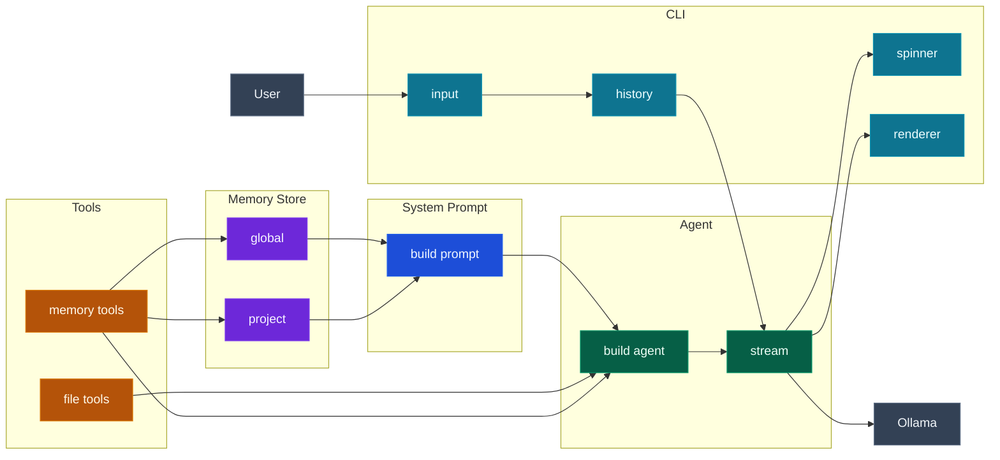
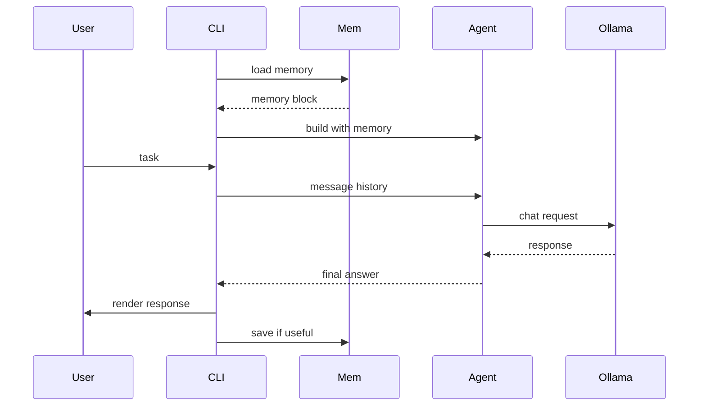

# saathi-cli

*Saathi means companion in Hindi. This tool walks alongside you in your codebase.*

A coding agent you own completely — built from first principles using Gemma 4, Ollama and LangChain. It reads files, writes code, navigates directories, runs shell commands and searches your codebase, all from a single terminal session with a rich, coloured interface.

This is not a replacement for Claude Code or GitHub Copilot. It is a transparent foundation you can read, modify and extend in any direction.

---

## Architecture

### Component map



#### Blocks

| Block | What it is |
| --- | --- |
| **User** | You — typing tasks and reading responses in the terminal. |
| **Ollama** | The local LLM server. Runs Gemma 4 on your machine. The agent sends chat requests here and streams tokens back. |
| **Memory Store** | Two persistent JSON files. `global` lives at `~/.saathi/memory.json` and holds facts that apply across all projects (preferred style, language). `project` lives at `.saathi/memory.json` inside the current folder and holds project-specific facts (entry point, stack, key files). |
| **System Prompt** | `build_system_prompt()` assembles the agent's identity, behavioural rules, optional context-scope paths, and the current memory block into a single string that heads every conversation. |
| **Tools — file tools** | `read_file`, `write_file`, `list_directory`, `run_bash`, `search_in_file`. Each is a `@tool` function the agent can call to interact with the filesystem and shell. |
| **Tools — memory tools** | `save_memory` and `recall_memory`. Let the agent read and write facts to the memory store during a session, so useful discoveries persist across restarts. |
| **Agent — build agent** | `build_agent()` wires the LLM, tools, and system prompt into a LangGraph `CompiledStateGraph`. Called once at startup and again whenever the context scope or memory changes. |
| **Agent — stream** | The running ReAct loop. Sends the message history to Ollama, receives tool calls and observations in a loop, and emits chunks back to the CLI as they arrive. |
| **CLI — input** | `Prompt.ask()` — reads the user's task from the terminal. Also handles slash commands (`/context`, `/memory`) before they reach the agent. |
| **CLI — history** | The growing list of `HumanMessage` and `AIMessage` objects for the session. `compact_history()` trims the oldest messages before each call so the conversation always fits within the context window. |
| **CLI — spinner** | `ThinkingSpinner` — a background thread that cycles through 70+ phrases while the model is generating. Updates to show the active tool name when the agent picks a tool. |
| **CLI — renderer** | Prints tool observations in dim bordered panels and renders the final answer as full Markdown (headers, tables, code blocks) using Rich. |

#### Edges

| Edge | What flows |
| --- | --- |
| `global / project → build prompt` | Saved facts are formatted into a memory block and injected into the system prompt at startup. |
| `build prompt → build agent` | The assembled system prompt string is passed into `build_agent()` so the agent knows its identity and remembered facts before the first message. |
| `file tools / memory tools → build agent` | The full tool list is registered with the agent at build time. The agent discovers tool names and docstrings automatically — no extra wiring needed. |
| `memory tools → global / project` | During a session the agent can call `save_memory` and `recall_memory` to read and write the JSON files directly. |
| `build agent → stream` | `build_agent()` returns the compiled LangGraph graph. `stream()` on that graph runs the ReAct loop. |
| `stream → Ollama` | Each iteration of the loop sends the current message list to Ollama as a chat request and reads back a token stream. |
| `User → input` | The user presses Enter; the terminal captures the text. |
| `input → history` | The new `HumanMessage` is appended to the session history list. |
| `history → stream` | `compact_history()` trims the list to 75% of the context window, then the trimmed messages are sent into the stream. |
| `stream → spinner` | When the agent emits a tool call chunk, the spinner updates to show the tool name and arguments. |
| `stream → renderer` | Tool observations are printed as panels as they arrive. The final answer is rendered as Markdown once the stream ends. |

---

### Request flow — one turn



#### Steps

| Step | What happens |
| --- | --- |
| `CLI → Mem: load memory` | At startup, `MemoryStore` reads both JSON files. Global facts and project facts are merged, with project facts taking priority for the same key. |
| `Mem → CLI: memory block` | The facts are formatted as a plain-text block (`key: value` lines) ready to be injected into the system prompt. |
| `CLI → Agent: build with memory` | `build_agent()` is called with the memory block. The system prompt now contains the agent's identity, any context-scope paths, and all remembered facts. |
| `User → CLI: task` | You type a task and press Enter. Slash commands are handled here before the agent sees anything. |
| `CLI → Agent: message history` | `compact_history()` trims the session history to fit 75% of the 32k context window, always keeping the system prompt and the most recent messages. The trimmed list is passed to `agent.stream()`. |
| `Agent → Ollama: chat request` | LangGraph sends the message list to Ollama's `/api/chat` endpoint. Gemma 4 receives the system prompt, conversation history, tool definitions, and your task. |
| `Ollama → Agent: response` | Gemma streams tokens back. If the response contains a tool call, LangGraph intercepts it, executes the tool, appends the observation, and sends another request. This loop repeats until Gemma produces a plain text answer. |
| `Agent → CLI: final answer` | The last message in the stream with no tool calls is the final answer. It arrives as a text chunk. |
| `CLI → User: render response` | Rich renders the answer as full Markdown — headers, code blocks, tables, and inline formatting — under a cyan rule. |
| `CLI → Mem: save if useful` | If the agent called `save_memory` during the turn, the new fact is already written to the JSON file and will be available in every future session. |

---

## File structure

```text
saathi-cli/
├── cli.py            terminal UI, spinner, rich rendering, history, /context command
├── agent.py          LLM connection, context window config, build_agent(), compact_history()
├── system_prompt.py  agent persona, context-scope injection, memory injection
├── tools.py          seven tool definitions (read, write, list, bash, search, save_memory, recall_memory)
├── memory_store.py   persistent memory — global (~/.saathi/) and project-level (.saathi/)
├── requirements.txt  Python dependencies
└── README.md         this file
```

| File | What it owns |
| --- | --- |
| `cli.py` | Everything the user sees and types. Spinner, colour, `/context` flag, session history. |
| `agent.py` | Connects to Ollama, sets context window size, builds the LangGraph agent, compacts history. |
| `system_prompt.py` | Agent identity, behavioural rules, context-scope injection, memory injection. |
| `tools.py` | Each `@tool` function is a discrete capability. Add new tools here — the agent discovers them automatically. |
| `memory_store.py` | Reads and writes `memory.json` files at global and project scope. Independent of LangChain. |

---

## Tools available

| Tool | What it does |
| --- | --- |
| `read_file` | Read any file's full contents (up to 100 KB) |
| `write_file` | Write or overwrite a file; creates parent directories |
| `list_directory` | List files and folders with sizes |
| `run_bash` | Execute a shell command, capture stdout + stderr |
| `search_in_file` | Find text in a file, returns matching lines with line numbers |

---

## Setup

### Step 1 — Install Ollama

Download from [ollama.com/download](https://ollama.com/download) and start the server:

```bash
ollama serve
```

### Step 2 — Pull Gemma 4

```bash
ollama pull gemma4:12b
```

### Step 3 — Install Python dependencies

```bash
pip install -r requirements.txt
```

### Step 4 — Run

```bash
python cli.py
```

---

## Usage

### Basic session

```bash
python cli.py
```

```text
╭─────────────────────────────────────────╮
│ saathi — your coding companion          │
│ Powered by Gemma 4 via Ollama           │
╰─────────────────────────────────────────╯

You: List all Python files in this directory
You: Read agent.py and explain the streaming loop
You: Create a file called hello.py that prints Hello World and run it
You: Search for the word 'tool' in tools.py
You: What does this codebase do overall?
```

### Scope the agent to specific files or folders

```bash
# at startup — agent focuses on these paths from the beginning
python cli.py --context ./src ./utils/config.py

# mid-session — update scope without restarting
You: /context ./src/models ./tests

# clear scope — agent works unrestricted again
You: /context
```

When a context scope is set, the system prompt tells the agent to prefer those paths when the user says "this file" or "here" without naming a specific path. Changing scope also clears conversation history since old context would be misleading.

### Session commands

| Command | Description |
| --- | --- |
| `<any text>` | Run a task |
| `/context <path> ...` | Scope agent to specific files or folders |
| `/context` | Clear scope — agent works unrestricted |
| `/memory list` | Show all saved facts |
| `/memory save <scope> <key> <value>` | Manually save a fact |
| `/memory delete <scope> <key>` | Delete a fact |
| `/memory clear <scope>` | Wipe all facts from a scope |
| `clear` | Reset conversation history (keeps scope and memory) |
| `/rollback` | Undo the last turn — restores any files the agent changed and removes the turn from history |
| `/rollback <n>` | Undo the last n turns |
| `/checkpoints` | List all turns and which files each one touched |
| `help` | Show command reference |
| `quit` / `exit` | End the session |

### Startup flags

```bash
python cli.py --model gemma4:27b
python cli.py --context ./src ./lib/utils.py
python cli.py --model gemma4:4b --context ./experiments
```

---

## Rollback

Every turn is checkpointed before the agent runs. If you don't like what the agent did — it rewrote a file incorrectly, went in the wrong direction, or just made a mess — you can undo it.

### How it works

Before each turn, saathi snapshots the original content of every file the agent is about to touch. After the turn completes, that snapshot is saved alongside the position in conversation history. Rolling back replays those snapshots in reverse.

- Files the agent **edited** are restored to their content before the turn.
- Files the agent **created** are deleted.
- The turn's messages are removed from conversation history so the agent has no memory of the undone work.

Shell commands (`run_bash`) are **not** reversible — installs, git commits, and other side effects happen outside saathi's control.

### Commands

```text
You: /rollback
You: /rollback 3
You: /checkpoints
```

| Command | What it does |
| --- | --- |
| `/rollback` | Undo the last turn |
| `/rollback <n>` | Undo the last n turns |
| `/checkpoints` | Show a table of every recorded turn and which files it touched |

### Example

```text
You: Refactor utils.py to use dataclasses

⚙ read_file(file_path='utils.py')
⚙ write_file(file_path='utils.py', ...)

────────────── saathi ──────────────
Done. Converted three classes to dataclasses.

You: Actually that broke something, undo it

You: /rollback
  restored  /path/to/utils.py
Rolled back 1 turn.

You: /rollback 2       ← undo two turns at once
  restored  /path/to/utils.py
  deleted   /path/to/new_helper.py
Rolled back 2 turns.
```

### Checkpoints table

`/checkpoints` shows you what is available to roll back before you commit to it:

```text
┌─────────────────────────────────────────────┐
│ Checkpoints                                 │
├──┬──────────────────────────────┬───────────┤
│ #│ Task                         │ Files     │
├──┼──────────────────────────────┼───────────┤
│ 1│ Read agent.py and explain... │ —         │
│ 2│ Refactor utils.py to use ... │ utils.py  │
│ 3│ Create a helper module       │ helper.py │
└──┴──────────────────────────────┴───────────┘
```

Turns that only read files or ran bash commands show `—` in the Files column — there is nothing to restore for those turns, but rolling back still removes them from conversation history.

---

## Context window and token management

Ollama defaults to a 2048-token context window, which causes responses to be cut off mid-sentence. saathi-cli sets sensible defaults in `agent.py`:

```python
CTX_WINDOW  = 32768   # total tokens: prompt + history + response
MAX_PREDICT = 4096    # max tokens the model can generate per response
```

Gemma 4 supports up to 128k. Raise these values if you have the RAM — edit `agent.py` directly.

### Conversation history compaction

Each turn accumulates messages in a `history` list. Before every call, `compact_history()` trims the oldest messages to stay within 75% of `CTX_WINDOW`, always keeping:

- the system prompt
- the most recent messages
- the history starting on a `HumanMessage` (never mid-conversation)

This means the agent remembers earlier turns in the session, and long sessions degrade gracefully rather than failing silently.

---

## Persistent memory

saathi remembers facts across sessions using two JSON files:

| Scope | Location | Use for |
| --- | --- | --- |
| Global | `~/.saathi/memory.json` | User preferences, coding style, cross-project conventions |
| Project | `.saathi/memory.json` | Stack, entry points, architecture decisions, key files |

Both are loaded at startup and injected into the system prompt so the agent already knows saved facts without spending a tool call on them. Project facts override global facts for the same key.

### Managing memory during a session

Four commands let you inspect and modify memory without restarting:

**List all facts:**

```text
You: /memory list
```

Shows global and project memory in a table. Project facts override global facts for the same key.

**Save a fact manually:**

```text
You: /memory save project entry_point cli.py
You: /memory save global preferred_language Python
```

The agent calls this automatically when it learns something, but you can also save facts directly.

**Delete a single fact:**

```text
You: /memory delete project entry_point
```

**Clear an entire scope:**

```text
You: /memory clear project
```

Wipes all facts from global or project memory. Scope must be `'global'` or `'project'`.

### Memory files

```jsonc
// ~/.saathi/memory.json  (global — persists across all projects)
{
  "preferred_style": "concise answers, no preamble",
  "preferred_language": "Python"
}

// .saathi/memory.json  (project — specific to this folder)
{
  "entry_point": "cli.py",
  "llm_framework": "langchain 1.x with create_agent",
  "context_window": "32768 tokens"
}
```

You can edit these files directly with any text editor — they're plain JSON. Delete a key to forget it.

### Memory scoping

When you run `/context ./some-folder`, the project memory pointer moves to that folder's `.saathi/memory.json`. Each folder keeps its own isolated memory. Global memory is shared across all projects.

Using `/context` also clears the conversation history (but keeps memory), since old context would be misleading in a new folder.

---

## How the terminal UI works

The CLI uses [Rich](https://github.com/Textualize/rich) for all output.

- **Spinner** — cycles through 70+ phrases (`simmering…`, `philosophising…`, `jugaad laga raha hoon…`, `ulajhan suljha raha hoon…`) while the model generates
- **Tool call** — when the agent picks a tool, the spinner updates to show `⚙ read_file(file_path='agent.py')`
- **Observation panel** — tool result shown in a dim bordered panel with syntax highlighting (truncated at 300 chars)
- **Final answer** — rendered as full Markdown (headers, code blocks, tables) under a cyan rule

---

## Extending saathi

### Add a new tool

Open `tools.py` and add a `@tool` function. The docstring is what the agent reads to decide when to use it — make it precise:

```python
@tool
def fetch_url(url: str) -> str:
    """
    Fetch the content of a web page and return it as plain text.
    Use this when the user asks about something that requires live web information.
    Input: a full URL including https://.
    Returns the page text, or an error message if the request fails.
    """
    import httpx
    response = httpx.get(url, timeout=10, follow_redirects=True)
    return response.text[:5000]
```

No other changes needed — `get_all_tools()` returns all `@tool` functions automatically.

### Change the agent's personality

Edit `SYSTEM_PROMPT_BASE` in `system_prompt.py`. The prompt controls:

- how the agent introduces itself
- what rules it follows (read before write, never delete unless asked)
- how it handles uncertainty
- whether it defers to official documentation over memorised API details

### Swap the model

Any model served by Ollama works. Change `OLLAMA_MODEL` in `agent.py` or pass `--model` at startup. Models with strong instruction-following and tool-use capability work best — Mistral, Llama 3, and Qwen 2.5 Coder are good alternatives.

### Replace Ollama with a cloud model

Swap `ChatOllama` for any LangChain chat model:

```python
# OpenAI
from langchain_openai import ChatOpenAI
llm = ChatOpenAI(model="gpt-4o", temperature=0.1)

# Anthropic
from langchain_anthropic import ChatAnthropic
llm = ChatAnthropic(model="claude-sonnet-4-6", temperature=0.1)
```

The rest of the code — tools, prompt, history, streaming, CLI — is unchanged.

---

## What comes next

- [ ] Persistent memory across sessions (summarise and reload on startup)
- [ ] Git tool (status, diff, log, commit)
- [ ] Web search tool
- [ ] Multi-file context (auto-read all files in scoped folder at startup)
- [ ] Token usage display per turn
- [ ] Save session transcript to file
- [ ] MCP server support (expose tools over Model Context Protocol)

---

## Part of LLMfromScratch

This project is part of [github.com/dwinsi/LLMfromScratch](https://github.com/dwinsi/LLMfromScratch) — a series building from a single neuron to a language model to a working agent, one step at a time.

---

*Built with Gemma 4 + Ollama + LangChain + Rich. Apache 2.0 licence.*
