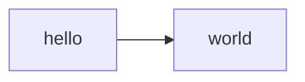
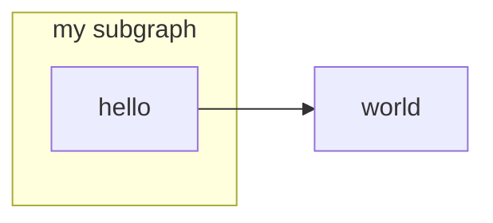
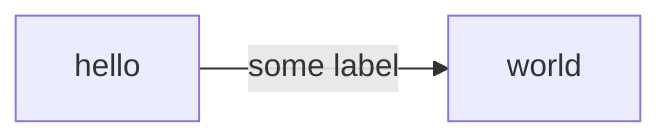
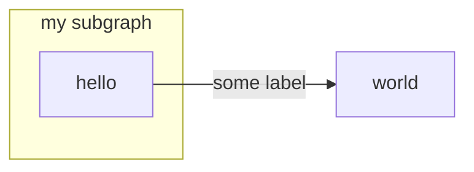
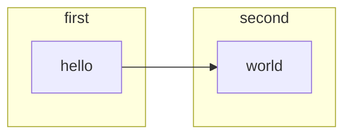
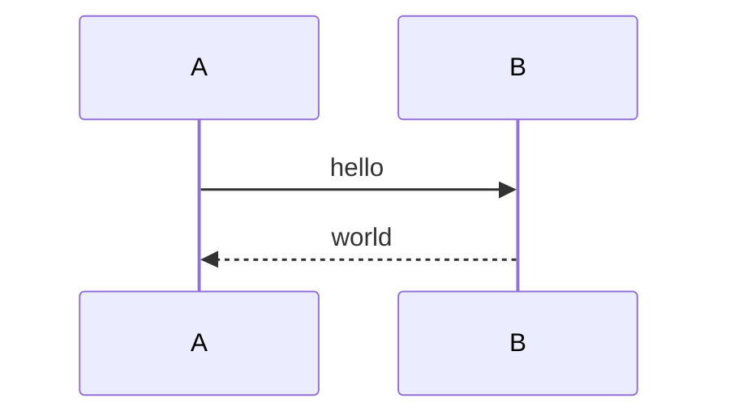
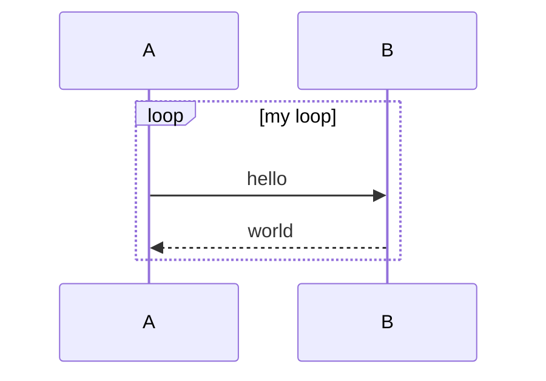
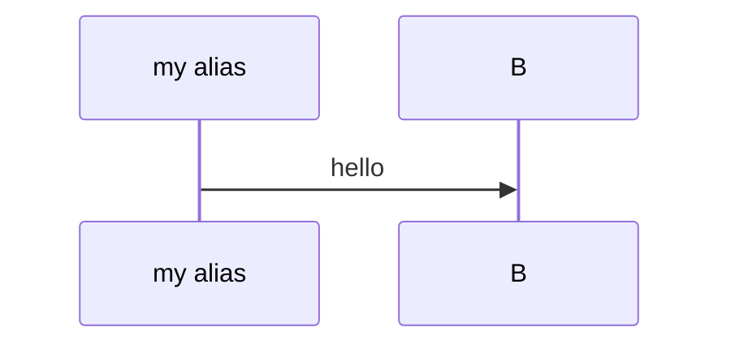

# Mermaid Test

## Test 1 — minimal graph

## Test 2 — subgraph

## Test 3 — edge labels

## Test 4 — subgraph with edge labels

## Test 5 — multiple subgraphs with cross edges

## Test 6 — minimal sequenceDiagram

## Test 7 — sequenceDiagram with loop

## Test 8 — sequenceDiagram with alias

