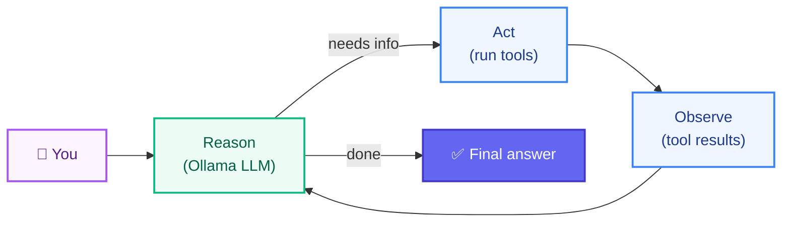
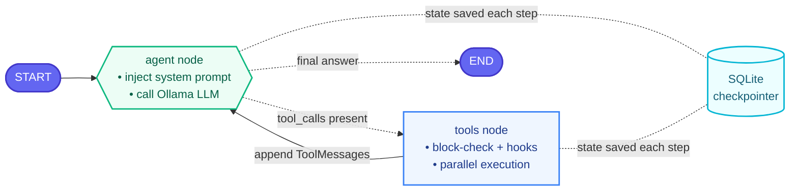
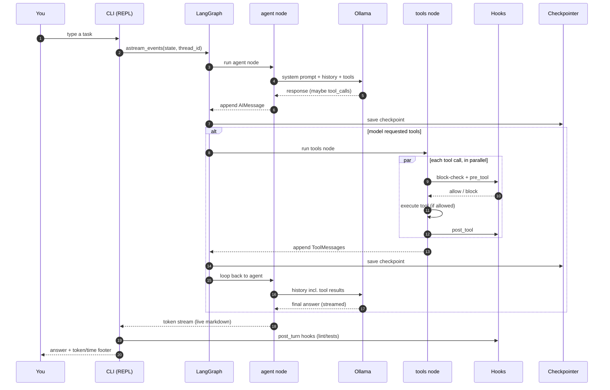
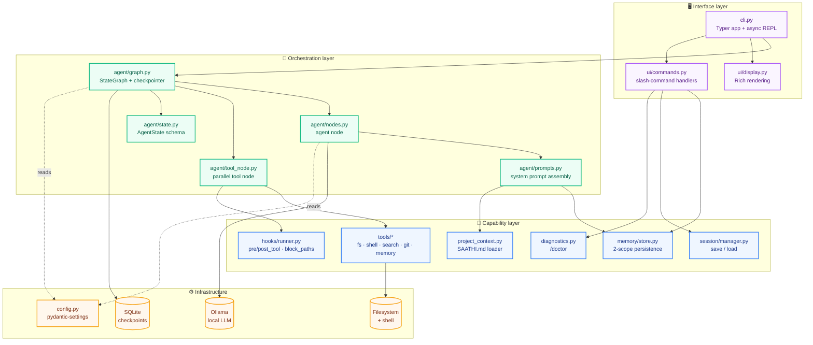
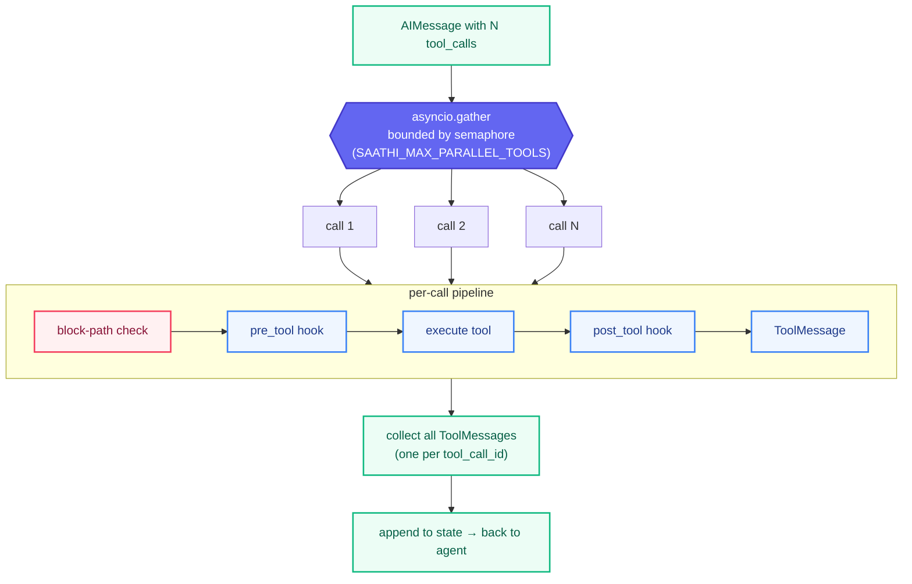

# Saathi — Architecture & Concepts

A deep dive into how Saathi is built: the **LangGraph** primitives it relies on,
the **enterprise-grade patterns** applied throughout, and a full architectural
walkthrough with diagrams.

> New to the project? Read the [README](README.md) first for what Saathi *does*.
> This document explains *how* and *why*.

---

## Table of contents

1. [Mental model](#1-mental-model)
2. [LangGraph concepts we use](#2-langgraph-concepts-we-use)
3. [The agent graph](#3-the-agent-graph)
4. [Turn lifecycle](#4-turn-lifecycle)
5. [Component architecture](#5-component-architecture)
6. [The parallel tool pipeline](#6-the-parallel-tool-pipeline)
7. [Enterprise-grade methods](#7-enterprise-grade-methods)
8. [Design decisions & trade-offs](#8-design-decisions--trade-offs)

---

## 1. Mental model

Saathi is a **ReAct agent** (Reason + Act) implemented as a **LangGraph state
machine**. A turn is a loop:

> the model **reasons**, optionally **calls tools**, **observes** the results,
> and loops until it produces a final answer.

Everything runs locally: the model via **Ollama**, state via **SQLite**, tools
against your **filesystem and shell**. No cloud calls, full transparency.



---

## 2. LangGraph concepts we use

LangGraph models an agent as a **graph of nodes** that pass a **shared state**
between them, executed by a Pregel-style runtime. Here is every primitive Saathi
uses and where.

### `StateGraph`

The builder for the whole agent. You declare a **state schema**, add **nodes**
(functions), wire them with **edges**, then `compile()` into a runnable graph.
→ [`agent/graph.py`](src/saathi/agent/graph.py)

### State schema + reducers

State is a `TypedDict`. Each field can have a **reducer** — a function that says
how updates merge into the existing value. Our `messages` field uses the built-in
`add_messages` reducer, so every node that returns `{"messages": [...]}` *appends*
to the conversation instead of overwriting it.
→ [`agent/state.py`](src/saathi/agent/state.py)

```python
class AgentState(TypedDict):
    messages: Annotated[list[BaseMessage], add_messages]  # append, don't replace
    context_paths: list[str]
    mode: str
    session_id: str
```

### Nodes

A node is just an (async) function `state -> partial state update`. We have two:

- **`agent`** — injects the system prompt and calls the LLM.
  → [`agent/nodes.py`](src/saathi/agent/nodes.py)
- **`tools`** — runs the tool calls the model requested.
  → [`agent/tool_node.py`](src/saathi/agent/tool_node.py)

### Edges: normal & conditional

- A **normal edge** always fires: `START → agent`, and `tools → agent`.
- A **conditional edge** picks the next node from the state. We use the prebuilt
  **`tools_condition`**, which inspects the last message: if it contains
  `tool_calls`, route to `tools`; otherwise route to `END`.

> ⚠️ **Design note:** `tools_condition` *already* covers the `END` case. Adding a
> second, unconditional `agent → END` edge would terminate the loop on every step.
> We deliberately have only the conditional edge (guarded by a regression test in
> [`tests/test_graph.py`](tests/test_graph.py)).

### `ToolNode` → our `make_hooked_tool_node`

LangGraph ships a prebuilt `ToolNode` that executes tool calls. We **replaced** it
with a custom node so we can add **hooks**, **sensitive-path blocking**, and
**bounded parallelism** while preserving the invariant that *every `tool_call_id`
gets exactly one `ToolMessage`* (otherwise the next LLM call errors).
→ [`agent/tool_node.py`](src/saathi/agent/tool_node.py)

### Checkpointer (`AsyncSqliteSaver`)

A checkpointer persists the full graph state after every super-step, keyed by a
**`thread_id`**. This gives us, for free:

- **durable conversation memory** across the session,
- **time-travel** via `aget_state_history()` — the basis of `/checkpoints`,
- **rollback** via `aupdate_state()` — the basis of `/rollback`.

We own the `aiosqlite` connection directly (rather than the `from_conn_string`
context manager) so the saver lives for the whole REPL, and we close it on exit.
→ [`agent/graph.py`](src/saathi/agent/graph.py)

### Streaming with `astream_events`

Instead of waiting for a full turn, we consume a fine-grained event stream:
`on_chat_model_stream` (token deltas → live output), `on_tool_start` /
`on_tool_end` (tool activity → spinner + panels), and `on_chat_model_end`
(usage metadata → token footer).
→ [`cli.py`](src/saathi/cli.py)

### Super-step execution model

LangGraph runs in **super-steps**: all nodes reachable in the current step run,
their state updates are merged via reducers, then the next step is computed. Our
graph is linear per step (`agent` then maybe `tools`), but the *tools* node
internally fans out across all requested calls (see §6).

---

## 3. The agent graph

The compiled topology. Both edges leaving `agent` are **conditional** — the
runtime picks exactly one based on whether the model asked for tools.



- **Solid arrow** = unconditional edge (`tools → agent`).
- **Dotted arrows from `agent`** = the single conditional branch chosen by
  `tools_condition`.
- The checkpointer is not a node — it's the persistence layer snapshotting state
  after every super-step.

---

## 4. Turn lifecycle

What actually happens from keystroke to answer, including hooks and persistence.



---

## 5. Component architecture

Saathi is layered so each concern is independently testable and replaceable.
Dependencies point **downward** only.



---

## 6. The parallel tool pipeline

When the model emits several tool calls in one message, the tools node processes
them **concurrently**, each through its own hook pipeline, under a semaphore. This
is the heart of [`agent/tool_node.py`](src/saathi/agent/tool_node.py).



**Guarantees this pipeline enforces:**

| Guarantee | Why it matters |
| ----------- | ---------------- |
| Every `tool_call_id` gets exactly one `ToolMessage` | A missing response makes the next LLM call error out |
| Blocked / unknown / failing calls still return a message | The loop degrades gracefully instead of crashing |
| Concurrency capped by a semaphore | 20 tool calls won't spawn 20 subprocesses at once |
| Blocking decided *before* execution | Sensitive files are never written, not written-then-undone |

---

## 7. Enterprise-grade methods

Patterns applied deliberately to make Saathi production-quality rather than a demo.

### Typed, 12-factor configuration

All tunables come from environment variables (or `.env`) via **`pydantic-settings`**,
validated and typed. No magic constants scattered in code; no secrets committed.
→ [`config.py`](src/saathi/config.py), [`.env.example`](.env.example)

### Dependency injection

`build_graph()` receives its `memory_store` and `hook_runner` rather than
constructing them. Tests inject fakes/isolated instances; the CLI injects the real
ones. This is what makes the suite fully offline.
→ [`agent/graph.py`](src/saathi/agent/graph.py)

### Layered architecture / separation of concerns

Interface → Orchestration → Capability → Infrastructure (see §5). UI code never
talks to Ollama directly; tools never render to the console. Each layer is unit-
testable in isolation.

### `src/` layout + standards-based packaging

Code lives under `src/saathi/`, declared in **`pyproject.toml`** (PEP 621) with a
`saathi` entry point. Prevents accidental "works because cwd" imports and makes the
install path identical to what users get.

### Async-first I/O

The graph, nodes, tool node, hooks, and checkpointer are all `async`. LLM latency,
tool subprocesses, and SQLite writes overlap instead of blocking the event loop.

### Bounded concurrency

Parallelism is capped with an `asyncio.Semaphore` (§6) — throughput without
resource exhaustion.

### Graceful degradation & error isolation

Tools return error *strings* instead of raising; the tool node converts every
outcome (success, block, unknown tool, exception) into a `ToolMessage`. One bad
call can't take down a turn.

### Resilience: retry with backoff

The LLM call in the agent node is wrapped in a narrow retry
([`retry.py`](src/saathi/retry.py)): only *connection-establishment* failures
(server not up yet / briefly unreachable) are retried, with exponential backoff.
Read timeouts mid-generation are deliberately **not** retried — that would
duplicate output and time out again. Attempts/delay are configurable
(`SAATHI_OLLAMA_MAX_RETRIES`, `SAATHI_OLLAMA_RETRY_BASE_DELAY`).

### Security controls

- **Sensitive-path blocking** (`block_paths`) refuses writes to `*.env`, keys, etc.
- **Command denylist** in `run_bash` rejects obviously destructive one-liners.
→ [`hooks/runner.py`](src/saathi/hooks/runner.py), [`tools/shell.py`](src/saathi/tools/shell.py)

### Extensibility via hooks (middleware / AOP pattern)

`pre_tool`, `post_tool`, and `post_turn` hooks let teams inject formatting,
linting, tests, and policy **without touching core code** — the same idea as
web-framework middleware or aspect-oriented "advice".
→ [`hooks/runner.py`](src/saathi/hooks/runner.py)

### Extensibility via MCP

External [Model Context Protocol](https://modelcontextprotocol.io) servers
declared in `.saathi/mcp.json` are connected at startup via
`langchain-mcp-adapters`; their tools are merged into the toolset and flow through
the same hooked, parallel tool node as built-ins. Loading is best-effort — a
broken server is skipped, never fatal. MCP tools return content blocks, which the
tool node coerces to text (`_result_to_text`).
→ [`mcp_client.py`](src/saathi/mcp_client.py)

### Observability

- Per-turn **token & latency footer** from streamed usage metadata.
- **`/doctor`** health checks (Ollama reachability, model presence, writable dirs,
  `git`/`patch` on PATH).
- **Structured logging** (`structlog`) on the security-relevant paths — tool
  blocks/errors and hook runs. Quiet by default (WARNING+), `--debug` drops to
  DEBUG; all log output goes to stderr so stdout stays clean for `--print`.
→ [`diagnostics.py`](src/saathi/diagnostics.py), [`logging_config.py`](src/saathi/logging_config.py)

### Persistence & recovery

State is checkpointed every super-step, enabling durable memory, `/checkpoints`
time-travel, and `/rollback` — no bespoke snapshot code.

### Resource lifecycle management

`close_graph()` closes the SQLite connection on exit and on `/model` switch,
preventing connection leaks and event-loop teardown noise.
→ [`agent/graph.py`](src/saathi/agent/graph.py)

### Cross-platform robustness

stdout/stderr are forced to UTF-8 so the Unicode UI survives legacy Windows
codepages; `run_bash` and hooks branch on `sys.platform`.
→ [`ui/display.py`](src/saathi/ui/display.py)

### Automated, isolated testing

114 tests (offline except a bundled stdio MCP echo server) with fixtures,
`tmp_path` isolation, and a regression test for the graph-loop wiring — plus an
opt-in live e2e test (`pytest -m live`) that skips when Ollama is unavailable.
→ [`tests/`](tests/README.md)

---

## 8. Design decisions & trade-offs

| Decision | Alternative | Why we chose it |
| ---------- | ------------- | ----------------- |
| Custom hooked tool node | Prebuilt `ToolNode` | Needed hooks, blocking, and bounded parallelism with the all-answered invariant |
| `AsyncSqliteSaver` (own connection) | `from_conn_string` context manager | Saver must outlive a single `with` block in a long REPL |
| Only conditional `agent` edges | Extra `agent → END` | An unconditional END edge breaks the ReAct loop |
| Tools return error strings | Raise exceptions | Keeps the agent loop alive; the model can react to errors |
| Two-scope JSON memory | Single store / a database | Simple, transparent, human-editable; global vs. project separation |
| Local Ollama | Cloud LLM | Privacy, zero cost, full transparency — the project's premise |
| `pydantic-settings` | Hardcoded constants | Typed, validated, 12-factor config; no secrets in code |
| Semaphore-bounded `gather` | Unbounded parallelism | Throughput without exhausting file handles / subprocesses |
| `/code-review` as a code-orchestrated workflow | A review "agent" with tools | The task is well-specified (analyze a diff); parallel structured LLM calls with confidence filtering are more controllable than an open-ended agent |
| Compaction → fresh `thread_id` | `RemoveMessage` surgery on the same thread | `add_messages` only appends, so a new thread cleanly rebaselines the summarized history; `/rollback` can't cross a compaction (acceptable) |
| Retry connect errors only | Retry all failures | Re-running a slow/mid-stream response duplicates output; only connection setup is safe to retry |

---

*Built with LangGraph, Ollama, Typer, Rich, and pydantic. See the
[README](README.md) for usage and the [test guide](tests/README.md) for
verification.*
