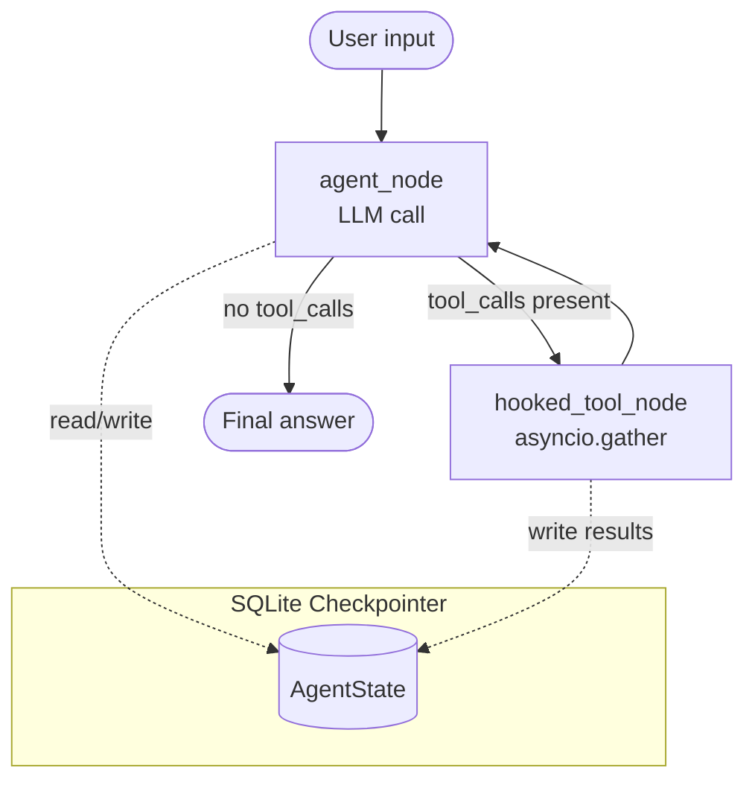
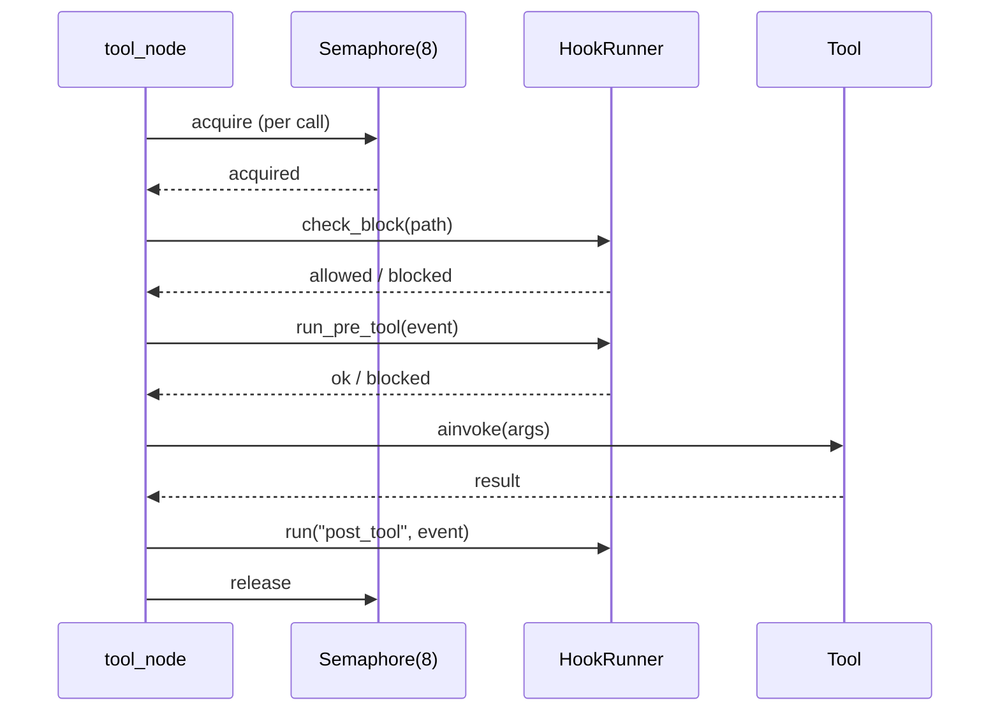

# Preface — Building Production AI Agents: A Complete Engineering Guide

---

> *"The best way to understand a system is to build one you would actually use."*

---

## What This Book Is

This book is a complete engineering reference for building production-grade LLM agent systems in Python. It is not a survey of AI products, a prompt-engineering cookbook, or a beginner's introduction to machine learning. It is, deliberately and stubbornly, a book about **software engineering** — the kind of careful, testable, observable, maintainable engineering that turns a weekend prototype into something you would trust in a real workflow.

The worked example running through every chapter is **saathi-langgraph**: a local coding assistant built on LangGraph and Ollama that runs entirely on your own hardware. "Saathi" is a Hindi word meaning companion or ally — a fitting name for a tool that sits beside you while you work. By the time you finish this book, you will understand not only how saathi works, but *why* every design decision was made, what alternatives were considered, and what you would need to change to adapt the architecture to your own requirements.

This is a book you will read at a desk, with a terminal open beside you. Code listings are complete and runnable. Every pattern shown in prose appears in the actual saathi codebase. Footnotes point you to specific files and line numbers. The goal is that after reading a chapter, you can open the source and recognize every technique you just learned.

---

## What This Book Is Not

It is worth being explicit about scope.

**It is not a beginner Python tutorial.** The book assumes you are comfortable with Python 3.11 or later, that you have written async code before (even if asyncio still feels slippery), and that you know how to read a traceback. Chapter 1 covers the specific async and typing patterns the rest of the book depends on, but it does so at an engineering depth, not an introductory one.

**It is not a model-training book.** You will not find chapters on gradient descent, fine-tuning, or CUDA kernels. The models we use are pre-trained and accessed through a local inference server. Our job is to orchestrate them, not to build them.

**It is not a cloud-deployment guide.** The entire system runs on a laptop. That is a deliberate design choice explored at length in the section on local LLMs below. A production deployment chapter does appear at the end of the book, but "production" here means "reliable, observable, and maintainable" — not "running on Kubernetes."

**It is not a framework sales pitch.** LangGraph is a powerful tool, but this book takes the time to explain the parts that are genuinely awkward, the places where the abstraction leaks, and the decisions where a different framework — or no framework at all — might serve you better.

---

## Who This Book Is For

The primary reader is a **senior Python engineer** who has been handed responsibility for an AI-adjacent project and wants to understand, from first principles, how to build something reliable. You may have used the OpenAI Python SDK or the Anthropic SDK to write a quick prototype. You may have watched agent frameworks sprout and multiply over the past two years and wondered which ones are worth learning. You want to understand how the pieces fit together at an engineering level, not just call `chain.invoke()` and hope for the best.

The secondary reader is an **ML engineer or data scientist** with strong Python skills who wants to understand the software engineering side of deploying LLM systems. You understand transformers and inference; this book covers the surrounding plumbing.

The tertiary reader is a **software architect** evaluating agent frameworks for a team. The architecture chapters give you the vocabulary and the trade-off analysis to make informed decisions, and the production patterns chapter maps directly to enterprise concerns: auditability, access control, cost management, and graceful degradation.

What unites all three readers: you prefer to understand things rather than accept them. You are willing to read code. You believe that systems worth building are worth understanding deeply.

---

## The Worked Example: saathi-langgraph

Every chapter of this book is anchored in a single, complete, real project. Here is what saathi-langgraph actually does:

### What It Does

saathi is a **local coding assistant** that you run in your terminal. You type questions and tasks; it uses a locally hosted language model to reason about them and take actions. Those actions include reading and writing files, running shell commands, searching codebases, managing git, looking things up in memory, and calling external tools via MCP (the Model Context Protocol).

The interaction model is a REPL (Read-Eval-Print Loop) — like an interactive Python shell, but instead of evaluating Python expressions, it runs an agent turn. Each turn may involve multiple rounds of tool use before the model produces a final answer.

### The Feature Set

Here is what is implemented in the project as of the writing of this book:

| Capability | Implementation |
| --- | --- |
| Interactive REPL | `cli.py` — Typer CLI, bilingual spinner, Rich output |
| 15 tools | filesystem, git, shell, search, memory (read/write/list/delete) |
| LangGraph state machine | compiled `StateGraph` with SQLite checkpointer |
| Persistent conversation history | `aiosqlite`-backed checkpoint store in `.saathi/checkpoints.db` |
| Ollama backend | `ChatOllama` via LangChain, configurable model and context window |
| Parallel tool execution | `asyncio.gather` with `asyncio.Semaphore` bounding concurrency |
| Lifecycle hooks | pre-tool, post-tool, post-turn shell hooks; path blocking |
| MCP server integration | `langchain-mcp-adapters`, stdio and HTTP transports |
| Code review mode | structured finding extraction with confidence scoring |
| History compaction | LLM-summarized message rolling to manage context window |
| Non-interactive scripting | `--print` flag, JSON or text output, exit codes |
| Custom slash commands | `.saathi/commands/*.md` files with `$ARGS` substitution |
| Project memory | per-project and global key-value memory in JSON |
| Structured logging | `structlog` to stderr, independent of stdout output |
| Retry logic | exponential backoff for connection failures, generic async retry |

### A Typical Session

```text
$ saathi
 ____      _        _    _____  _   _  ___ 
/ ___|    / \      / \  |_   _|| | | ||_ _|
\___ \   / _ \    / _ \   | |  | |_| | | | 
 ___) | / ___ \  / ___ \  | |  |  _  | | | 
|____/ /_/   \_\/_/   \_\ |_|  |_| |_||___|
Local coding agent — LangGraph + Ollama

You: what files are in this project?
→ list_directory  path=[yellow].[/yellow]

 The project contains the following files and directories:
  src/  tests/  pyproject.toml  README.md  ARCHITECTURE.md ...

You: /review
→ read_file  path=[yellow]src/saathi/agent/graph.py[/yellow]
→ read_file  path=[yellow]src/saathi/agent/nodes.py[/yellow]

 Code Review — 3 findings, 2 medium, 1 low ...

You: /compact
 Compacted 47 messages into summary. New session started.

You: /quit
```

The slash commands (`/review`, `/compact`, `/quit`) are built into the REPL. The `→ tool_name` lines are live tool-call display rendered by the `display.py` module. The spinner runs in a background thread while the model is thinking.

---

## Why Local LLMs?

Every major cloud LLM provider offers capable, convenient APIs. Why build an entire local inference stack when you could call `anthropic.messages.create()` in three lines?

There are five compelling reasons, and the weight of each depends on your situation.

### 1. Privacy and Data Residency

When you call a cloud API, your prompts and context travel over the internet to a third-party server. For many enterprise use cases — codebases containing proprietary algorithms, financial data, personal information, or trade secrets — this is either legally prohibited or organizationally unacceptable. A local model sees nothing outside your machine.

### 2. Cost at Scale

Cloud API pricing is typically quoted per million tokens. For an interactive coding assistant that runs all day, making dozens of tool-augmented turns per hour, costs accumulate quickly. A one-time investment in GPU hardware (or a well-provisioned laptop with Apple Silicon) serves unlimited queries at marginal cost.

> **Approximate comparison (2026 pricing):** A developer making 100 complex agent turns per day with a capable cloud model might spend $5-15/day in API costs. A local Ollama instance on a MacBook M3 Pro handles the same workload at the cost of electricity.

### 3. Latency and Responsiveness

Network round-trips, rate limiting, and queue waiting introduce latency that compounds across multi-step agent turns. Each tool call in saathi triggers another model invocation; five tool calls mean five round-trips. Locally, each invocation is a forward pass through a model already loaded in memory — typically 2-8 seconds for a 12B parameter model, with no network component.

### 4. Reproducibility

Cloud models are updated without notice. The model you called last month may behave differently today. A local model pinned to a specific Ollama tag is deterministic about its weights. For engineering work where you want stable, reproducible behavior — tests that depend on LLM outputs, documented benchmarks, regulated environments — local inference is the only option that gives you this guarantee.

### 5. Offline Operation

Development happens on airplanes, in conference centers with unreliable WiFi, in secure facilities without internet access. A local model works anywhere.

None of these arguments mean you should *never* use cloud APIs. The cloud models are genuinely more capable on complex reasoning tasks. The right architecture for many teams is a hybrid: local models for routine tasks and high-frequency calls, cloud models for complex reasoning where quality justifies cost. saathi supports switching models with a `/model` command precisely because this trade-off is real and situational.

---

## Technology Stack

The following table describes every significant dependency in the saathi stack and its role.

| Library | Version | Role |
| --- | --- | --- |
| **LangGraph** | `≥0.2` | State machine for the agent loop; checkpointing |
| **LangChain Core** | `≥0.3` | Message types, tool abstractions, streaming events |
| **LangChain Community** | `≥0.3` | `ChatOllama` integration |
| **langchain-mcp-adapters** | `≥0.1` | MCP server client, tool wrapping |
| **Ollama** | local server | Local LLM inference server |
| **pydantic** | `v2` | Data validation, structured outputs |
| **pydantic-settings** | `≥2` | Configuration from env vars and `.env` files |
| **typer** | `≥0.12` | CLI argument parsing, `--help` generation |
| **rich** | `≥13` | Terminal rendering: tables, panels, markup |
| **structlog** | `≥24` | Structured, context-rich logging to stderr |
| **aiosqlite** | `≥0.20` | Async SQLite for LangGraph's checkpointer |
| **httpx** | `≥0.27` | HTTP client; exception types used in retry logic |
| **asyncio** | stdlib | Concurrent tool execution, subprocess management |
| **pathlib** | stdlib | Filesystem path manipulation |
| **pytest** | `≥8` | Test runner |
| **pytest-asyncio** | `≥0.23` | Async test support |
| **ruff** | `≥0.4` | Linter and formatter |
| **mypy** | `≥1.10` | Static type checking |

All of these are mature, widely-used libraries with strong community support. The book spends time on each in proportion to how much depth is needed to use it correctly.

---

## Architectural Overview

The system has four layers. Understanding this layering before diving into code will help you navigate the codebase.

```flow
┌─────────────────────────────────────────────────────────────────┐
│  Layer 4: UI / CLI                                              │
│  cli.py — Typer CLI, REPL loop, spinner, slash commands         │
│  ui/display.py — Rich rendering, panels, tables                 │
└───────────────────────────┬─────────────────────────────────────┘
                            │ calls
┌───────────────────────────▼─────────────────────────────────────┐
│  Layer 3: Agent Orchestration                                   │
│  agent/graph.py — LangGraph StateGraph, checkpointer            │
│  agent/nodes.py — agent_node (LLM call)                         │
│  agent/tool_node.py — hooked_tool_node (parallel execution)     │
│  agent/state.py — AgentState TypedDict                          │
│  agent/prompts.py — system prompt assembly                      │
└───────────────────────────┬─────────────────────────────────────┘
                            │ invokes
┌───────────────────────────▼─────────────────────────────────────┐
│  Layer 2: Services                                              │
│  retry.py — generic async retry with backoff                    │
│  compaction.py — message history rolling                        │
│  hooks/runner.py — pre/post-tool shell hooks                    │
│  mcp_client.py — MCP server connections                         │
│  memory/store.py — project and global key-value memory          │
│  session/manager.py — thread ID management                      │
└───────────────────────────┬─────────────────────────────────────┘
                            │ uses
┌───────────────────────────▼─────────────────────────────────────┐
│  Layer 1: Tools                                                 │
│  tools/filesystem.py — read_file, write_file, list_directory    │
│  tools/git.py — git_status, git_diff, git_log, git_commit       │
│  tools/shell.py — run_command                                   │
│  tools/search.py — search_files, grep_codebase                  │
│  tools/memory_tools.py — memory_read, memory_write, etc.        │
└─────────────────────────────────────────────────────────────────┘
```

### The Agent Loop

The heart of the system is a **ReAct loop**: the model Reasons about the task, Acts by calling a tool, Observes the result, and repeats until it has enough information to produce a final answer.



### The Tool Execution Pipeline

When the LLM returns a response containing tool calls, the `hooked_tool_node` executes them. Multiple tool calls in a single response are executed **in parallel** using `asyncio.gather`, bounded by a semaphore to prevent resource exhaustion:



Five tool calls requested at once by the LLM become five coroutines passed to `asyncio.gather`. Each acquires the semaphore, runs its pipeline, and releases. All five complete before the next agent node invocation sees their results in the message history.

### State and Persistence

LangGraph's checkpointer writes the full `AgentState` to an aiosqlite database after every node execution. This means:

- Conversations persist across process restarts
- You can list and restore past conversations with `/history`
- The `/compact` command creates a new thread with summarized history, reducing token pressure while retaining context

---

## How to Read This Book

The book is structured in four parts. Each part builds on the previous, but experienced readers can navigate non-linearly.

### Part I: Foundations (Chapters 1-3)

**Chapter 1 — Python Foundations for LLM Engineering** covers every Python pattern used in the saathi codebase: asyncio, TypedDict, Pydantic v2, structlog, pathlib, pytest-asyncio. If you are already deeply comfortable with async Python, skim this chapter and use it as a reference.

**Chapter 2 — LangGraph Core Concepts** explains the graph model from first principles: nodes, edges, state reducers, the `add_messages` annotation, conditional routing, and how compilation works. We build a minimal agent from scratch before introducing the saathi graph.

**Chapter 3 — LLM Integration Patterns** covers the ChatOllama integration, token counting, context window management, the streaming events API (`astream_events`), and the mental model of LLM calls as async I/O operations.

### Part II: Building the Agent (Chapters 4-6)

**Chapter 4 — State Design and the AgentState Schema** goes deep on `TypedDict` state, the `Annotated[list[BaseMessage], add_messages]` reducer pattern, and what it means for state to flow through a graph.

**Chapter 5 — Tool Design and the Tool Contract** covers what makes a well-designed LangChain tool: the docstring-as-schema convention, async tools, structured inputs with Pydantic models, error handling that produces informative `ToolMessage` results, and the full tool inventory in saathi.

**Chapter 6 — Parallel Tool Execution** is a deep dive into saathi's `hooked_tool_node`: `asyncio.gather`, the Semaphore pattern, the per-call pipeline, and how to test concurrent async code.

### Part III: Production Patterns (Chapters 7-10)

**Chapter 7 — Hooks, Observability, and Control** covers the hook system (pre-tool, post-tool, post-turn), path blocking for write protection, and how hooks connect to external monitoring systems.

**Chapter 8 — Memory, Context, and Compaction** covers the two-tier memory system (global and project), the history compaction algorithm, and the general problem of keeping LLM context fresh and bounded.

**Chapter 9 — Configuration, Retry, and Resilience** covers pydantic-settings configuration, the generic async retry function, the RETRYABLE exception tuple, and what it means to make an agent robust against connection failures.

**Chapter 10 — Testing LLM Systems** is a complete guide to the saathi test suite: what to test, what not to test, mock patterns for LLM calls, async test patterns with pytest-asyncio, and live integration tests.

### Part IV: Extending and Deploying (Chapters 11-13)

**Chapter 11 — MCP: The Model Context Protocol** covers the emerging standard for connecting models to external tools, how saathi's MCP client works, writing your own MCP server, and the tradeoffs of stdio vs HTTP transports.

**Chapter 12 — Non-Interactive Mode and Scripting** covers saathi's `--print` mode, structured JSON output, exit codes, and how to compose agent calls in shell scripts and CI pipelines.

**Chapter 13 — Toward Production** covers deployment packaging, system service management, model management with Ollama, and architectural patterns for teams sharing a local inference server.

---

## Prerequisites

This book assumes:

**Python proficiency.** You are comfortable with Python 3.11+ syntax, including type annotations, dataclasses, context managers, and comprehensions. You have used `pip` and `venv` or equivalent packaging tools. You have written at least some async Python, even if `asyncio` internals remain mysterious.

**Basic familiarity with LLMs.** You understand what a language model is, what "tokens" means, what "context window" means, and roughly how a chat completion API works. You do not need to understand transformer architecture.

**git familiarity.** The project uses git for version control and the tools include git operations. You should be comfortable with `git commit`, `git diff`, and `git log`.

**Terminal comfort.** You work in a Unix-like terminal (or Windows with WSL or PowerShell). You know how to set environment variables and install software.

---

## Getting the Project Running

1. **Python 3.12+** — The project uses PEP 695 generic syntax which requires 3.12.
2. **Ollama** — Install from [ollama.ai](https://ollama.ai). After installation, pull the default model:

```bash
ollama pull gemma4:12b
```

1. **uv** (recommended) or pip — for dependency management:

```bash
# macOS/Linux
curl -LsSf https://astral.sh/uv/install.sh | sh

# Windows (PowerShell)
irm https://astral.sh/uv/install.ps1 | iex
```

### Installation

```bash
git clone <repo-url>
cd saathi-langgraph

# Create virtual environment and install
uv sync

# Or with pip
pip install -e ".[dev]"
```

### Configuration

Copy the example environment file:

```bash
cp .env.example .env
```

Edit `.env` to configure your setup:

```dotenv
SAATHI_OLLAMA_MODEL=gemma4:12b
SAATHI_OLLAMA_BASE_URL=http://localhost:11434
SAATHI_TEMPERATURE=0.1
SAATHI_CONTEXT_WINDOW=32768
SAATHI_MAX_TOKENS=4096
SAATHI_MAX_PARALLEL_TOOLS=8
```

All settings can also be passed as environment variables with the `SAATHI_` prefix, or overridden on the command line.

### Running

```bash
# Start the interactive REPL
saathi

# Or with explicit model selection
saathi --model qwen2.5-coder:14b

# Non-interactive, returns JSON
saathi --print --output-format json "list the Python files in src/"

# With context files loaded at startup
saathi --context src/saathi/agent/graph.py --context src/saathi/agent/nodes.py
```

### Running the Tests

```bash
# Full test suite (excludes live tests)
pytest

# With verbose output
pytest -v

# Live integration tests (require Ollama running)
pytest -m live

# Single test file
pytest tests/test_retry.py -v
```

### Health Check

```bash
# Verify Ollama is reachable and the configured model is available
saathi --print "what is 2 + 2"
```

If you see a JSON response with the answer, everything is working.

---

## A Note on 2026 Python

This book is written for Python 3.12 and embraces the language as it exists in 2026. A few notes on recent language evolution are worth making explicit.

### PEP 695 — Type Parameter Syntax

Python 3.12 introduced a new, cleaner syntax for generic functions and classes:

```python
# Old style (still valid)
from typing import TypeVar
T = TypeVar("T")
async def retry_async(fn: Callable[..., Awaitable[T]]) -> T: ...

# New PEP 695 style (Python 3.12+)
async def retry_async[T](fn: Callable[..., Awaitable[T]]) -> T: ...
```

saathi uses the new syntax in `retry.py`. Chapter 1 explains both forms so you understand what you are reading.

### asyncio Maturity

The asyncio ecosystem has matured considerably since its introduction in Python 3.4. In 2026, `asyncio.TaskGroup` (3.11), `asyncio.timeout` (3.11), and improved error reporting make async Python substantially more ergonomic than it was even three years ago. This book uses the modern APIs throughout.

### Pydantic v2

Pydantic v2 (released 2023, now universal in 2026) is substantially faster and stricter than v1. The API changed significantly: `@validator` became `@field_validator`, model configuration moved from inner `class Config` to `model_config = ConfigDict(...)`, and `BaseSettings` moved to the separate `pydantic-settings` package. All Pydantic usage in this book is v2 idioms.

### Type Annotations as Documentation

Modern Python type annotations are not optional ceremony — they are load-bearing documentation that enables static analysis tools (mypy, pyright) to catch bugs before runtime, and enables LLMs to understand your code better when using tools like saathi itself. The saathi codebase is fully annotated and passes mypy strict mode. This book explains every annotation pattern used.

---

## A Note on Agent System Design

Building an agent is not the same as building a chatbot. A chatbot takes input, generates output, and returns. An agent may take dozens of actions before returning a response, and those actions have **side effects** — files written, shell commands executed, git commits made.

This means agent engineering has a different risk profile from API engineering. The patterns in this book — hooks for blocking dangerous operations, path allowlists, sandboxed test execution, explicit undo checkpointing — exist because agents that act need guardrails that stateless APIs do not.

The book takes this seriously. Chapter 7 (Hooks and Control) is not an afterthought; it is a first-class concern. The test suite includes tests that verify hooks block disallowed paths. The non-interactive mode returns structured exit codes specifically so that automated callers can handle agent failures gracefully.

> **A design principle stated early and repeated often:** *An agent that cannot be safely stopped is not production-ready.* Every mechanism in saathi that limits, audits, or rolls back agent actions exists because building useful automation requires being able to trust it.

---

## Source Code and Errata

The complete source code for saathi-langgraph is available at the project repository. Each chapter references specific files and line ranges; the book was written against the commit tagged `book-edition-1`.

If you find errors in the text or bugs in the code, please open an issue on the repository. The errata page will list all known corrections.

---

## Acknowledgements

This book would not exist without the open-source work of the LangGraph team at LangChain, the Ollama project, and the broader Python async ecosystem. The patterns here are distilled from real engineering work, and that work stands on the shoulders of many contributors.

---

*Let's build something worth trusting.*

---

**Next:** [Chapter 1 — Python Foundations for LLM Engineering](./01-python-foundations.md)
